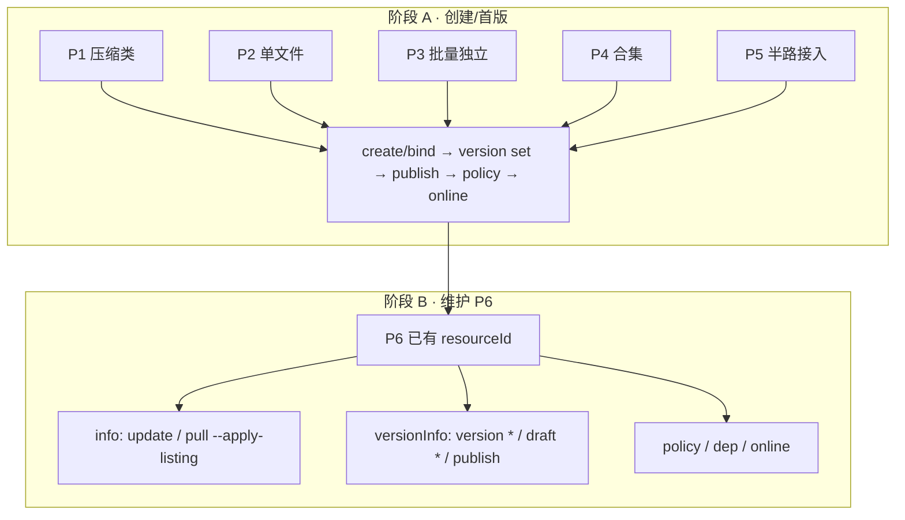
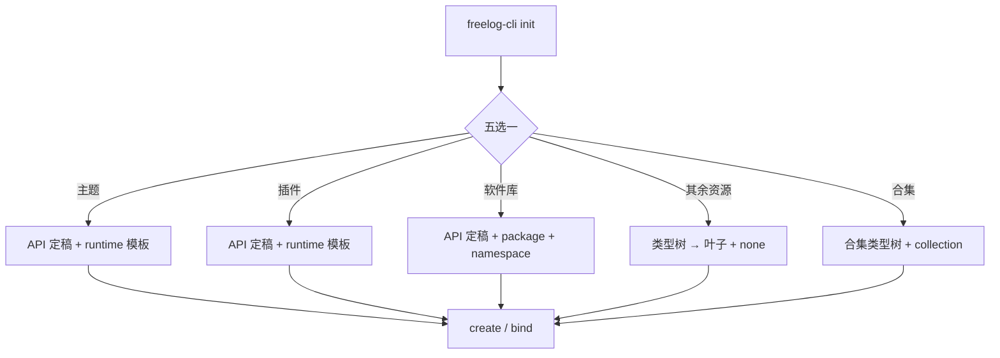

# 02 · 主路径（P1–P6）

> 文档角色：派生验收场景；用于验证产品契约，不反向定义产品、字段或实现完成状态。产品规则以仓库根目录 [DESIGN.md](../../../DESIGN.md) 为准。

最后更新：2026-08-07

关联：[01-生命周期与拓扑](./01-生命周期与拓扑.md) · [05-场景实例](./05-场景实例.md) · [04-问题矩阵](./04-问题矩阵.md)

---

## 1. 总览

六条主路径 = 从用户意图到上架（及维护）的**完整节点链**。L4 之后收敛到同一发布骨架 `publish → policy → online`。



---

## 2. P1 压缩类（主题 / 插件 / 软件库）

| 分支 | 节点链 | 关键差异 |
|---|---|---|
| P1a 从零 + runtime | login → init 主题/插件 → build → create → version set --file dist → publish → policy → online | 目录→zip |
| P1b 从零 + package | login → init 软件库 → build → create → … | 需 `--namespace` |
| P1c 已有代码仓 | login → init none（或五选一后已有仓）→ build → create → … | 不复制模板 |
| P1d 发新版 | pull → version set（版本 > latest）→ publish | 维护子路径 |

**upload：** `processFile.ts` 把目录打 zip。

命令实例 → [05 §P1](./05-场景实例.md#p1-压缩类)

---

## 3. P2 单文件（图片 / 视频）

| 节点链 |
|---|
| login → type info → init none → create → version set --file \<path\> [--video-cover] → publish → policy → online |

**upload：** 原文件，不 zip。视频封面本地路径在 publish/draft 时上传。

命令实例 → [05 §P2](./05-场景实例.md#p2-单文件)

---

## 4. P3 批量独立资源

**不是合集，不产生单品。** 每个文件 → 独立 resourceId + 独立 manifest/state 子目录。

| 节点链 |
|---|
| login → type info → **无父目录 init** → resource import-dir → （每项子目录）→ 逐项 policy/online |

**约束：** 只扫**顶层文件**；部分失败 exit 4 + `retry.batch.json`。

命令实例 → [05 §P3](./05-场景实例.md#p3-批量独立)

---

## 5. P4 合集

| 节点链 |
|---|
| login → init collection → collection create → collection item import-dir → collection version set → collection publish → collection policy → online |

**三类草稿分离：** 独立资源发版表单 / 合集发版表单 / 合集目录（单品列表）。见 [03 §3.9](./03-命令节点.md#39-三类草稿边界).

**扩展：** collect-rules、RSS（验证码人工）、logs、collection offline/online（维护）。

命令实例 → [05 §P4](./05-场景实例.md#p4-合集)

---

## 6. P5 半路接入

| 节点链 |
|---|
| login → init none（--resource-name 对齐 Console）→ **bind** \<resourceId\> → status |

**不能 create**（授权名已占用）。合集 bind 内部走 pull --collection。

命令实例 → [05 §P5](./05-场景实例.md#p5-半路接入)

---

## 7. P6 维护（sidebar 阶段 B）

假定 state 已有 resourceId，**不再 create**。

| 子场景 | Console | 节点链 | CLI |
|---|---|---|---|
| P6a 改 listing | sidebar **info** | status → update 或 pull --apply-listing | `update --title/intro/cover/tags` |
| P6b 发新版 | **versionInfo** | pull → version set → draft? → publish | `version set` → `draft push` → `publish` |
| P6c 改已发版说明 | versionInfo 历史版 | version edit | `version edit --version --description` |
| P6d 草稿协作 | versionInfo 草稿区 | draft pull → 改 → draft push | `draft pull/push/discard` |
| P6e 策略 | policy | apply / list / set | `policy *` |
| P6f 依赖 | dependency | dep add → dep auth | `dep *` |
| P6g 上下架 | Sider | online / offline | `online` / `offline` |
| P6h 换环境 | — | login → 删 state → bind | 见 [05 §P6h](./05-场景实例.md#p6h-换环境) |
| P6i 合集维护 | collectionSidebar | item * / draft --collection / collection update | 见 [05 §P4 维护](./05-场景实例.md#p4-合集维护) |

**S15 自动化覆盖：** P6a cover/tags、P6e policy 门禁、P6b bump/edit/show、P6f dep、P6i 合集 offline/draft。

---

## 8. init 子拓扑（五选一）



| scaffold | 五选一 | 类型树 | 模板 |
|---|---|---|---|
| `runtime` | 主题、插件 | 否 | **必选** |
| `package` | 软件库 | 否 | **必选** + namespace |
| `none` | 其余、已有仓、半路 | 是（其余） | 否 |
| `collection` | 合集 | 是 | 否 |

**方案 A：** init **不含**批量/文件夹合集选项；批量 → `resource import-dir`；文件夹合集 → `collection init-from-folder` 或 init 选合集。

**runtime 模板（8）：** vite-vue-ts, vite-vue, vite-react-ts, vite-react, webpack-vue-ts, webpack-vue, webpack-react-ts, webpack-react

**package 模板（3）：** package-js, package-react, package-vue

---

## 9. 路径选择决策树

```text
要发什么？
├─ 主题/插件/软件库（zip）        → P1
├─ 单张图/单个视频                → P2
├─ 文件夹里每个文件都是独立资源    → P3（不是 P4！）
├─ 文件夹做成一个合集（有子资源）  → P4
├─ Console 已经建好了壳            → P5
└─ 已经上架，要改信息/发新版       → P6
```

选错路径的典型后果见 [04 §4.7 合集](./04-问题矩阵.md#47-l4-合集专项)（例如把 P3 当 P4 以为「上传文件夹就是合集」）。
