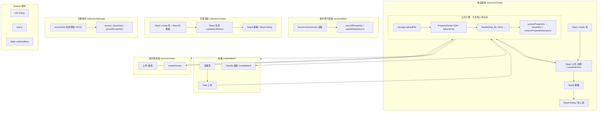

# CLI 拓扑与 Console 对照（细粒度）

> 文档角色：Console 页面 → Effect → API → CLI → 测试的证据索引。它不定义产品范围，也不维护独立的“完成结论”；产品设计见仓库根目录 [DESIGN.md](../../../DESIGN.md)。

字段有效约束和提示不在本文重复维护，统一引用 [Console表单字段与交互规则](./Console表单字段与交互规则.md) 的 `FORM-*` ID。

术语统一：Console `creator/sidebar` 的“单品”在 CLI 中称**独立资源**；合集中的“单品”称**目录项**。

最后更新：2026-08-06

**用途：** 从 Console **页面 → 交互 → Model/Effect → API/字段 → CLI 命令/服务** 逐层展开，避免 parity 总表漏项。  
**配套：** [CLI数据操作与Console对照.md](./CLI数据操作与Console对照.md) §2 为扁平索引；**本文是拓扑真源**。

---

## 0. 阅读方法

### 0.1 六层拓扑

| 层 | 名称 | 示例 |
|---|---|---|
| **L0** | 用户场景 / 路由 | `/resource/creator`、`collectionSidebar/versionInfo` |
| **L1** | 页面 Step / Tab | creator Step2、sidebar versionInfo |
| **L2** | UI 触发 / 组件 | `FLocalUpload`、`onClick_step2_submitBtn`、`FAddResourcesHandleAuth` |
| **L3** | Model Effect / 页面直调 | `resourceCreatorPage/step2Effects`、`Handle/index.tsx` |
| **L4** | 内部链路 / 工具 | `handleData_By_Sha1…`、`PropertyParser`、`getAttrsInfoByKeys` |
| **L5** | HTTP API + 写入字段 | `POST createVersion` · `inputAttrs[]` |
| **L6** | CLI 命令 + service 函数 | `freelog-cli publish` → `resource/publishVersion` |

### 0.2 验证层级（每个叶节点必标）

| 标记 | 含义 |
|---|---|
| **A** | 代码路径存在，字段形状与 Console 源码同构 |
| **B** | dev `verify-scenarios` 或手工 dev 测过 API 能通 |
| **C** | 同输入下请求 body 与 Console Network 抓包一致 |

**规则：** 只有 **A+B+C** 三者齐全，该节点才可标「对齐」。仅有 A 或 B **不能**写进 parity 总表 ✅。

### 0.3 节点 ID

格式：`TOP-<域>-<步骤>-<动作>`  
例：`TOP-RC-S2-SUBMIT` = 单品 creator Step2 发行按钮。

---

## 1. 全局拓扑（脚手架写入范围）

**不在上图（—）：** 云存储选文件、Markdown/Cartoon 微应用、列表/收藏/节点/收入、付费签约 UI。（RSS/collect-rules 见 TOP-CC-RSS/RULES，CLI 已覆盖 #45–46，属维护分支。）

---

## 2. 公共子图 · 本地文件属性链（逐节点）

| 节点 ID | L2–L4 | L5 API/字段 | L6 CLI | A | B | C | parity # |
|---|---|---|---|:---:|:---:|:---:|---:|
| `TOP-SH-UPLOAD` | `FLocalUpload` / batch Task | `Storage.uploadFile` | `storageUpload.uploadFileIfNeeded` | ✓ | ✓ | — | 1 |
| `TOP-SH-PARSE-SSE` | `PropertyParser.parsePromise` | GET SSE `/v2/storages/files/listSSE/info` | —（CLI 未用 SSE） | — | — | — | — |
| `TOP-SH-PARSE-POLL` | batch `getFilesSha1Info` | `Storage.filesListInfo` | `pollFilesSha1Info` | ✓ | — | — | 2,5 |
| `TOP-SH-HANDLE` | `handleData_By_Sha1…2` | 内部 + `getAttrsInfoByKey` | `handleFilePropertiesBySha1` | ✓ | — | — | 3 |
| `TOP-SH-TEMPLATE` | collection Step1 sha1:'' | `Storage.filesInfo` | `resolveCollectionPropertiesFromType` | ✓ | — | — | 4 |
| `TOP-SH-MAP-ATTR` | step2 submit 映射 | `inputAttrs`（additional） | `createVersionPropertiesFromHandleData` | ✓ | — | — | 6 |
| `TOP-SH-MAP-CUSTOM` | 同上 | `customPropertyDescriptors` | 同上 | ✓ | — | — | 7 |
| `TOP-SH-COVER-SSE` | `CoverGenerator` | POST SSE `generateCoverImageSSE` | — | — | — | — | — |
| `TOP-SH-COVER-SYNC` | batch 注释掉的封面 | POST `generateCoverImage` | `generateCoverUrlFromSha1`（import-dir 图片） | ✓ | — | — | 11 |
| `TOP-SH-VALIDATE` | 类型配置校验 | `getResourceTypeInfoByCode` | `assertLocalFileAllowedByType` | ✓ | ✓ | — | 8 |
| `TOP-SH-ZIP` | 主题/插件构建 | 本地 zip | `processFileForPublish` | ✓ | ✓ | — | 9 |

**C 层阻断项（公共链）：** `TOP-SH-PARSE-SSE` vs `TOP-SH-PARSE-POLL` 同 sha1 是否等价；`TOP-SH-MAP-*` publish 实际 body 未抓包 diff。

---

## 3. 按 Console 页面展开

### 3.1 单品首版 `resourceCreator`

**路由：** `/resource/creator`  
**Model：** `models/resourceCreatorPage/step{1-4}Effects.ts`

#### Step1 · 创建壳 `TOP-RC-S1-CREATE`

| 层 | Console | CLI |
|---|---|---|
| L2 | `onClick_step1_createBtn` | `freelog-cli create` |
| L3 | `step1Effects.ts` | `resourceService.createResource` |
| L5 | `Resource.create` · name, resourceTypeCode, resourceTitle, resourceTypeName? | 同左 |
| L3 读 | `getResourceTypeInfoByCode` | `typeService.assertResourceTypeCode` |
| L3 读 | `Resource.info`（重名校验） | create 前 info |

| A | B | C | # |
|:---:|:---:|:---:|---:|
| ✓ | ✓ | — | 13 |

#### Step2 · 本地上传 + 属性 + 首版 `TOP-RC-S2-*`

| 节点 ID | L2 触发 | L3 Effect | L5 写入 | L6 CLI | A | B | C |
|---|---|---|---|---|:---:|:---:|:---:|
| `TOP-RC-S2-LOCAL-UP` | `onSucceed_step2_localUpload` | step2Effects | （链到 §2 SHARED） | `version set --file` **仅写路径** | ✓ | ✓ | — |
| `TOP-RC-S2-STORAGE` | 云存储选文件 | step2Effects storageSpace | Storage 引用 | — | — | — | — |
| `TOP-RC-S2-EDIT-ATTR` | 表单改 systemProperties | onChange_step2_systemProperties | 本地 state | manifest inputAttrs inherit | ✓ | — | — |
| `TOP-RC-S2-DRAFT` | 存草稿按钮 | onTrigger_step2_SaveDraft | `saveVersionsDraft` | `draft push` | ✓ | ✓ | — |
| `TOP-RC-S2-SUBMIT` | 发行按钮 | onClick_step2_submitBtn | **`createVersion`** 全字段 | `publish` | ✓ | ✓ | **—** |
| `TOP-RC-S2-AUTH-EX` | 依赖授权抽屉 | submit 前 flatMap contracts | `authExcludedItems[]` | manifest authExcludedItems | ✓ | — | — |

**`TOP-RC-S2-SUBMIT` → createVersion 字段清单（必须与 Console 一致）：**

| 字段 | Console 来源 | CLI 来源 | C 验证 |
|---|---|---|---|
| resourceId | step1 | manifest/state | — |
| version | 固定 1.0.0 首版 | manifest.version | B |
| fileSha1, filename | step2_fileInfo | processFile + upload | B |
| inputAttrs | systemProperties type=additional | filePropertyService + inherit | **—** |
| customPropertyDescriptors | customProperties + customConfigurations | 同上 | **—** |
| dependencies | step2_directDependencies | manifest.dependencies | — |
| baseUpcastResources | step2_baseUpcastResources | manifest | — |
| authExcludedItems | step2_authExcludedItems | manifest | — |
| description | 空串首版 | manifest.description | — |
| videoCover | TODO 注释 | manifest.videoCover | — |
| batchSignContracts | **不传**（单品 step2） | manifest 可选传 | ⚠️ 超集 |

| # | 14–16, 17 |
|---:|---|

#### Step3 · 策略 `TOP-RC-S3-POLICY`

| L5 | `Resource.update` · addPolicies[] | `policy apply --from-file` | A✓ B✓ | #20 |

#### Step4 · Listing / 上架 `TOP-RC-S4-*`

| 节点 | L5 | CLI | 备注 | # |
|---|---|---|---|---:|
| `TOP-RC-S4-LISTING` | update · tags, coverImages, intro | `update --tags --cover --intro` | A✓ B✓ | 21 |
| `TOP-RC-S4-SOFT-ON` | update status:1 无门禁 | — | ↷ 刻意不做 | 22 |
| `TOP-RC-S4-HARD-ON` | sidebar 硬上架 | `online` | A✓ B✓ | 23 |

---

### 3.2 批量首版 `resourceCreatorBatch`

**页面：** `pages/resource/creatorBatch/Handle/` + `Task/`

| 节点 ID | L2–L3 | L5 | L6 | A | B | C | # |
|---|---|---|---|:---:|:---:|:---:|---:|
| `TOP-RB-TASK-UP` | Task: fileIsExist → uploadFile | Storage.* | import-dir 内 | ✓ | ✓ | — | 24 |
| `TOP-RB-HANDLE-PARSE` | handleLocalUploadSuccess → handleData×N | §2 | prepareFiles | ✓ | — | — | 25 |
| `TOP-RB-NAMES` | generateResourceNames | Resource.generateResourceNames | batch/prepare | ✓ | ✓ | — | 26 |
| `TOP-RB-RELEASE` | onClickRelease | **createBatch** | resource import-dir | ✓ | ✓ | — | 27 |
| `TOP-RB-BATCH-ATTR` | 每 card systemProperties | createResourceObjects[].inputAttrs/custom… | prepareFiles | ✓ | — | **—** | 28 |
| `TOP-RB-BATCH-SIGN` | FMicroAPP 填 batchSignContracts | createResourceObjects[].batchSignContracts | batch.json 手填 | ✓ | — | — | 29 |
| `TOP-RB-SINGLE` | authExcludedItems 项或环境不提供 createBatch | create + createVersion 单条 | createOneResource | ✓ | — | — | 30 |

**createBatch 每 item 字段（Handle/index.tsx L864–934）：** name, resourceTitle, policies, coverImages, tags, version, fileSha1, filename, description, customPropertyDescriptors, baseUpcastResources, dependencies, **batchSignContracts**, inputAttrs。

---

### 3.3 维护 · 发新版 `resourceVersionCreator`

**路由：** `/resource/versionCreator/:id`  
**Model：** `resourceVersionCreatorPage.ts`

| 节点 ID | L5 | L6 | 与 creator Step2 差异 | A | B | C | # |
|---|---|---|---|:---:|:---:|:---:|---:|
| `TOP-RV-UPLOAD` | §2 SHARED | version set --file + publish 内解析 | 同链 | ✓ | ✓ | — | 53 |
| `TOP-RV-CREATE` | createVersion | publish | version 非固定 1.0.0 | ✓ | ✓ | **—** | 54 |
| `TOP-RV-DRAFT` | saveVersionsDraft | draft push | | ✓ | ✓ | — | 55 |
| `TOP-RV-STORAGE` | Storage.objectDetails / batchObjectList | — | 云存储 | — | — | — | — |
| `TOP-RV-AUTH-EX` | authExcludedItems | manifest | | ✓ | — | — | — |

**Console 额外读：** authTree（`FAntvG6/FGraph_Tree_Authorization_Resource`）— CLI publish 内 authTree ✓ B。

---

### 3.4 维护 · 改已发版 `resourceVersionEditor` + sidebar versionInfo

**Model：** `resourceVersionEditorPage.ts`  
**页面：** `sidebar/versionInfo/$id/index.tsx`

| 节点 ID | L2 | L3 | L5 字段 | L6 | A | B | C | # |
|---|---|---|---|---|:---:|:---:|:---:|---:|
| `TOP-RE-LOAD` | 打开页 | fetchDataSource | resourceVersionInfo1 读 | pull | ✓ | ✓ | — | 56 |
| `TOP-RE-DESC` | 改 description | updateDataSource | description | version edit --description | ✓ | ✓ | — | 57 |
| `TOP-RE-SYNC` | 同步属性按钮 | **syncAllProperties** | inputAttrs + customPropertyDescriptors | version edit --sync-properties | ✓ | — | **—** | 58–59 |
| `TOP-RE-VIDEO` | Console 当前维护页无入口 | — | — | `version edit --video-cover`（CLI 增强，非 Console parity） | — | ✓ | — | 60 |
| `TOP-RE-DISCARD` | 丢弃草稿 | — | deleteResourceDraft | draft discard | ✓ | — | — | 18 |

**`TOP-RE-SYNC` 差异明细：**

| 项 | Console | CLI |
|---|---|---|
| 数据源 | editor state（先 resourceVersionInfo1 加载） | manifest 直读 |
| 是否重新 handleData | 否 | 否 |
| inputAttrs 映射 | additional systemProperties | buildCreateVersionInputAttrs |
| custom 映射 | customProperties + customConfigurations | normalizeCustomPropertyDescriptors |

---

### 3.5 合集首版 `collectionCreator`

**Model：** `collectionCreatorPage/step{1-4}Effects.ts` + Step2 页面直调

| 节点 ID | L3/L2 | L5 | L6 | A | B | C | # |
|---|---|---|---|:---:|:---:|:---:|---:|
| `TOP-CC-S1-CREATE` | step1 createBtn | create subjectType:4 | collection create | ✓ | ✓ | — | 31 |
| `TOP-CC-S1-TEMPLATE` | step1 后 handleData sha1:'' | filesInfo → systemProperties | create 后 hydrateCollectionTypeProperties | ✓ | — | — | 32 |
| `TOP-CC-S2-ITEMS` | FAddResourcesHandleAuth | addResourceItems_Draft | collection item add/import-dir | ✓ | ✓ | — | 34；baseUpcast 合同预检 ✅ 2026-08-12 |
| `TOP-CC-S2-AUTH-EX` | FContractHandleDrawer | addCollectionItems[].authExcludedItems | manifest / --auth-excluded-file | ✓ | — | — | 35 |
| `TOP-CC-S2-ITEM-CRUD` | Step2 页面 | update/delete/reorder/setItemsTitle Draft APIs | collection item * | ✓ | ✓ | — | 36–38 |
| `TOP-CC-S2-SUBMIT` | step2 submitBtn | updateCollection 全字段 | collection publish | ✓ | ✓ | `T-COLL-MERGE` | 40；合集 deps/upcast 预检 ✅ 2026-08-12 |
| `TOP-CC-S2-DRAFT` | step2_SaveDraft | saveVersionsDraft --collection | draft push --collection | ✓ | — | — | 41 |
| `TOP-CC-S3-POLICY` | step3 | update addPolicies | collection policy apply | ✓ | ✓ | — | 42 |
| `TOP-CC-S4-LISTING` | step4 | update listing | collection update | ✓ | ✓ | — | 43–44 |
| `TOP-CC-RSS` | step4/info | Rss.* / bindRssFeed | collection rss * | ✅ | — | — | 45 |
| `TOP-CC-RULES` | step4 | setCollectRules | collect-rules set/get | ✅ | — | — | 46 |

**`TOP-CC-S2-SUBMIT` updateCollection 字段：** inputAttrs, customPropertyDescriptors, description, catalogueProperty, dependencies, authExcludedItems, **isMergeCatalogueDraft**。Console 使用 `itemsChanged ? 1 : 0`；CLI 使用目录发布指纹条件化生成 0/1，验证证据见 `T-COLL-MERGE`。

---

### 3.6 合集维护 `collectionManager` + `collectionSidebar`

**Model：** `collectionManager/versionEffects.ts`、`infoEffects.ts`  
**页面：** `collectionSidebar/versionInfo/$id/index.tsx`

| 节点 ID | L3 | L5 | L6 | A | B | C | # |
|---|---|---|---|:---:|:---:|:---:|---:|
| `TOP-CM-ITEM-ADD` | FAddResourcesHandleAuth | addResourceItems_Draft | item add/import-dir | ✓ | ✓ | — | 72；baseUpcast 合同预检 ✅ 2026-08-12 |
| `TOP-CM-ITEM-CRUD` | versionInfo 页面 | item draft APIs | collection item * | ✓ | ✓ | — | 73 |
| `TOP-CM-SYNC-PROP` | **version_syncAllProperties** | updateCollection **仅** authExcludedItems + customPropertyDescriptors | collection properties sync | ✓ | ✓ | `T-COLL-SYNC` | 74 |
| `TOP-CM-SAVE-DRAFT` | version_SaveDraft | saveVersionsDraft | draft * --collection | ✓ | — | — | 75 |
| `TOP-CM-PUBLISH` | **version_SaveDate** | updateCollection 全字段 + isMergeCatalogueDraft | collection publish | ✓ | ✓ | `T-COLL-MERGE` | 76；合集 deps/upcast 预检 ✅ 2026-08-12 |
| `TOP-CM-LOGS` | ChangeLogDrawer | getCollectionUpdateLogs 读 | collection logs | ✓ | — | — | 77 |
| `TOP-CM-INFO` | infoEffects | update listing | collection update | ✓ | ✓ | — | 47–52 |

---

### 3.7 Sidebar · 单品维护

| 页面 | 节点 | L5 | L6 | A | B | # |
|---|---|---|---|:---:|:---:|---:|
| info | SaveEditTitleBtn 等 | update · resourceTitle/intro/coverImages/tags | update / collection update | ✓ | ✓ | 47–50 |
| policy | resourceAuthPage | update addPolicies / updatePolicies | policy apply/set | ✓ | ✓ | 61–62 |
| policy | 新增后顺带上架 | update status:1 | 用户再 online | ↷ | — | 63 |
| dependency | 依赖页 | 读为主；resolveResources 注释 | dep list | 读 | — | 65 |
| contract | 合同页 | batchSetContracts | dep auth --policy-map | ✓ | — | 66 |
| Sider | resourceOnline / offline | update status 1/4 + 门禁 | online / offline | ✓ | ✓ | 70–71 |

**publish 前：** `authTree`（FGraph 组件 + CLI `resource/publishVersion`）— A✓ B✓ #67。

---

### 3.8 特殊 / 本地脚手架

| 节点 | L6 | A | B | # |
|---|---|:---:|:---:|---:|
| `TOP-MISC-BIND` | bind | ✓ | ✓ | 78 |
| `TOP-MISC-PULL` | pull / status | ✓ | ✓ | 79 |
| `TOP-MISC-INIT` | init 五选一 | ✓ | ✓ | 80 |
| `TOP-MISC-AUTODRAFT` | 300ms 自动 saveVersionsDraft | ↷ | — | 81 |

---

## 4. CLI 命令反向索引（L6 → 拓扑节点）

| CLI 命令 | 覆盖拓扑节点 | 未覆盖的 Console 细节 |
|---|---|---|
| `init` | TOP-MISC-INIT | 无 |
| `create` | TOP-RC-S1, TOP-CC-S1 | — |
| `version set` | TOP-RC-S2-LOCAL-UP（**仅路径**） | 不触发属性解析 |
| `publish` | TOP-RC-S2-SUBMIT, TOP-RV-CREATE, §2 SHARED | C 已证 3 类型（verify:console）；batchSign 可选超集 |
| `resource import-dir` | TOP-RB-* | batchSignContracts 手填；authExcluded 降级 |
| `version edit` | TOP-RE-DESC/SYNC/VIDEO | sync 数据源差异；verify 未测 sync |
| `draft *` | TOP-RC-S2-DRAFT, TOP-RV-DRAFT, TOP-CM-SAVE-DRAFT | 无自动草稿 ↷ |
| `policy *` | TOP-RC-S3, TOP-CM policy | 不改已有策略正文 — |
| `dep *` / `dep auth` | 依赖声明 + batchCreateContracts + batchSetContracts（含自有资源作依赖，与 Console 一致；首版前以 contracts 列表验证） | 非 createBatch.batchSignContracts |
| `online` / `offline` | TOP-RC-S4-HARD-ON, SB3 | 软上架 ↷ |
| `collection create` | TOP-CC-S1 + S1-TEMPLATE | template C 未证 |
| `collection publish` | TOP-CC-S2-SUBMIT, TOP-CM-PUBLISH | isMergeCatalogueDraft ✅；C 已证 merge0/1；`--dry-run` |
| `collection properties sync` | TOP-CM-SYNC-PROP | C 未证 |
| `collection item *` | TOP-CC-S2-*, TOP-CM-ITEM-* | authExcluded 微应用 → 手填 |
| `pull` / `status` | TOP-MISC-PULL, TOP-RE-LOAD | — |
| `bind` | TOP-MISC-BIND | — |

---

## 5. 缺口登记簿（按拓扑节点，非扁平计数）

| 节点 ID | 问题 | 严重度 | 建议动作 |
|---|---|---|---|
| `TOP-SH-PARSE-SSE` vs `TOP-SH-PARSE-POLL` | Console SSE；CLI REST 轮询 | P0 | ✅ metaInfoArray 一致（S14）；handleData 仍待 Console 并排 |
| `TOP-RC-S2-SUBMIT` / `TOP-RV-CREATE` | createVersion body C | P0 | ✅ verify:console（RT005001/RT001/RT006003）；publish deps+upcast 预检 ✅ 2026-08-12 |
| `TOP-RE-SYNC` | 数据源 manifest ≠ editor state | P1 | ✅ 先 resourceVersionInfo1 再 merge |
| `TOP-CM-PUBLISH` | isMergeCatalogueDraft 条件化 | P1 | ✅ 目录指纹 + verify:collection merge0/1 |
| `TOP-RB-BATCH-SIGN` | manifest 手填 batchSignContracts | P2 | ✅ verify:batch；import-dir 发行前 batchSign 覆盖预检 ✅ 2026-08-12 |
| `TOP-SH-COVER-SYNC` | SSE vs 同步 API | P2 | ✅ verify:cover |
| `TOP-RC-S2-SUBMIT` batchSignContracts | CLI 可传、Console 单品不传 | P2 | ✅ publish 默认不传；manifest 透传已修 |
| verify-scenarios | 无属性/sync 断言 | P0 | ✅ S6d/S6e/S11d |

---

## 6. 验证矩阵（叶节点 → 需要的测试）

| 测试 ID | 覆盖节点 | 做法 | 状态 |
|---|---|---|---|
| **T-UNIT-SHARED** | §2 handleData 映射 | filePropertyService.test mock | 已有 |
| **T-DEV-MAIN** | 各 TOP-* 主链 | verify-scenarios 52 项 | 已有 |
| **T-PAYLOAD-KEY** | TOP-RC-S2-SUBMIT | S6d manifest ↔ version show keys | **已有** |
| **T-SYNC-VER** | TOP-RE-SYNC | S6e --sync-properties + version show | **已有** |
| **T-COLL-MERGE** | TOP-CM-PUBLISH | S11d merge=0 无目录变更 | **已有** |
| **T-COLL-SYNC** | TOP-CM-SYNC-PROP | S11d properties sync | **已有** |
| **T-PAYLOAD-VALUE** | TOP-RC-S2-SUBMIT | S6f / verify:payload value parity | **已有（CLI round-trip）** |
| **T-PAYLOAD-CV** | TOP-RC-S2-SUBMIT, TOP-RV-CREATE | Console Network ↔ CLI dry-run | **已有**（verify:console，3 类型） |
| **T-BATCH-SIGN** | TOP-RB-BATCH-SIGN | manifest batchSignContracts dev | **已有**（verify:batch） |
| **T-COLL-UC** | TOP-CC-S2-SUBMIT, TOP-CM-PUBLISH | verify:collection merge0/1 | **已有** |
| **T-META-API** | TOP-SH-PARSE-* | S14 / verify:meta REST vs SSE | **已有** |
| **T-COVER-API** | TOP-SH-COVER-SSE/SYNC | verify:cover 同 sha1 URL | **已有** |

**规则：** 新增 Console 写入 Effect → 先在本文增 L0–L6 行 → 再改代码 → 补 T-* 测试 → 最后才更新 parity 总表状态。

---

## 7. 维护约定

1. **Console 新增 Effect** → 在 §3 对应页面下增节点行，分配 `TOP-*` ID。  
2. **CLI 新增命令** → 更新 §4 反向索引。  
3. **parity 总表 §2** 每行 `#` 必须能链接到本文某一 `TOP-*` 节点（可加「拓扑」列）。  
4. **禁止**仅用单元测试 mock 或 42/42 主链通过，将节点 C 标为完成。

---

## 8. 权威路径

| 用途 | 路径 |
|---|---|
| Console creator | `...\console\src\models\resourceCreatorPage\` |
| Console batch | `...\console\src\pages\resource\creatorBatch\Handle\` |
| Console versionCreator/Editor | `...\models\resourceVersionCreatorPage.ts`、`resourceVersionEditorPage.ts` |
| Console collection | `...\models\collectionCreatorPage\`、`collectionManager\` |
| Console 属性链 | `...\utils\PropertyParser.ts`、`service.ts` handleData |
| Console 加目录 | `...\components\FAddResourcesHandleAuth\` |
| CLI 属性 | `packages/cli/src/services/filePropertyService.ts` |
| CLI publish | `packages/cli/src/services/resource/publishVersion.ts` |
| CLI 合集 | `packages/cli/src/services/collection/` |
| 场景验证 | `packages/cli/scripts/verify-scenarios.mjs` |
