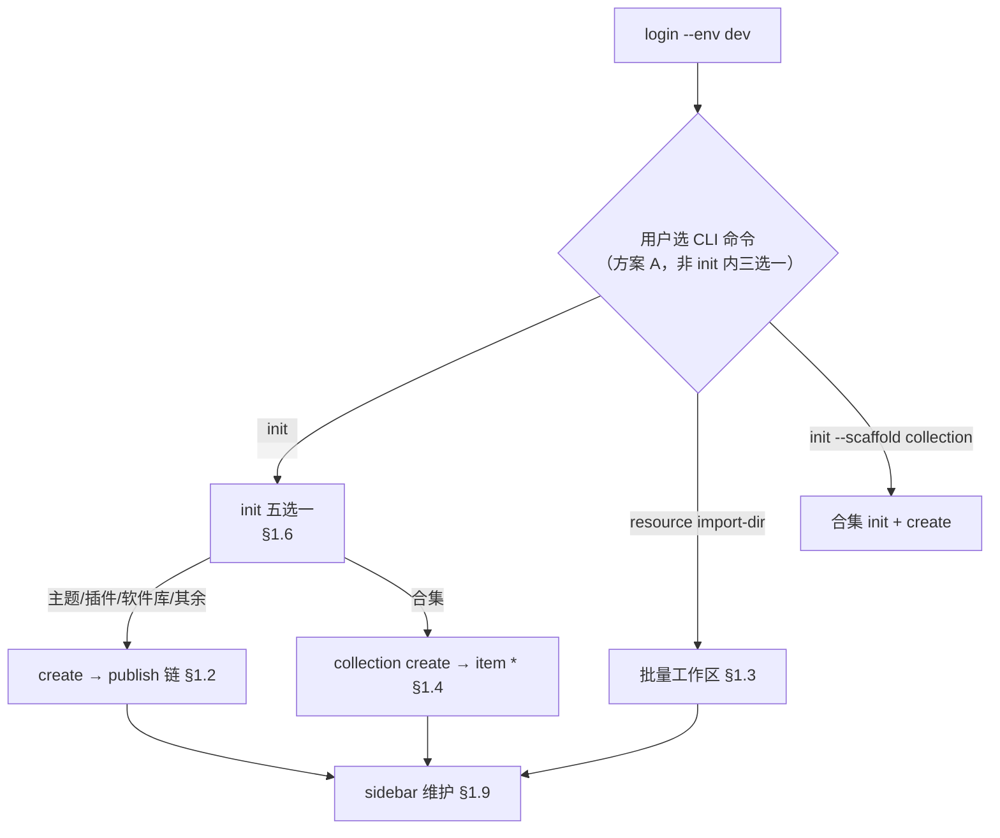

# CLI 脚手架设计

最后更新：2026-08-06（方案 A 定稿）

## 0. 文档分工（先读）

| 文档 | 回答什么 | 读序 |
|---|---|---|
| **本文** | 用户走什么流程；本地存什么；命令怎么组织 | **1** |
| [CLI字段账本](./CLI字段账本.md) | 每个字段从哪来、写到哪、平台 API 映射 | **2**（查表） |
| [场景目录](../场景/README.md) | 全路径穷举、**问题矩阵**、命令实例 | **3**（排查/生产） |
| [CLI使用说明与Console差异](../使用/CLI使用说明与Console差异.md) | 命令参数与 Console 差异 | 按需 |

**写作顺序（演进规则）：流程定稿 → 数据模型定稿 → 改代码。** 字段细节以字段账本为准；本文只保留流程所需的模型骨架。

**设计公理：** 脚手架对齐 Console **本地文件**相关的全部数据操作：上传 → **`handleData_By_Sha1…`（PropertyParser 解析该类型下所有文件的 meta）** → 组装 `inputAttrs` / `customPropertyDescriptors` → `createVersion` / `createBatch` 提交。云存储选文件、RSS、付费签约、列表运营不在范围（§1.9.5）。

### 0.5 可验证事实（不靠猜）

下列内容均有**代码或 API 实测**依据；文档中的 `RT001` 等仅为 **dev/test 当前快照**，不是 CLI 硬编码。

#### 0.5.1 环境与 API 基址

来源：`packages/cli/src/core/env.ts`（与 tools-lib `domain.ts` 一致）。

| CLI `--env` | API Base |
|---|---|
| `production` / `prod` | `https://api.freelog.cn` |
| `test` | `https://api.testfreelog.com` |
| `dev` / `development` | `https://api.devfreelog.com` |

**环境相关：** API 域名、登录态、Cookie（dev 资源接口依赖 Cookie）、**各环境类型树节点的 `code`**。  
**环境无关：** init 五选一用的**展示名**（见 §0.5.2）、scaffold 预设、模板 id、压缩判定展示名。

#### 0.5.2 类型定稿：展示名（常量）vs resourceTypeCode（运行时）

| init 选项（交互文案） | 匹配展示名（代码常量） | 源码 |
|---|---|---|
| 主题 | `主题` | `resourceTypeTree.ts` → `SCAFFOLD_RESOURCE_TYPE_NAMES.theme`；旧脚手架 `initTemplate.ts` → `RESOURCE_TYPE_MAP[TYPE_THEME]` |
| 插件 | `插件` | 同上 `widget` |
| 前端库 / 软件库 | 优先 `前端库`，否则 `软件库` | 同上 `package`；旧脚手架仅 `前端库` |
| 其余资源 | 用户树选叶子 | `type pick` / init `other` 分支 |
| 合集 | 用户树选 subjectType=4 叶子 | `type list --subject collection` |

**匹配算法（已实现）：** `GET /v2/resources/types/listSimpleByGroup?status=1` → `resolveScaffoldResourceTypeFromForest`：按展示名 `node.name === 展示名` 精确匹配；多候选报错；展示名全失败才 fallback 到 code hint（`theme`/`widget`/`package` 等，**不是** RT 码）。

**`tools-lib/src/utils/predefined.ts` 的 `theme`/`widget`/`image`…** 是平台内置**英文 category 名**，与 dev 的 `RT001` **不是同一套字符串**；CLI 定稿类型**不写死**这些 RT 码。

#### 0.5.3 dev / test 实测 resourceTypeCode（2026-08-06，可复验）

联调账号见 [CLI交接文档 §4](../交接/CLI交接文档.md#4-环境和账号)。复验命令：

```bash
freelog-cli login --env dev --yes
freelog-cli type list --env dev --json
# 或 init 交互选「主题/插件/前端库」后看 manifest.resource.typeCode
```

| 展示名 | dev（`api.devfreelog.com`） | test（`api.testfreelog.com`） | 备注 |
|---|---|---|---|
| 主题 | `RT001`（status=1，**有 2 个子类型**） | `RT001`（status=1） | init 定稿**父节点** RT001，不要求选叶子 |
| 插件 | `RT002`（叶子） | `RT002` | |
| 前端库 | `RT029`（status=1，**有 2 个子类型**） | `RT029` | package 定稿优先匹配此项 |
| 软件库 | `RT027`（**status=2 已停用**） | `RT027`（status=2） | 仅在前端库不存在时 fallback；当前环境**不会**定稿到 RT027 |

**prod 未在本仓联调快照中验证**；脚本/CI 必须在目标环境执行 `type list` 或 `type info <code>`，**禁止**假设 prod code 与 dev 相同。

#### 0.5.4 Console 源码与 API 定义位置

| 用途 | 路径 |
|---|---|
| Console 资源页 | `D:\appinside\freelogfe-web-repos\packages\console\src\pages\resource\` |
| creator 四步 Model | `console/src/models/resourceCreatorPage/step{1-4}Effects.ts` |
| sidebar info / versionInfo | `console/src/models/resourceInfoPage.ts`、`resourceVersionEditorPage.ts` |
| 发新版页 | `console/src/pages/resource/versionCreator/` → `resourceVersionCreatorPage.ts` |
| 合集侧栏 | `console/src/models/collectionManager/{infoEffects,versionEffects}.ts` |
| HTTP API 定义 | 本仓 `tools-lib/src/service-API/resources.ts` → `FServiceAPI.Resource.*` |
| 详细页面对照（备份，已合并进本文 §1.8、§1.10） | `backup/freelog-cli-ts-copy/docs/新方案/开发设计/API/Console资源页API对照表.md` |

#### 0.5.5 Console 与 CLI 的明确差异（有源码，不是猜测）

| 项 | Console（源码行为） | CLI |
|---|---|---|
| 创建首版版本号 | `resourceCreatorPage/step2Effects` → `createVersion` **`version: '1.0.0'` 固定** | `version set --version` 用户指定；批量/import 默认 `1.0.0` |
| 发新版版本号 | `resourceVersionCreatorPage` → `createVersion` **`version: versionInput`**（semver patch 递增） | `version set` + `publish` |
| 发版草稿 | Step2 / versionCreator **`useDebounceEffect` 300ms** → `saveVersionsDraft` | **无**自动保存；须显式 `draft push` |
| creator Step4「上架」 | `step4Effects` → `Resource.update` **`status: 1`**（软路径，策略门禁弱） | **不对齐**；须 `online`（严格：latestVersion + ≥1 启用策略） |
| sidebar 上下架 | `sidebar/Sider` → `resourceOnline()` / `status: 4` | `online` / `offline`（对齐侧栏**硬路径**） |
| 改 listing | `resourceInfoPage` → `Resource.update` 分字段 | `update --title/intro/cover/tags` |
| 改已发版说明 | `resourceVersionEditorPage` → **`updateResourceVersionInfo`** | `version edit` |
| policyText | `encodeURIComponent(text)` 后 `addPolicies` | `policy apply` 提交前编码（同口径） |

### 0.1 术语（必读，勿混用）

Console 与本文严格区分下列概念：

| 术语 | 是什么 | 平台/API | 不是什么 |
|---|---|---|---|
| **资源** | 平台上一等公民，有 `resourceId` | `Resource.*` | — |
| **独立资源** | `subjectType=1`，可单独 create / publish / online | `Resource.create` | 合集目录里的「一行」 |
| **单个资源** | 口语：一个独立资源（一张图、一个视频） | 同上 | 批量、合集 |
| **合集** | `subjectType=4` 的资源壳 + 目录 | `Resource.create` + `updateCollection` | 上传整个文件夹 |
| **子资源** | 合集**目录项所指向**的独立 resource：先有完整 resource，再被挂进合集 | 仍是 `subjectType=1` 的 Resource | 目录行本身 |
| **单品** | 合集**目录中的一条**（catalogue item）：`resourceId` + `itemTitle`，在目录草稿或正式目录里 | `*_CollectionItems_Draft`、`addResourceItems_Draft` | 独立发布的单个资源 |
| **目录项** | 同 **单品** | 同上 | — |
| **条目类型** | 创建**子资源**时用的 `resourceTypeCode`（如 image / video） | 类型树叶子 | 合集类型 code |

**关系（发行合集 Step2）：**

```text
媒体文件 → 子资源（独立 resource，各有 manifest/state）
         → 单品（合集目录草稿里的一行，指向该 resourceId）
         → collection publish 合并进正式合集目录
```

**批量发行资源：** 只有 N 个**独立资源**，**没有单品**（未加入任何合集目录）。

旧文档或代码注释里把「任意独立资源」叫「单品」是**错误用法**；以本表为准。

### 0.2 脚手架定位（本地文件工作面）

脚手架解决的是：**以本地目录和文件为源，创建/更新 Freelog 资源，并与平台同步。**

```text
本地目录 + 本地文件
  → freelog.manifest.json（用户意图：发什么、路径在哪）
  → create / version set / publish（读本地路径上传）
  → .freelog/state.json（平台事实回写）
  → pull / update（与 Console 侧栏维护对齐）
```

| 脚手架是 | 脚手架不是 |
|---|---|
| 本地工程立项（init + 模板） | Console 资源列表 / 搜索 / 筛选 |
| manifest 里写 `version.filePath` 指向本地文件 | 云存储浏览器（源文件须在磁盘或后续扩展） |
| 批量文件夹 → 各子目录 manifest | 「我的收藏」「创作收入」等运营页 |
| 与 Console **sidebar / creator** 写同一 API 的数据 | 复制 Console 全部 UI 能力 |

工程模板、目录压缩上传是脚手架在**本地构建产物 → 平台**链路上的扩展，不是独立于「数据操作 parity」之外的另一套产品。

### 0.3 两层交互（方案 A，已定稿）

**两层正交，不能合并成一个 select：**

| 层 | 问什么 | 何时发生 | CLI 入口 |
|---|---|---|---|
| **发行模式** | 怎么发行？ | 用户**选命令**时 implicit 决定 | 见 §1.1 |
| **工程立项** | 建什么本地工程？ | 仅「单个资源 / 合集壳」需要 `init` 时 | `init` 交互 **五选一**（§1.6） |

**方案 A（采用）：** `freelog-cli init <dir>` **不**内嵌 creatorEntry 三选一；用户通过**不同命令**进入不同发行模式：

```text
发行单个资源     →  freelog-cli init <dir>          → init 五选一（§1.6）→ create → …
批量发行资源     →  freelog-cli resource import-dir  → 不经过 init
发行合集         →  freelog-cli init <dir> --scaffold collection
                   或 init 五选一选「合集」          → collection create → item * → …
```

init 五选一（对齐旧脚手架，**仅工程立项**）：

```text
主题 | 插件 | 前端库 / 软件库 | 其余资源 | 合集
  ├─ 前三：API 定稿展示名，不问类型树 → 选工程模板（package 还要 namespace）
  ├─ 其余资源：此时才弹资源类型树 → scaffold none，无模板
  └─ 合集：弹合集类型树（subjectType=4）→ scaffold collection，无 runtime 模板
```

**禁止：** 在 init 五选一层混入「批量 import」「文件夹合集」——批量走 `resource import-dir`；文件夹进合集走 §1.4 命令链（文档与示例引导，不进 init select）。

### 0.4 Console 数据操作 parity（原则）

完整 parity 清单见 **§1.9**；Console 页面 → API → CLI **操作级溯源**见 [CLI数据操作与Console对照](../对齐/CLI数据操作与Console对照.md)（**主真源**）；本节 **§1.10** 保留维护期速查表。不在 parity 范围内：列表浏览、收藏、加节点、交易收入、详情页预览、策略 Builder UI、视频转码。

---

## 1. 流程（Console 发行模式 ↔ CLI 命令）

Console `creatorEntry` 有三种发行模式（§1.1）。**方案 A：** CLI 用**不同命令**对应三种模式；`init` 只负责 **§1.6 工程立项五选一**，不内嵌三选一。

### 1.1 发行模式与 CLI 命令入口（方案 A）

来源：`console/src/pages/resource/creatorEntry/index.tsx`

| Console 卡片 | 发行什么 | CLI 入口（用户先选命令） |
|---|---|---|
| **发行单个资源** | 1 个独立 resource | `freelog-cli init <dir>` → §1.6 五选一 → `create` → 发布链 |
| **批量发行资源** | N 个独立 resource | `freelog-cli resource import-dir <dir>`（**不经过 init**） |
| **发行合集** | 1 合集 + 目录单品 | `init` 选「合集」或 `--scaffold collection` → `collection create` → `item *` → … |



**与 init 五选一的关系：** 五选一是**工程立项**（本地 manifest + 可选模板），发生在「发行单个资源 / 发行合集 Step1」之前；Console **creatorEntry 不问你用 vite 还是 webpack**。

### 1.2 发行单个资源（Console `resourceCreator`）

Console 四步（`creator/index.tsx`）与 CLI 逐步对照：

| Console 步 | Console 做什么 | 平台 API | CLI 等价 |
|---|---|---|---|
| **Step1** 创建资源授权条目 | 选 `resourceTypeCode`、填 name/title | `Resource.create` | `init`（写 manifest）→ `create` |
| **Step2** 上传资源文件 | 选文件/目录、发首版 | `uploadFile` + `Resource.createVersion` | `version set` → `publish` |
| **Step3** 添加授权策略 | 策略 Builder / 应用策略 | `Resource.update`（addPolicies） | `policy apply` |
| **Step4** 完善资源信息 | 封面、标签、简介、**上架** | `Resource.update` + `status=1` | `update` → `online` |

**资源类型在 Step1 里选**，不是从项目目录名推断：

| 类型 | Console Step1 | CLI init（§1.6） |
|---|---|---|
| 主题 | 选展示名「主题」 | 五选一「主题」→ API 定稿 code → `--scaffold runtime` + **必选模板** |
| 插件 | 选展示名「插件」 | 五选一「插件」→ 同上 |
| 前端库/软件库 | 选 package 类 | 五选一「软件库」→ API 定稿（优先「前端库」）→ `--scaffold package` + **必选模板** + namespace |
| 图片/视频/文件 | 树选叶子 | 五选一「其余资源」→ **此时才**弹类型树 → `--scaffold none` |
| 已有工程 | （Console 无模板页） | `init . --scaffold none --resource-type <code>`，无模板 |

**CLI 命令链（脚本）：**

```bash
freelog-cli init my-project --scaffold none --resource-type <code> --yes --env dev
freelog-cli create --yes --env dev
freelog-cli version set --version 1.0.0 --file <路径> --env dev
freelog-cli publish --yes --env dev
freelog-cli policy apply --from-file ./policy.free.json --yes --env dev
freelog-cli online --yes --env dev
```

**本地模型：** 一个目录 = 一套 manifest/state（§2.2、§2.3）。

### 1.3 批量发行资源（Console `resourceCreatorBatch`）

Console 三屏（`creatorBatch/index.tsx`）：

| Console 屏 | 做什么 | 平台 API |
|---|---|---|
| **ResourceType** | 整批共用一个 `resourceTypeCode` | — |
| **Handle** | 本地上传多文件；逐项填 name/title/策略/标签；提交 | `uploadFile` + `Resource.createBatch`（含 createVersion、policies） |
| **Finish** | 展示成功/失败；可选「添加至合集」 | — |

**业务结果：** N 个**独立资源**各自 create + 发首版 +（可选）策略；**不是合集，没有单品**。  
Console 在浏览器内存里维护列表；CLI 用**文件夹 + 子目录 manifest/state** 持久化（§2.7）。

**CLI 等价：**

```bash
freelog-cli resource import-dir ./photos --resource-type <code> --env dev
# 或声明式
freelog-cli resource import-dir ./photos --config freelog.batch.json --env dev
```

| Console 批量步 | CLI |
|---|---|
| ResourceType | `--resource-type` 或 batch.json `defaults.resourceTypeCode` |
| Handle 上传 + 逐项 meta | 扫描顶层文件；`freelog.batch.json` 的 `items[]` |
| Handle 提交 createBatch | `import-dir` 内部 `createBatch` / fallback 逐个 create |
| Finish 各资源 policy/online | 各子目录 `policy apply` → `online`；或 batch.json `policyFile` |
| Finish「添加至合集」 | **另走** §1.4 发行合集（不是 import-dir 的一部分） |

### 1.4 发行合集（Console `collectionCreator`）

Console 四步（`collectionCreator/index.tsx`）：

| Console 步 | Console 做什么 | 平台 API | CLI 等价 |
|---|---|---|---|
| **Step1** 创建合集授权条目 | 选合集类型、name/title | `Resource.create`（subjectType=4） | `init --scaffold collection` → `collection create` |
| **Step2** 添加**单品** | 资源库选已有 / 本地上传 / RSS 等 | `addResourceItems_Draft`；上传时先 create 子资源 | `collection item add` / `collection item import-dir` |
| **Step3** 添加授权策略 | 合集策略 | `Resource.update`（addPolicies） | `collection policy apply` |
| **Step4** 完善合集信息 | 封面、标签、发布合集 | `updateCollection` + `status=1` | `collection update` → `collection publish` → `online` |

**Step2 才是「单品」出现的地方**——目录草稿里的一行，指向一个**子资源**（独立 resource）。

**文件夹媒体 → 合集的 Console 路径：**

```text
Step1 创建合集壳
Step2 本地上传多文件 → 每个文件先变成子资源（create + createVersion + policy + online）
                    → 再 addResourceItems_Draft 写入单品（目录草稿）
Step3–4 合集策略 + 发布
```

**CLI 等价：**

```bash
freelog-cli init my-collection --scaffold collection --resource-type <合集code> --yes --env dev
freelog-cli collection create --yes --env dev
freelog-cli collection item import-dir ./photos --resource-type <条目类型code> --env dev
freelog-cli collection version set --description "首版" --env dev
freelog-cli collection publish --yes --env dev
freelog-cli collection policy apply --from-file ./policy.free.json --yes --env dev
freelog-cli online --yes --env dev
```

**本地模型：**

| 对象 | 目录 / 存储 |
|---|---|
| 合集 | 合集项目根：`freelog.manifest.json`（subject=collection）+ state |
| 子资源 | import 生成的子目录：各一套 manifest/state |
| 单品 | 合集 `state.collection.catalogueDraft`（不是子目录里的 manifest） |

#### 1.4.1 本地发版链路 vs 平台驱动进目录

**脚手架核心**只覆盖 **本地文件 → 平台资源** 的写入提交：

| 链路 | 数据来源 | manifest `version.filePath` | CLI 主命令 | 是否脚手架主线 |
|---|---|---|---|---|
| 单品 / 主题 / 插件 | 本地文件或构建目录 | 有 | `version set` → `publish` | **是** |
| 批量独立资源 | 本地文件夹 | 子目录各有 | `resource import-dir` | **是** |
| 合集 + 本地媒体条目 | 本地文件夹 | 子资源子目录各有 | `collection item import-dir` | **是** |
| 合集 + 资源库已有条目 | 平台 resourceId | 无（引用已有） | `collection item add` | 维护分支 |
| **合集 + RSS** | **外部 feed URL** | **无** | `collection rss send-code/bind/sync` | **维护分支，非本地发版** |
| **合集 + 自动收录规则** | **平台规则引擎** | **无** | `collection collect-rules *` | **维护分支，非本地发版** |

RSS / collect-rules **不在脚手架范围**（外部 feed / 平台规则，无本地 `filePath`）。仓库内虽保留 `collection rss *` 等命令，文档与验收以 **本地发版链路** 为准，不要求 RSS parity。

### 1.5 三种模式对照（一张表）

| | 发行单个资源 | 批量发行资源 | 发行合集 |
|---|---|---|---|
| Console 入口 | resourceCreator | resourceCreatorBatch | collectionCreator |
| 平台产物 | 1 独立 resource | N 独立 resource | 1 合集 + N 单品（→ N 子资源） |
| CLI 主入口 | `init` + `create` + 发布链 | `resource import-dir` | `collection create` + `item *` + `collection publish` |
| 本地 manifest 个数 | 1 | N（子目录各 1） | 1 合集 + N 子资源子目录 |
| 是否有单品 | 否 | 否 | 是（目录草稿） |
| 文件夹多图 | 不适用（单文件/单目录） | **典型场景** | Step2 本地上传（典型场景） |

### 1.6 init 工程立项：五选一（对齐旧脚手架）

`freelog-cli init <dir>` 交互时**仅**展示下列五选一（§0.3 方案 A）。**不**包含批量 import、文件夹合集——后者见 §1.3 / §1.4 命令链。

| 选项 | 资源类型树 | scaffold | 工程模板 | 类型 code 来源 |
|---|---|---|---|---|
| **主题** | 不弹 | runtime | **必选** | API：`name=主题` → 见 §0.5.3（dev/test 当前为 `RT001`） |
| **插件** | 不弹 | runtime | **必选** | API：`name=插件` → §0.5.3（dev/test：`RT002`） |
| **前端库 / 软件库** | 不弹 | package | **必选** + namespace | API：优先 `name=前端库` → §0.5.3（dev/test：`RT029`）；fallback `软件库` |
| **其余资源** | **弹**，选到叶子 | none | 无 | 用户所选叶子 code |
| **合集** | 弹合集类型（subjectType=4） | collection | 无 runtime 模板 | 用户所选合集类型 code |

**类型定稿规则（主题/插件/软件库）：** 调用 `Resource.resourceTypes({ status: 1 })`，按旧 `RESOURCE_TYPE_MAP` **展示名**匹配，**不写死** `theme`/`widget`/`package` 字符串；唯一匹配才自动定稿，多个候选须报错。实现：`resolveScaffoldResourceTypeFromForest`。

**不要模板时：** 不要选前三项；走「其余资源」+ 类型树，或 `init --scaffold none --resource-type <code>`。

**子命令快捷方式**（跳过五选一，行为等价）：

```bash
freelog-cli init theme my-theme --template vite-vue-ts --runtime 0.5 --env dev
freelog-cli init widget my-widget --template vite-react-ts --yes --env dev
freelog-cli init package my-lib --template package-vue --namespace myLib --yes --env dev
```

| 入口 | 何时用 |
|---|---|
| `init theme\|widget\|package <dir>` | 明确要建主题/插件/软件库工程 |
| `init <dir>` | 五选一；或脚本传 `--scaffold` / `--resource-type` |

`--resource-type` 可覆盖定稿类型（一般不需要）。`create` 时校验 code 在平台存在。

批量发行：`freelog-cli resource import-dir`；文件夹合集：`freelog-cli collection init-from-folder`（不进入 init 五选一）。

### 1.7 半路接入

Console 在资源列表点已有资源 → sidebar 维护。CLI：

```bash
freelog-cli init . --scaffold none --resource-type <code> --yes --env dev
freelog-cli bind <resourceId> --env dev
```

之后从 §1.2 / §1.4 对应阶段继续。

### 1.8 Console 两阶段：创建（creator）与维护（sidebar）

Console 对资源的**数据操作**分两大阶段，CLI 均须 **功能 parity**（本地文件 → manifest → API；见 [对照 §0 对齐公理](../对齐/CLI数据操作与Console对照.md#0-对齐公理脚手架--console-无界面版)）：

```text
阶段 A · 创建/首版（creator 四步 或 creatorBatch / collectionCreator）
阶段 B · 长期维护（resourceSidebar / collectionSidebar / versionCreator）
```

#### 1.8.1 阶段 A — 创建与首版（creator）

**独立资源 `resourceCreator`（四步）：**

| Console 步 | 页面做什么 | 写入平台的 data | CLI（本地文件驱动） |
|---|---|---|---|
| Step1 | 选类型、填 name/title | `Resource.create` | `init` → `create` |
| Step2 | 上传文件/目录、版本号、说明、依赖、**存发版草稿** | `uploadFile` + 版本意图 + `saveVersionsDraft` | `version set` → 可选 `draft push` → `publish` |
| Step3 | 策略 Builder | addPolicies | `policy apply --from-file` |
| Step4 | listing、**上架** | listing + status | `update` → `online` |

**批量：** §1.3 `resource import-dir`。**合集：** §1.4。

#### 1.8.2 阶段 B — 维护（sidebar）

| Tab | Console 页面 / Model | 平台 API（tools-lib 方法 · HTTP） | CLI | 状态 |
|---|---|---|---|---|
| info | `sidebar/info` · `resourceInfoPage.ts` | `Resource.update` PUT `/v2/resources/{id}` · 字段 `resourceTitle`/`intro`/`coverImages`/`tags` | `update`；`pull --apply-listing` | 已实现 |
| versionInfo（已发版元数据） | `sidebar/versionInfo` · `resourceVersionEditorPage.ts` | **`updateResourceVersionInfo`** PUT `/v2/resources/{id}/versions/{version}` · `description` 等 | `version edit` | 已实现 |
| versionInfo / versionCreator（发新版） | `versionCreator/$id` · `resourceVersionCreatorPage.ts` | 草稿：`saveVersionsDraft` POST `.../versions/drafts`；发行：**`createVersion`** POST `.../versions` | `version set` → `draft push`? → **`publish`** → `createVersion` | 已实现 |
| versionInfo（草稿） | 同上 + `resourceSider.fetchDraft` | `lookDraft` GET / `deleteResourceDraft` DELETE `.../drafts` | `draft pull` / `draft discard` | 已实现 |
| policy | `sidebar/policy` · `resourceAuthPage.ts` | `update` · `addPolicies` / `updatePolicies` | `policy apply/list/set` | 已实现 |
| dependency | `resourceDependencyPage.ts`（只读树）+ 签约 | `batchSetContracts` PUT `.../batchSetContracts` | `dep *` + `dep auth` | 免费已实现 |
| Sider 上下架 | `sidebar/Sider` · `resourceOnline()` | `update` · `status: 1`（上架）/ `4`（下架） | `online` / `offline` | 已实现 |

合集 **collectionSidebar versionInfo** 另含目录单品（`collection item *` → `addResourceItems_Draft` 等）与合集发版草稿（`draft * --collection` → 同一 `saveVersionsDraft` 接口，draftData 结构不同）。

#### 1.8.3 维护期命令示例

```bash
freelog-cli update --title "新标题" --cover ./cover.png --env dev
freelog-cli version set --version 1.1.0 --file dist --env dev
freelog-cli draft push --env dev
freelog-cli publish --yes --env dev
freelog-cli version edit --version 1.0.0 --description "修正" --env dev
```

**草稿：** `draft *` 只同步发版**表单**草稿，不替代 publish（见 §2.5）。CLI 不自动防抖存草稿。

### 1.9 Console 数据操作 parity

**完整 81 项业务清单 + 逐项状态见 [CLI数据操作与Console对照 §0–§2](../对齐/CLI数据操作与Console对照.md)** — **唯一真源**，本文不再重复状态表。

**结论（2026-08-06，交测前）：** 主链 **B 层 dev 可达**（`verify:scenarios` 52 项）；**C 层部分已证**（createVersion×3、updateCollection merge0/1、properties sync 契约、authExcluded 降级、cover/meta/batch）。**仍不能说 payload 100% 对齐**——createBatch 每项 body、维护 sync Console 抓包等待扩展。完整状态见 [CLI数据操作与Console对照 §0](../对齐/CLI数据操作与Console对照.md#0-一屏结论2026-08-06-诚实核对)。

<!-- legacy 1.9 tables removed; see CLI数据操作与Console对照.md -->

#### 1.9.1 阶段 A — 创建 / 首版

| Console | 数据操作 | CLI | 状态 |
|---|---|---|---|
| creator Step1 | 创建壳 + typeCode | `init` → `create` / `bind` | **已实现** |
| creator Step2 | 首版文件 + 版本号 + 说明 + 视频封面 | `version set` + `publish` | **已实现** |
| creator Step2 | 发版表单草稿 | `draft push`（可选） | **已实现** |
| creator Step3 | 新增策略 | `policy apply` | **已实现** |
| creator Step4 | listing + 上架 | `update` + `online` | **已实现** |
| creatorBatch | 批量 create + createVersion | `resource import-dir` | **已实现** |
| collectionCreator | 合集壳 + 目录 + 发版 | §1.4 命令链 | **已实现** |

#### 1.9.2 阶段 B — 维护：基础信息（sidebar info）

| Console | 字段 | CLI | 状态 |
|---|---|---|---|
| 改资源标题 | resourceTitle | `update --title` | **已实现** |
| 改简介 | intro | `update --intro` | **已实现** |
| 改封面 | coverImages（本地文件上传） | `update --cover` | **已实现** |
| 改标签 | tags | `update --tags` | **已实现** |
| 从平台拉回 listing | pull listing | `pull --apply-listing` | **已实现** |
| 合集 listing / 展示样式 | catalogueProperty 等 | `collection update` | **已实现** |

**不可变（Console 同限）：** resourceName、resourceTypeCode 创建后不可改。

#### 1.9.3 阶段 B — 维护：版本与草稿（sidebar versionInfo）

| Console | 数据操作 | CLI | 状态 |
|---|---|---|---|
| 设下一版（文件/版本号/runtime） | 版本意图 → createVersion | `version set` | **已实现** |
| 发版表单草稿（防抖保存） | saveVersionsDraft | `draft push/pull/discard` | **已实现** |
| 发布正式新版本 | createVersion | `publish` | **已实现** |
| 修改已发布版本说明 | 版本 description | `version edit` | **部分**（仅 description） |
| 修改已发布版本 inputAttrs / 自定义属性 | updateResourceVersionInfo 全字段 | — | **未对齐** |
| 上传后自动解析文件 meta → inputAttrs | PropertyParser SSE · `handleData_By_Sha1…` | — | **未对齐**（见 §1.9.6） |
| 视频版本封面 | videoCover | `version set --video-cover` | **已实现** |
| 版本依赖/属性/排除项（**manifest 声明**） | dependencies、手填 inputAttrs 等 | manifest `version.*` → publish/draft | **已实现** |
| 合集发布说明 + 发版草稿 | collection 版本草稿 | `collection version set` + `draft * --collection` | **已实现** |
| 合集目录单品（**本地 import**） | catalogue draft | `collection item *` → `collection publish` | **已实现** |

#### 1.9.4 阶段 B — 策略 / 依赖 / 上下架

| Console | CLI | 状态 |
|---|---|---|
| policy 新增/启停 | `policy apply/list/set`；`collection policy *` | **已实现** |
| dependency 声明 | `dep add/remove/update/list` | **已实现** |
| 免费 dep 签约 | `dep auth --policy-map` | **已实现** |
| 上下架 | `online` / `offline` | **已实现** |

#### 1.9.5 不在脚手架范围（勿当缺口）

| 项 | 说明 |
|---|---|
| **云存储选文件**作版本源 | Console 浏览器选远端文件；脚手架只认本地路径 |
| **RSS / collect-rules** | 外部 feed / 平台规则进合集，非本地发版 |
| **付费 dep 签约** | 须支付确认，回 Console |
| **contract 只读列表** | 消费侧查询，非本地发版 |
| 资源列表/收藏/加节点/收入 | 运营侧，非发版脚手架 |

#### 1.9.6 本地发版 — 文件属性解析

Console 对 **每一种本地文件** 在 **createVersion 之前** 必走属性链路（`handleData_By_Sha1…` → PropertyParser → `inputAttrs` / `customPropertyDescriptors`）。

**CLI 现状（2026-08-07）：** `filePropertyService.ts` 已实现等价链；接入 `publish` / `import-dir` / `collection item import-dir` / `version edit --sync-properties`。C 层：`verify:payload`、`verify:meta`、`verify:create-batch`、S6d/S6e/S13b。

**剩余 ⚠️：** 合集属性项 Console spot check（#32/#35/#39）。视频封面在**发新版**路径已覆盖（#16 / S10）；Console 维护页不改已发版 videoCover（#60 与 Console 同限）。

#### 1.9.7 填写/交互差异（功能仍须等价）

以下项是 **数据填写方式或 UI 形态** 不同，**不是**功能可省略。CLI 须用命令/文件/显式操作达到与 Console 相同的 API 与平台对象：

| 项 | Console | CLI 等价 |
|---|---|---|
| 策略 Builder UI | 可视化编辑 | `policy apply --from-file` |
| 修改已有策略正文 | 页面编辑 | 新增策略 + 启停（与 Console 同限） |
| 视频转码 | 无 | 上传原文件（双方均不做） |
| creator Step4 软 `status:1` | 四步内顺带上架 | 严格 `online` 命令（门禁相同，路径更明确） |
| Console 300ms 自动 `saveVersionsDraft` | 防抖自动存 | 显式 `draft push`（远端 draft 对象相同） |

### 1.10 Console 页面 → API → CLI 溯源（维护期速查）

**完整数据操作明细（请求体字段、草稿分类、上传链路、策略语法、dev 实测）见 [CLI数据操作与Console对照](../对齐/CLI数据操作与Console对照.md)。** 下表仅作维护期快速索引；接口签名见 `tools-lib/src/service-API/resources.ts`。

| 阶段 | Console 入口 | 触发 / Model 函数 | API · 写入字段 | CLI 等价 |
|---|---|---|---|---|
| A·创建壳 | creator Step1 | `onClick_step1_createBtn` | `create` · `name, resourceTypeCode, resourceTitle, resourceTypeName?` | `create` |
| A·首版 | creator Step2 提交 | `onClick_step2_submitBtn` | `createVersion` · **`version:'1.0.0'`**, `fileSha1`, `filename`, `inputAttrs`, `customPropertyDescriptors`, … | `version set` + `publish`（**缺 PropertyParser 步**） |
| A·**文件属性** | creator Step2 上传后 | `onSucceed_step2_localUpload` → `handleData_By_Sha1…` | PropertyParser → `inputAttrs` / 属性表单 | ❌ **未对齐**（§1.9.6） |
| A·首版草稿 | creator Step2 | `onTrigger_step2_SaveDraft`（300ms） | `saveVersionsDraft` · `draftData` | `draft push`（显式） |
| A·策略 | creator Step3 | `onClick_step3_addPolicyBtn` | `update` · `addPolicies[{policyName,policyText}]` | `policy apply` |
| A·listing+软上架 | creator Step4 | `onClick_step4_submitBtn` | `update` · `tags, coverImages, intro, status:1` | `update` + **`online`**（CLI 不对齐软 status） |
| B·listing | sidebar info 保存 | `onClick_SaveEditTitleBtn` 等 | `update` · 单字段 `resourceTitle`/`intro`/`coverImages`/`tags` | `update` |
| B·发新版 | versionCreator 发行 | `onClick_CreateVersionBtn` | `createVersion` · `version: versionInput` | `version set` + `publish` |
| B·发版草稿 | versionCreator | `_SaveDraft`（300ms） | `saveVersionsDraft` | `draft push` |
| B·改已发版说明 | sidebar versionInfo | `syncAllProperties` | **`updateResourceVersionInfo`** · `description`, `inputAttrs`, … | `version edit`（**仅 description**） |
| B·丢弃草稿 | versionInfo 空态 | UI 按钮 | `deleteResourceDraft` | `draft discard` |
| B·上下架 | sidebar Sider | `resourceOnline()` / 下架 | `update` · `status:1` / `4`（硬路径） | `online` / `offline` |
| 合集目录 | collectionSidebar | `FAddResourcesHandleAuth` | `addResourceItems_Draft` · `addCollectionItems[]` | `collection item add/import-dir` |
| 合集发版 | collectionSidebar 发布 | `version_SaveDate` | `updateCollection` · `isMergeCatalogueDraft`, … | `collection publish` |

---

## 2. 数据模型

字段全表见 [CLI字段账本](./CLI字段账本.md)。本节只定义**流程相关的结构与分离原则**。

### 2.1 四类本地持久化

| 存储 | 路径 | 性质 | Git |
|---|---|---|---|
| 用户意图 | `freelog.manifest.json` | 下一版发什么、叫什么 | 提交 |
| 平台事实 | `.freelog/state.json` | resourceId、latestVersion、草稿同步 | 忽略 |
| 凭据 | `~/.freelog-auth` 等 | token/cookie/userId | 永不提交 |
| 批量声明 | `freelog.batch.json/yaml` | 批量 import 或合集 import 时，逐项字段与 **itemTitle**（写入目录草稿的标题） | 可选提交 |

### 2.2 manifest（用户意图）

```json
{
  "schemaVersion": 1,
  "subject": "resource | collection",
  "identity": { "name": "短授权标识" },
  "resource": {
    "typeCode": "resourceTypeCode",
    "typeName": "可选自定义类型名",
    "title": "展示标题",
    "intro": "",
    "coverImages": [],
    "tags": []
  },
  "version": {
    "version": "1.0.0",
    "filePath": "dist | 文件路径",
    "description": "",
    "runtimeVersion": "0.5",
    "dependencies": [],
    "baseUpcastResources": [],
    "authExcludedItems": []
  },
  "collection": {
    "description": "合集发布说明",
    "catalogueProperty": {},
    "dependencies": []
  },
  "policies": []
}
```

**禁止写入 manifest：** resourceId、latestVersion、policyId、fileSha1、draftSync、凭据。

**subject 含义：**

| subject | 对应 Console 模式 | 发布命令 |
|---|---|---|
| `resource` | 发行单个资源、批量发行资源 | `publish` |
| `collection` | 发行合集 | `collection publish` |

### 2.3 state（平台事实）

```json
{
  "env": "dev",
  "resource": {
    "resourceId": "",
    "resourceName": "user@shortName",
    "userId": "",
    "status": 0,
    "latestVersion": "",
    "policies": []
  },
  "version": {
    "fileSha1": "",
    "filename": "",
    "draftSync": {}
  },
  "collection": {
    "catalogueDraft": {},
    "draftSync": {},
    "collectRules": {},
    "rss": {}
  },
  "sync": {
    "listingFingerprint": "",
    "platformUpdateDate": ""
  }
}
```

**规则：** 写命令前 `state.env` 必须等于当前 `--env`；owner 必须等于登录用户。

### 2.4 分离原则

| 问题 | 读哪里 | 写哪里 |
|---|---|---|
| 用户希望下一版发什么文件 | manifest.version | `version set` |
| 平台实际 latestVersion 是多少 | state.resource | `publish` 后回写 |
| 合集目录有哪些**单品** | state.collection.catalogueDraft | `collection item *` |
| 批量 N 个文件的差异字段 | freelog.batch.json items | import-dir |

### 2.5 三类草稿（易混，必须区分）

| 草稿 | 平台接口族 | CLI 命令 | 存在 state 的 |
|---|---|---|---|
| **独立资源**发版表单 | saveVersionsDraft… | `draft push/pull/discard` | version.draftSync |
| **合集**发版表单 | 同上 | `draft * --collection` | collection.draftSync |
| **合集目录**（含单品列表） | CollectionItems_Draft… | `collection item *` | collection.catalogueDraft |

**边界：** `draft discard --collection` 不删目录草稿；`collection item remove` 不改发版表单草稿；`collection publish` 才合并目录草稿为正式合集版本。

### 2.6 批量配置（freelog.batch.json）

用于 **批量发行**（§1.3）与 **合集 item import-dir**（§1.4 Step2）的声明式模式：

```json
{
  "defaults": {
    "resourceTypeCode": "image",
    "version": "1.0.0",
    "policyFile": "policy.free.json"
  },
  "items": [
    { "filePath": "a.jpg", "name": "photo-a", "resourceTitle": "图 A" }
  ]
}
```

零配置模式：仅 `--resource-type` + 扁平目录，每文件默认 1.0.0。

### 2.7 批量工作区：批量发行资源 ↔ Console `resourceCreatorBatch`

对应 Console **批量发行资源**（§1.3）。**不是发行合集，不产生单品。**

#### 2.7.1 原则

| 误区 | 正解 |
|---|---|
| `photos/` 是一个 Freelog 项目，一个 manifest | `photos/` 是**批量工作区**；每个文件 → 一个**独立资源** |
| 对 `photos/` 跑 `init` + `create` 能发布全部图片 | 只会创建一个资源壳 |
| 批量导入会产生「单品」 | **单品只存在于合集目录**；批量发行只有独立资源 |
| 一个 manifest 里列多个 resourceId | 每个独立资源各有一套 manifest/state（通常在子目录） |

平台 API 层面：每个图片/视频都是独立的 `Resource.create` + `createVersion` + 独立策略 + 独立上下架。CLI 本地模型与之一一对应。

#### 2.7.2 三层结构

```text
批量工作区根（如 photos/）
├── [可选] freelog.batch.json     ← 第 1 层：批量声明（N 个 item 的意图与 defaults）
├── [源文件] a.jpg, b.jpg …       ← 导入输入（零配置模式）；import 后仍可能保留在顶层
└── [子目录] 每个文件 → 一个独立资源项目
    └── a/                        ← 第 2 层：独立资源项目（与 §1.2 相同 schema）
        ├── freelog.manifest.json
        ├── .freelog/state.json
        └── a.jpg                 ← 发布用文件副本（manifest.version.filePath 指向它）
```

| 层 | 路径 | 存什么 | 对应平台 |
|---|---|---|---|
| 批量声明 | `freelog.batch.json` | defaults + items[].filePath/name/title/policy… | 无单一平台对象；是导入脚本输入 |
| 独立资源项目 | `<子目录>/freelog.manifest.json` | 该**独立资源**的 identity、type、version 意图 | 一个 resourceId（subjectType=1） |
| 独立资源事实 | `<子目录>/.freelog/state.json` | resourceId、latestVersion、policies… | 该独立资源的平台事实 |

**批量工作区根本身没有 manifest/state**（当前实现）。根目录只是「输入目录 + 可选 batch 配置 + N 个子项目容器」。

#### 2.7.3 导入前后目录形态（零配置）

**导入前：**

```text
photos/
├── IMG_001.jpg
├── IMG_002.jpg
└── clip.mp4
```

**`resource import-dir photos --resource-type <imageCode>` 之后：**

```text
photos/
├── IMG_001.jpg              ← 源文件仍可能在顶层（实现会 copy 到子目录）
├── IMG_002.jpg
├── clip.mp4                 ← 若类型不匹配需另一次 import 或 batch.json 分项声明
├── IMG_001/                 ← 独立资源 #1
│   ├── freelog.manifest.json
│   ├── .freelog/state.json
│   └── IMG_001.jpg
└── IMG_002/                 ← 独立资源 #2
    └── …
```

`import-dir` 对每个文件：**平台 create（+ createBatch）→ createVersion → 本地写子目录 manifest/state**。  
因此批量发行的「create」发生在 import 内部，不是用户对根目录再跑 `create`。

#### 2.7.4 声明式模式（freelog.batch.json）

根目录放 `freelog.batch.json`，items 引用**相对 batch 文件**的路径：

```json
{
  "defaults": {
    "resourceTypeCode": "image",
    "version": "1.0.0",
    "policyFile": "policy.free.json"
  },
  "items": [
    { "filePath": "IMG_001.jpg", "name": "img-001", "resourceTitle": "图 1" },
    { "filePath": "clip.mp4", "resourceTypeCode": "video", "name": "clip-1" }
  ]
}
```

同一文件夹可混 image + video：**靠 items 逐项覆盖 type**，而不是一个 manifest 管多种资源。

#### 2.7.5 命令作用域

| 你在哪 | 命令 | 作用对象 |
|---|---|---|
| `photos/`（根） | `resource import-dir .` | 扫描顶层文件 → 生成/更新子目录 |
| `photos/`（根） | `pull --all` | 逐个 pull 含 manifest 的子目录 |
| `photos/IMG_001/` | `policy apply` / `online` / `publish` | **仅**该独立资源 |
| `photos/IMG_001/` | `status` | **仅**该独立资源 |

当前**没有**批量级的 `status --all` / `policy apply --all`（待补）；批量收尾需循环子目录或在 batch.json 的 defaults.policyFile 于 import 时应用。

#### 2.7.6 部分失败与重试

`import-dir` 可能部分成功：成功项已写入对应子目录 manifest/state；失败项仍在顶层源文件。

| 字段 | 位置 | 含义 |
|---|---|---|
| `details.created[]` | 命令 JSON 输出 | 成功项：subdir、resourceId、resourceName |
| `details.failures[]` | 命令 JSON 输出 | 失败项：file、error |

重试策略：**只对 failures 中的文件**再 import 或手写子目录 `create`；不要对整目录无差别重跑（避免 duplicate resourceName）。

#### 2.7.7 批量发行 vs 发行合集（同一文件夹、两种 Console 入口）

| | 批量发行资源（§1.3） | 发行合集 Step2（§1.4） |
|---|---|---|
| Console 入口 | `resourceCreatorBatch` | `collectionCreator` Step2 本地上传 |
| 平台对象 | N 个**独立资源** | 1 **合集** + N **子资源** + N **单品**（目录行） |
| 父级项目 | 无（仅 batch 根） | 合集项目 `my-album/`（collection manifest/state） |
| 子目录 manifest | 独立资源（subjectType=1） | **子资源**（仍是 subjectType=1） |
| 合集目录 | **无单品** | `catalogueDraft` 里 N 条**单品** |
| 关联命令 | 无 `collection item *` | `addResourceItems_Draft` 把子资源挂成单品 |
| 最终发布 | 各独立资源分别上架 | 子资源上架 + `collection publish` 合并目录 |

`collection item import-dir`：先按批量发行同样逻辑生成**子资源**子目录，再 online 门禁，最后 `addResourceItems_Draft` 写入**单品**。**单品不是子目录，是合集 state 里的 catalogue 记录。**

#### 2.7.8 已定稿项（原设计缺口）

1. **源文件去留：** **保持现状**——import 时 copy 到子目录；顶层源文件可保留（用户自行清理）。不在 import 时自动删除。
2. **批量根 state：** **延后**——暂不引入 `.freelog/batch.state.json`；批次信息以 `import-dir --json` 的 `details.created/failures` 为准；子目录 manifest/state 为真源。
3. **批量运维命令：** **部分**——已有 `pull --all`；`status --all` / `policy apply --all` / `online --all` **延后**，当前循环子目录执行。

**合集 Step2 部分失败（§1.4）：** **不回滚**已成功子资源与已写入的目录单品；失败项列入 JSON `failures`；仅对失败文件重试 `collection item import-dir` 或 `retry.batch.json`（同 §2.7.6）。

---

## 3. 命令与工程结构

### 3.1 命令树

```text
freelog-cli
├── login / logout / status
├── type { list, search, info, pick }
├── template { list }
├── init / bind / create
├── resource { import-dir }          ← 批量发行资源（§1.3）
├── version { set, edit } / publish
├── draft { push, pull, discard }
├── dep { add, remove, update, list, auth }
├── policy { apply, list, set }
├── online / offline / update / pull
└── collection                       ← 发行合集（§1.4）
    ├── create / update / publish
    ├── version { set }
    ├── policy { apply, list, set }
    ├── item { add, remove, update, reorder, import-dir }
    ├── collect-rules { get, set }
    └── rss { send-code, bind, sync }
```

### 3.2 init 的职责边界

| init 做 | init 不做 |
|---|---|
| 写 manifest、复制工程模板 | create 平台资源 |
| **五选一**工程立项（§1.6） | creatorEntry 三选一（方案 A：用命令区分） |
| `--scaffold none/collection/runtime/package` | **批量发行**（`resource import-dir`） |
| 为发行单个资源 / 合集壳准备本地目录 | 文件夹批量/文件夹合集向导（独立命令链 §1.3/§1.4） |

**命令与 Console 模式对应：**

| Console 模式 | CLI 立项 / 入口 |
|---|---|
| 发行单个资源 | `init` → `create` → 发布链（§1.2） |
| 批量发行资源 | `resource import-dir`（§1.3），**不经过 init** |
| 发行合集 | `init --scaffold collection` → `collection create` → `item *`（§1.4） |
| 工程模板（CLI 扩展） | `init --scaffold runtime/package` → 再走发行单个资源 |

### 3.3 分层架构

```text
commands/*           → 参数、输出、调用 service
  collection/*       → collection 子命令（与 services/collection 一一对应）
services/
  collection/*       → 合集域（owner / items / publish / platform…）
  batch/*              → 批量 import-dir（createFromDir / batch 配置）
  resource/*           → 单品发行（createVersionParams / publishVersion）
  shared/guards/*      → 横切门禁（frozen / publish / sha1 / batch 上限）
  statusService.ts     → status 业务编排
  …                    → sync / draft / policy / init 等
config/project.ts    → manifest/state 读写
platform/*           → @freelog/tools-lib2/node
core/*               → env、auth、error、tty
adapters/*           → 草稿 payload 转换
```

命令层薄；复杂度在 service 子域模块。

### 3.4 写命令公共管线

```text
applyCommandFlags → resolveCwd → requireAuth
  → load manifest + state → env/owner 校验
  → ensureSynced（可 --no-auto-pull）
  → 业务校验 → API → 写回 manifest/state
```

失败必报：env 不一致、owner 不符、online 门禁不满足、批量部分失败须列 success/failures。

---

## 4. 横切规则（摘要）

完整字段见 [CLI字段账本 §2](./CLI字段账本.md#2-cli-基础字段)。

| 主题 | 规则 |
|---|---|
| 环境 | `--env dev/test/prod`；state.env 必须匹配 |
| 登录 | dev 须存 Cookie；凭据加密；auth.env 必须匹配 |
| 输出 | `--json` 稳定结构；`--yes` 非交互；`--debug` 脱敏 |
| 文件 | 压缩类传目录→zip；媒体传文件；类型能力查平台配置 |
| Console | 业务对齐；不做四步向导 UI、不后台保存草稿、不软上架 |

---

## 5. 实现索引与演进

### 5.1 模块 ↔ 路径

| Console 模式 | 主要模块 |
|---|---|
| 发行单个资源 + init | `initWizard`, `initCatalog`, `resourceTypePicker`, `scaffold`, `resource/publishVersion` |
| 批量发行资源 | `batch/*`, `commands/resource` |
| 发行合集 | `collection/*`, `batch/*` |
| 发布 | `resource/*`, `fileProperty/*`, `processFile`, `policyService`, `onlineService` |
| 同步 / 状态 | `sync/*`, `statusService`, `config/project` |
| 横切门禁 | `shared/guards/*` |

### 5.2 测试

```bash
pnpm verify   # typecheck + unit + build
```

新增能力：先补字段账本 → 更新本文流程/模型 → 再写测试与代码。

### 5.3 演进任务（文档已定稿 → 代码对齐）

| 优先级 | 任务 | 状态 |
|---|---|---|
| P0 | init 交互瘦身为 **五选一**（§1.6）；批量/文件夹合集迁至 `resource import-dir` / `collection init-from-folder` | **已实现** |
| P0 | 类型定稿走 API 展示名（§1.6）；与 `resolveScaffoldResourceTypeFromForest` 一致 | **已实现** |
| P1 | 对照表 §2 状态与代码同步 | **见 CLI数据操作与Console对照** |
| P0 | PropertyParser 全链路（对照表 §3 P0） | **未实现** |
| P3 | 批量根 state、`status --all` 等 | **延后**（§2.7.8） |

定稿项（§0.3 方案 A、§2.7.8、合集失败策略）**已闭合**；P0 完成前不新增交互分支。
