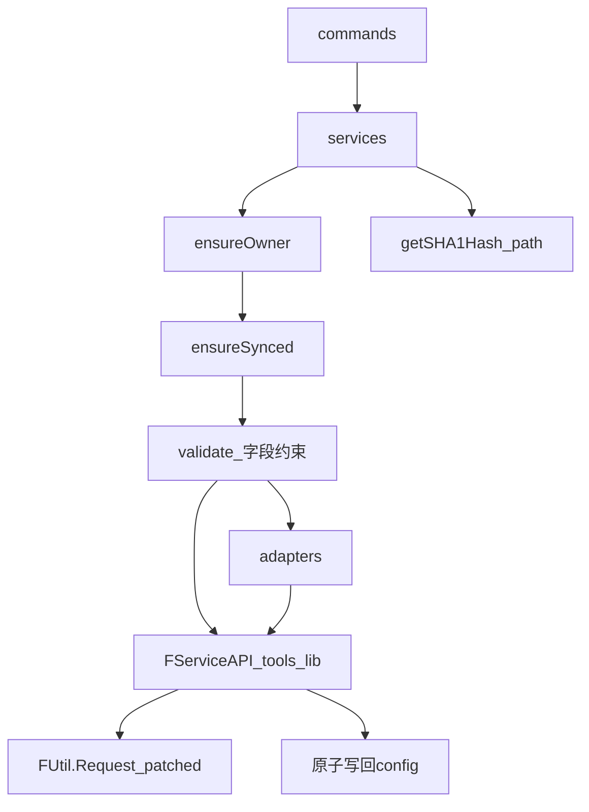

# 开发设计：总览与模块

> 实现入口：[02-命令规格](./02-命令规格.md) · **技术选型**：[10](./10-技术选型.md) · CLI 横切：[08](./08-CLI工程约定.md) · 业务×CLI：[09](./09-业务与CLI技术结合.md)

## 1. 目标架构

```text
commands/*              argv、TTY/--yes、确认、spinner、exit 映射、打印
services/*              ensureOwner → ensureSynced → validate → API → 写回 config
adapters/*              纯形状转换（无 IO）
@freelog/tools-lib      FServiceAPI（除签约/支付外全部用此包；源码见 freelogfe-web-repos）
platform/bootstrap.ts   patch FUtil.Request → Node Bearer
platform/tool/*         路径 getSHA1Hash（File API 适配）
config IO               原子读写 freelog.*.config（禁止写 token）
```



分层禁令与 CliError 见 [08](./08-CLI工程约定.md)。栈与契约见 [10-技术选型](./10-技术选型.md)。

## 2. 写命令统一管线

```text
1. ensureOwner()       → exit 2
2. ensureSynced()      → 冲突 exit 3；落后默认 auto-pull
3. 字段/业务校验       → exit 4
4. 授权门禁（若适用）  → exit 5
5. 执行意图 → API
6. 原子写回缓存（含 owner / draftSync）
```

细节：[01-Owner与同步](./01-Owner与同步.md)

## 3. 模块落点

| 模块 | 路径（目标） | 说明 |
|------|-------------|------|
| CLI 横切 | commands 公共 helper | `--cwd`/`--yes`/`--json`、CliError、TTY |
| Owner / Sync | `src/services/syncService.ts` | [01](./01-Owner与同步.md) |
| 字段校验 | `src/services/validation/` | [03](./03-字段约束.md) |
| 草稿防腐层 | `src/adapters/versionDraftAdapter.ts` | [04](./04-草稿转换层.md) |
| draft 命令 | `src/commands/draft.ts` | push / pull / discard |
| 平台 API | `@freelog/tools-lib` → `FServiceAPI` | 除签约/支付外全量；含 drafts |
| Request 适配 | `src/platform/bootstrap.ts` | Node Bearer 替换 `FUtil.Request` |
| SHA1 路径适配 | `src/platform/tool/getSHA1Hash.ts` | 浏览器 `File` → 本地路径 |
| 配置类型 | `public/freelog.*.ts` | userId / username / draftSync |

## 4. 退出码

| Code | 含义 |
|------|------|
| 0 | 成功或用户取消确认 |
| 2 | 未登录 / Owner 不符 |
| 3 | 同步或草稿冲突 |
| 4 | 字段/业务校验 / 缺参 |
| 5 | 依赖授权未完成 |
| 1 | 其它错误 |

完整约定（stdout/json/原子写等）→ [08](./08-CLI工程约定.md)。

## 5. 文档关系

| 问题 | 文档 |
|------|------|
| 技术栈 / 与 Console 同源 | [10-技术选型](./10-技术选型.md) |
| 有哪些命令 | [产品/02-命令面](../产品设计/02-命令面.md) |
| 用户怎么串 | [产品/03-用户流程](../产品设计/03-用户流程.md) |
| 每命令业务步骤 | [02-命令规格](./02-命令规格.md) |
| CLI 工程注意点 | [08](./08-CLI工程约定.md) + [09 业务结合](./09-业务与CLI技术结合.md) |
