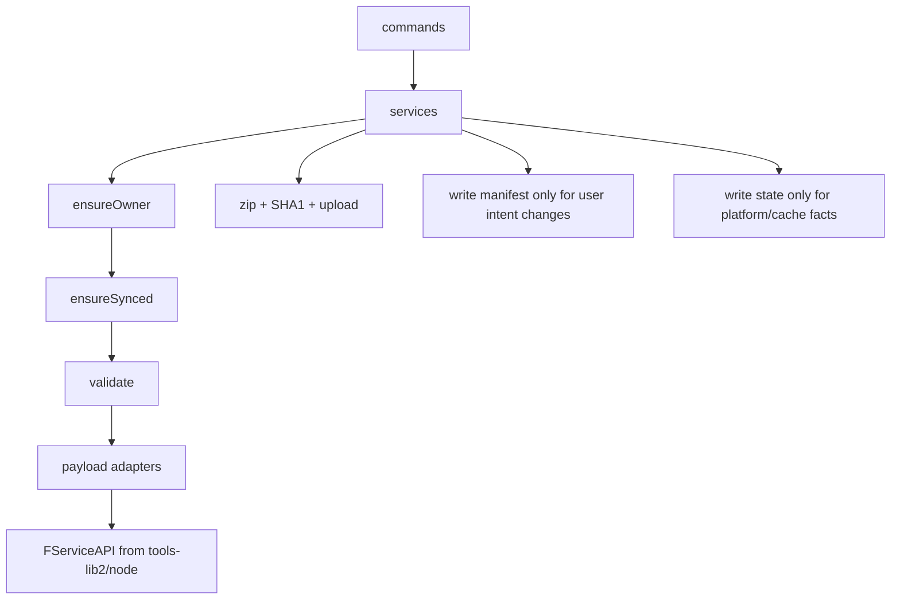

# 开发设计：总览与模块

> 主设计：[14 无旧负担脚手架目标设计](./14-无旧负担脚手架目标设计.md) · 拓扑：[15 资源生命周期拓扑设计](./15-资源生命周期拓扑设计.md) · 命令规格：[02](./02-命令规格.md)

本文是实现入口，只描述目标态。新 CLI 不兼容旧配置文件，不执行用户 JS/TS 配置。

## 1. 目标架构

```text
commands/*                 argv、TTY/--yes、确认、spinner、exit 映射、打印
services/*                 ensureOwner -> ensureSynced -> validate -> API -> 写回 state/manifest
adapters/*                 纯形状转换：manifest <-> Console 同形 payload / draftData
platform/tools-lib.ts      唯一 import '@freelog/tools-lib2/node' 的入口
platform/bootstrap.ts      FUtil.configurePlatform(env/token/error mapping)
platform/tool/*            本地路径 SHA1、zip、upload 前处理
config/manifest.ts         读写 freelog.manifest.json，用户意图
config/state.ts            读写 .freelog/state.json，CLI 状态
```



## 2. 本地文件边界

| 文件 | 所有者 | 可提交 | 内容 |
|---|---|---:|---|
| `freelog.manifest.json` | 用户 | 是 | 资源意图、版本意图、依赖、策略声明、合集目录展示规则 |
| `.freelog/state.json` | CLI | 否 | resourceId、完整 resourceName、owner、latestVersion、fileSha1、draftSync、平台缓存 |
| `template.manifest.json` | 模板包 | 是 | 模板 id、运行时档位、模板文件路径，不参与资源发布 |

实现约束：

1. `pull` 刷新 state，可按显式参数更新 manifest 的平台基线，但不得整文件覆盖用户意图。
2. `publish` 成功后写 state 中的版本、文件、latestVersion 信息；不把平台事实塞回用户意图字段。
3. `draftSync` 只在 `.freelog/state.json`。
4. token/cookie 永不写入项目文件。

## 3. 写命令统一管线

```text
1. loadContext(cwd)          -> manifest + state + auth + env
2. ensureOwner()            -> exit 2
3. ensureSynced()           -> 冲突 exit 3；仅落后默认 auto-pull
4. validateIntent()         -> exit 4
5. authorizationGate()      -> 依赖授权缺口 exit 5
6. execute()                -> FServiceAPI / 文件处理
7. persist()                -> 原子写 manifest/state
```

哪些命令需要 Owner/Sync 见 [01](./01-Owner与同步.md) 与 [02](./02-命令规格.md)。

## 4. 模块落点

| 模块 | 路径目标 | 说明 |
|---|---|---|
| CLI 横切 | `src/commands/_shared/` | `--cwd`、`--yes`、`--json`、TTY、CliError |
| Manifest | `src/config/manifest.ts` | schema 校验、默认值、原子写 |
| State | `src/config/state.ts` | state schema、缓存、draftSync、原子写 |
| Context | `src/services/context.ts` | cwd、auth、env、manifest/state 聚合 |
| Owner / Sync | `src/services/syncService.ts` | 平台 owner 与本地 state 对齐 |
| 字段校验 | `src/services/validation/` | 资源类型、文件、策略、合集字段 |
| 发布 | `src/services/publishService.ts` | zip、sha1、upload、createVersion |
| 草稿 | `src/adapters/versionDraftAdapter.ts` + `src/services/draftService.ts` | 单品发版草稿 |
| 合集目录 | `src/services/collectionService.ts` | catalogue drafts、updateCollection |
| 平台 API | `src/platform/` | 封装 tools-lib2 Node 入口和错误映射 |

## 5. 退出码

| Code | 含义 |
|---:|---|
| 0 | 成功或用户取消确认 |
| 2 | 未登录、登录环境不匹配、Owner 不符 |
| 3 | listing / 草稿同步冲突 |
| 4 | 缺参、字段、类型、冻结、业务门禁失败 |
| 5 | 依赖授权未完成或需要 Console 交互 |
| 1 | 网络、未知错误、平台不可用 |

## 6. 不可混用的概念

| 概念 | 正确入口 | 禁止替代 |
|---|---|---|
| 平台资源壳 | `create` | `init` 顺手创建 |
| 本地发版意图 | 编辑 manifest / `version set` | 平台草稿自动保存 |
| 平台发版草稿 | `draft push/pull/discard` | `publish` 参数 |
| 正式版本 | `publish` | `draft push` |
| listing 基础信息 | `update` | `online` |
| 上架 | `online` 严格门禁 | 普通 update 改 status |
| 合集目录草稿 | `collection item *` | 单品发版草稿 adapter |

## 7. 文档关系

| 问题 | 文档 |
|---|---|
| 产品原则、用户任务 | [产品设计/01](../产品设计/01-结论与原则.md) |
| 用户可见命令 | [产品设计/02](../产品设计/02-命令面.md) |
| 端到端流程 | [产品设计/03](../产品设计/03-用户流程.md) |
| 数据字段 | [06 Manifest 与 State 字段](./06-Config字段.md) |
| 工程横切 | [08 CLI 工程约定](./08-CLI工程约定.md) |
| Console 对齐 | [05 页面覆盖](./05-Console页面覆盖.md) 与 [产品设计/05](../产品设计/05-Console与CLI对照.md) |
