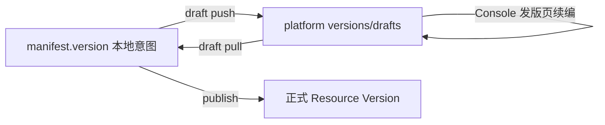

# 开发设计：草稿转换层

> 单品发版草稿专用。合集目录草稿走 `collection item *`，不使用本文 adapter。字段约束见 [03](./03-字段约束.md)。

## 1. 三态



| 态 | 存储 | 命令 | Console 是否可见 |
|---|---|---|---:|
| 本地发版意图 | `freelog.manifest.json` | `version set` / `dep *` / 手改 manifest | 否 |
| 平台发版草稿 | `GET/POST/DELETE .../versions/drafts` | `draft push/pull/discard` | 是 |
| 正式版本 | `.../versions/{version}` | `publish` / `version edit` | 是 |

`draftSync` 是 CLI 对最近一次草稿同步的指纹记录，只能写在 `.freelog/state.json`。

## 2. API

| 能力 | FServiceAPI | 要求 |
|---|---|---|
| 查草稿 | `Resource.lookDraft` 或同等函数 | 无草稿按空处理；404 不是硬错误 |
| 存草稿 | `Resource.saveVersionsDraft` | POST body `{ resourceId, draftData }` |
| 删草稿 | `Resource.deleteResourceDraft` | DELETE |

CLI 需要通过 `@freelog/tools-lib2/node` 调用，不新增平行 HTTP 封装。

## 3. state 中的 `draftSync`

```ts
type DraftSync = {
  schemaVersion: 1;
  lastFingerprint: string;
  lastRemoteUpdateDate?: string;
  lastPushedAt?: string;
  lastPulledAt?: string;
};
```

维护规则：

1. `draft push` 成功：写 `lastFingerprint`、`lastRemoteUpdateDate`、`lastPushedAt`。
2. `draft pull` 成功：写 `lastFingerprint`、`lastRemoteUpdateDate`、`lastPulledAt`。
3. `draft discard` 成功：删除 `draftSync`。
4. `version set`、`dep *`、手改 manifest：不改 `draftSync`。

## 4. 规范化与指纹

参与指纹的字段：

```ts
type CanonicalDraft = {
  versionInput: string;
  selectedFileInfo: { name: string; sha1: string } | null;
  descriptionEditorInput: string;
  directDependencies: { id: string; name: string; type: string; versionRange: string }[];
  baseUpcastResources: { resourceID: string; resourceName: string }[];
  additionalProperties: { key: string; value: string }[];
  customProperties: { key: string; name: string; value: string; description: string }[];
  customConfigurations: {
    key: string;
    name: string;
    description: string;
    type: "input" | "select";
    input: string;
    select: string[];
  }[];
};
```

规则：

1. 字符串 trim，空值归一为 `""` / `[]` / `null`。
2. 数组按稳定 key 排序。
3. object key 稳定排序后 JSON stringify。
4. SHA-256 生成小写 hex 指纹。
5. 同一逻辑内容字段顺序不同，指纹必须相同。

## 5. manifest -> draftData

| draftData 字段 | 来源 | 规则 |
|---|---|---|
| `versionInput` | `manifest.version.version` | 缺省 `""` |
| `selectedFileInfo` | state.version.fileSha1 + filename | 二者都有才写；`draft push --upload` 可先上传 |
| `descriptionEditorInput` | `manifest.version.description` | 纯文本 |
| `directDependencies` | `manifest.version.dependencies` | resource 依赖；按 Console shape |
| `baseUpcastResources` | `manifest.version.baseUpcastResources` | 字段名转换 |
| `additionalProperties` | `manifest.version.inputAttrs` | object 转 `{key,value}` |
| `customProperties` | readonly descriptors | `readonlyText` |
| `customConfigurations` | editable/select descriptors | `editableText` -> input，其它 -> select |
| `videoCover` | P1 暂不支持 | 不写；平台需要时再补 |

`draft push` 默认不读取 `version.filePath`，除非传 `--upload`。这样允许只同步版本号/说明/依赖草稿。

## 6. draftData -> manifest

| manifest 字段 | 来源 |
|---|---|
| `version.version` | `versionInput` |
| `version.description` | `descriptionEditorInput` |
| `version.dependencies` | `directDependencies` 中 resource 类型 |
| `version.baseUpcastResources` | `baseUpcastResources` |
| `version.inputAttrs` | `additionalProperties` |
| `version.customPropertyDescriptors` | `customProperties` + `customConfigurations` |

保留规则：

1. `version.filePath` 永不被 `draft pull` 清空或改写。
2. `state.resource.*` 永不由草稿覆盖。
3. `selectedFileInfo` 只写 state.version.fileSha1/filename，不写 manifest。

有损规则：

1. Console 的 radio/checkbox 回到 CLI 后统一成为 select。
2. `type === "object"` 的依赖项跳过并 warn；CLI P0 只处理资源依赖。

## 7. `draft push` 冲突算法

```text
ensureOwner
if --upload: upload manifest.version.filePath -> state.version.fileSha1/filename in memory
localDraft = toDraftData(manifest, state)
localFp = fingerprint(localDraft)
remote = lookDraft(resourceId)

remote 不存在:
  save localDraft
  write draftSync
  return 0

--force:
  save localDraft
  write draftSync
  return 0

remoteFp = fingerprint(remote.draftData)
sync = state.version.draftSync

localFp == remoteFp:
  refresh draftSync
  return 0

sync 为空:
  exit 3，提示 draft pull / draft push --force / draft discard

localDirty = localFp != sync.lastFingerprint
remoteDirty = remoteFp != sync.lastFingerprint
  or remote.updateDate != sync.lastRemoteUpdateDate

localDirty && remoteDirty -> exit 3
!localDirty && remoteDirty -> exit 3
localDirty && !remoteDirty -> save localDraft; write draftSync; return 0
else -> save localDraft; write draftSync; return 0
```

`--force` 在 TTY 下需要确认；CI 必须同时传 `--force --yes`。

## 8. `draft pull`

```text
ensureOwner
remote = lookDraft(resourceId)
remote 不存在 -> exit 4
applyDraftToManifest(remote.draftData)
write manifest
write state.version.fileSha1/filename if selectedFileInfo exists
write state.version.draftSync
```

若本地 manifest 与远端草稿都有变更，默认 exit 3；`--force` 表示接受远端覆盖 manifest.version 中的草稿字段，但仍保留 filePath。

## 9. `draft discard`

```text
ensureOwner
delete remote draft
delete state.version.draftSync
```

无远端草稿时可以 warn + exit 0。

## 10. status 展示

人读：

```text
平台发版草稿: 有  updateDate=...
本地草稿同步: 从未同步 / 已同步 / 本地有未 push 变更 / 平台有更新 / 双端冲突
建议: freelog-cli draft pull
```

JSON：

```json
{
  "platformVersionDraft": {
    "exists": true,
    "updateDate": "...",
    "fingerprint": "..."
  },
  "localDraftSync": null,
  "draftAdvice": "pull_or_force_push_or_discard"
}
```

Console 发版页有 300ms 自动保存；CLI 永不自动保存。远端有草稿但本地无 `draftSync` 时，`status` 必须显式提示，这通常代表 Console 写过草稿。

## 11. 自测清单

| # | 场景 | 期望 |
|---|---|---|
| 1 | 无远端草稿，`draft push` | 成功，state 写 draftSync |
| 2 | push 后 Console 改说明，`draft pull` | manifest.description 更新，filePath 保留 |
| 3 | push 后本地改、远端未改 | push 快进成功 |
| 4 | push 后本地和远端都改 | 无 force exit 3 |
| 5 | 远端有草稿，本地从未同步 | push 无 force exit 3 |
| 6 | `draft push --upload` | selectedFileInfo 可在 Console 看到 |
| 7 | `draft discard` | 远端无草稿，state 无 draftSync |
| 8 | 指纹字段乱序 | 指纹一致 |
| 9 | radio/checkbox 往返 | 变 select 且 warn |
| 10 | 换账号操作 | exit 2 |

## 12. 二期：合集发版表单草稿

合集目录草稿 P0 已由 `collection item *` 管理。若后续要支持合集“发版表单草稿”，单独新增 `collection draft push/pull/discard` 和 `collectionVersionDraftAdapter`，复用本文指纹模型，但不能与单品 `draft *` 混用。
