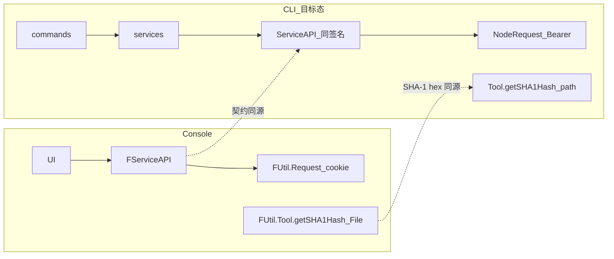

# 开发设计：技术选型（目标态 / 最佳实践）

> **立场**：2026 最佳实践 + Console 同源契约；**目标态 only**（已备份 → 工作树不保留旧 CLI 布局/双轨）。  
> 仓库 → [12-仓库与发布管理](./12-仓库与发布管理.md) · API → [API/API迁移清单](./API/API迁移清单.md)

---

## 0. 总原则

| # | 原则 | 定稿 |
|---|------|------|
| 1 | **业务 API 与 Console 同源** | 路径 / Method / Body / 字段名以 `@freelog/tools-lib` 的 `FServiceAPI.*` 为准；调用顺序对齐 Console（含上传前 sha1 → `fileIsExist` → `getResourceBySha1`） |
| 2 | **工具语义同源、运行时适配** | Console 用 `FUtil.Tool.getSHA1Hash(File)`；CLI 提供**同算法、同 hex 结果**的 Node 实现，对外仍叫 `getSHA1Hash`（路径入参），禁止另起一套 hash 语义 |
| 3 | **不整包吃浏览器 tools-lib** | `FUtil.Request` 绑 cookie / `window` / React；CLI 用可注入的 Node Request（Bearer），**API 面**仍镜像 `FServiceAPI` |
| 4 | **薄命令、厚可测核心** | `commands` 只做 argv/TTY/exit；业务在 `services`；形状转换在 `adapters`；纯函数可单测 |
| 5 | **CI 优先** | 全主路径 flags + `--yes`；TTY 可选；统一退出码 |



---

## 1. 平台契约层（最高优先级）

### 1.1 权威来源

| 优先级 | 来源 | 用途 |
|--------|------|------|
| 1 | `packages/@freelog/tools-lib/src/service-API/*.ts` | URL、Method、参数类型 |
| 2 | Console `pages/resource` + models 实际调用 | 调用顺序、可选字段、门禁 |
| 3 | 本仓库 [API 对照表](./API/Console资源页API对照表.md) | 实现核对清单 |

**禁止**以旧手写文档或「CLI 历史路径」覆盖 tools-lib。

### 1.2 目标模块形态（推荐）

长期理想（可跨仓）：

```text
@freelog/service-api          # 纯函数：createXxx(params) → { method, url, data|params }
  + 可注入 Request            # Console: cookie axios；CLI: Bearer ofetch/axios
@freelog/platform-utils       # getSHA1Hash 双端实现（见 §2）
```

短期（CLI 仓内亦可先落地）：

```text
src/platform/
  service-api/     # 自 tools-lib 镜像：Resource / Storage / Contract / Rss …
  request.ts       # Node Request 适配器（替换 FUtil.Request）
  tool/
    getSHA1Hash.ts # 与 FUtil.Tool.getSHA1Hash 语义对齐
```

命名建议：业务代码写 `ServiceAPI.Resource.info(...)` / `PlatformTool.getSHA1Hash(filePath)`，**对照表与注释标明对应** `FServiceAPI` / `FUtil.Tool`。

### 1.3 为何不 `import { FServiceAPI, FUtil } from '@freelog/tools-lib'`

| 阻塞 | 说明 |
|------|------|
| Request | `withCredentials` + cookie；CLI 为 Bearer / 文件 token |
| 错误处理 | `window.location.replace`（未登录 / 冻结）在 Node 崩溃 |
| 域名 | 无 `window` 时 domain 逻辑易锁死 test |
| `getSHA1Hash` | 入参 `File` + `FileReader` + `self.crypto.subtle`，Node 不能直接调 |
| 包入口 | 无 node/`exports` 分包；会拖进 React / i18n / cookie |

**定稿**：契约同源、包不整引；优先推动 tools-lib **拆出无 DOM 的 service-api**（跨仓），CLI 先镜像同签名。

---

## 2. SHA1：与 Console `FUtil.Tool.getSHA1Hash` 对齐

### 2.1 Console 现状（权威行为）

```ts
import { FServiceAPI, FUtil } from '@freelog/tools-lib';

const sha1 = await FUtil.Tool.getSHA1Hash(file); // File → SHA-1 → 小写 hex
await FServiceAPI.Storage.fileIsExist({ sha1 });
await FServiceAPI.Resource.getResourceBySha1({ fileSha1: sha1 });
```

实现（tools-lib `utils/tools.ts`）：`FileReader.readAsArrayBuffer` → `crypto.subtle.digest('SHA-1', …)` → hex。

### 2.2 CLI 目标 API（同语义）

```ts
import { ServiceAPI, PlatformTool } from '../platform';

const sha1 = await PlatformTool.getSHA1Hash(absolutePath); // 文件字节 → 同算法 hex
await ServiceAPI.Storage.fileIsExist({ sha1 /* 字段名跟 tools-lib */ });
await ServiceAPI.Resource.getResourceBySha1({ fileSha1: sha1 });
```

| 项 | 定稿 |
|----|------|
| 算法 | **SHA-1**（与 Web Crypto `SHA-1` 一致，非 MD5/SHA-256） |
| 输出 | 小写 hex 字符串（与 Console 一致） |
| 输入 | Node：`string` 路径或 `Uint8Array` / `Readable`；**不**要求 `File` |
| 实现 | 优先 `node:crypto` `createHash('sha1')` 流式读文件（大文件友好）；单测与 Console 对同一 fixture 字节比对 hex |
| 调用序 | 与 Console 上传链一致：sha1 → exist →（可选）getBySha1 → upload → createVersion |
| 禁止 | 另造 `md5` 当平台文件指纹；或跳过 exist 检查改变平台去重语义 |

验收：同一二进制文件，浏览器 `getSHA1Hash(File)` 与 CLI `getSHA1Hash(path)` **hex 全等**。

---

## 3. 运行时与语言

| 项 | 选型 | 理由 |
|----|------|------|
| Runtime | **Node.js ≥ 22**（LTS；最低兼容可写 ≥20） | 与现代 TS/工具链对齐；原生更好 ESM/`parseArgs` |
| 语言 | **TypeScript 5.x**，`strict: true` | 契约类型从 tools-lib 镜像 |
| 模块 | **仅 ESM**（`"type": "module"`） | 2026 CLI 默认；不做 CJS 双轨 |
| 包管理 | **pnpm** | workspace / 锁文件稳定 |
| 目标 OS | Windows / macOS / Linux 一等 | 资源作者多 Win；CI 至少 Win+Linux |
| 仓库形态 | **pnpm monorepo + Changesets** | 详见 **[12-仓库与发布管理](./12-仓库与发布管理.md)** |

---

## 4. CLI 框架与交互

| 项 | 选型 | 不选 / 备注 |
|----|------|-------------|
| 命令解析 | **citty**（`defineCommand` + 懒加载子命令） | oclif 过重；yargs 体积大。若团队强依赖现有 commander 生态可二选一，**新方案默认 citty** |
| 提示 | **@clack/prompts**（仅 TTY） | 替代沉重 inquirer 默认问卷；非 TTY / `--yes` 禁止进入 |
| 日志人读 | **consola** | 统一 success/info/warn/error；尊重 `NO_COLOR` |
| 进度 | **ora** 或 consola spinner | 仅 TTY；`--json` 禁用 |
| 表格 | **cli-table3** 或简洁列打印 | 列表类可选 |

工程约定仍服从 [08](./08-CLI工程约定.md)：exit 码、stdout/stderr 分流、`--json`。

---

## 5. HTTP / 鉴权 / 上传

| 项 | 选型 | 定稿 |
|----|------|------|
| HTTP 客户端 | **ofetch**（或 axios，二选一锁定） | 默认 **ofetch**：timeout、error 形态清晰；团队更熟 axios 亦可，**全仓唯一** |
| 鉴权 | **Bearer token**（workspace > global） | 不走浏览器 cookie；与 Console 会话模型不同，**仅传输层差异** |
| baseURL | 显式 env / login 写入（prod/test） | 禁止无 window 时静默锁 test |
| 上传 | **multipart**：Node `FormData` + `Blob`/`fs` 流 或 `form-data` | 字段名/路径对齐 `FServiceAPI.Storage.uploadFile` |
| 超时 | 普通 60s；可选链 上传/publish 300s | 见 08 |
| 错误 | 解析平台 `ret` / `errCode` / `msg` / `data` | 映射退出码见 09；**禁止** `window` 跳转 |

Request 适配器职责 = Console 侧 `FUtil.Request`：**同一套 ServiceAPI 函数只换 transport**。

---

## 6. 校验、配置、声明式文件

| 项 | 选型 |
|----|------|
| 运行时 schema | **Zod**（`policy.json`、`auth-map`、命令 flags 聚合校验） |
| YAML | **yaml**（`yaml` 包 parse/stringify；Phase5 `--policy-map`） |
| 本地 config | 继续 `freelog.*.config`（js/ts/cjs）；读写用原子 rename；**Zod 或类型守卫**校验关键字段 |
| semver | **semver** 包（与 Console 发版规则一致） |
| 指纹（草稿） | `node:crypto` createHash('sha256') + stable stringify（见 04） |

---

## 7. 构建、测试、质量

| 项 | 选型 | 理由 |
|----|------|------|
| 构建 | **tsdown** 或 **unbuild** | 现代 TS 库/CLI 打包；替代过时 father 默认路径 |
| 测试 | **Vitest** | 快、ESM 友好；单测 adapter/ServiceAPI mock |
| HTTP mock | **msw** 或 ofetch mock / nock | 契约测试按 tools-lib 路径断言 |
| E2E | `execa` 拉起 `node dist/bin` | 断言 exit code + stdout JSON |
| Lint/format | **ESLint** flat + **Prettier**（或 oxlint+oxfmt 若团队接受） | |
| CI | GitHub Actions：Node 22 × Ubuntu + Windows | 覆盖路径与 `--cwd` |

分层测试要求：ServiceAPI 契约测、getSHA1Hash 字节黄金样例、写管线 Owner/Sync、防抖 status 样例（见 04/07/08）。

---

## 8. 目标目录（实现骨架）

```text
src/
  bin/index.ts                 # shebang → runMain
  commands/                    # citty 命令，无 HTTP
  services/                    # 业务编排
  platform/
    service-api/               # ≅ FServiceAPI.*
    request.ts                 # ≅ FUtil.Request（Node）
    tool/getSHA1Hash.ts        # ≅ FUtil.Tool.getSHA1Hash
  adapters/                    # versionDraftAdapter 等
  config/                      # 原子读写
tests/
  unit/
  contract/                    # 与 tools-lib 路径/body 快照
  e2e/
```

---

## 9. 历史脏层（承认现状，目标态不继承）

此前未按「与 Console 统一接口库」设计，下列均为**债务**，不是目标架构：

| 脏层 | 问题 | 清理 |
|------|------|------|
| `src/api/**` 手写路径 | 与 `FServiceAPI` 分叉（Method/Body/URL） | 新建 `platform/service-api` 后 **删除** |
| 独立 sha1/upload 旁路 | 未对齐 `getSHA1Hash` + Storage 链 | 统一 `PlatformTool` + `ServiceAPI.Storage` |
| 文档写 `freelogRequest` + 旧函数 `@deprecated` 双轨 | 鼓励长期共存 | **禁止** API 双轨；命令面亦不兼容旧 CLI |
| 以「修几个错接口」当终态 | 治标不治本 | 整层换成同源接口库 |

清单与步骤 → [API/API迁移清单](./API/API迁移清单.md)。

### 与旧文档口径

| 旧表述 | 新定稿 |
|--------|--------|
| 「不依赖 tools-lib，手写任意 api」 | **不整包依赖**；**必须** `FServiceAPI` 同签名 |
| 「CLI 自有 sha1 即可」 | 对齐 `FUtil.Tool.getSHA1Hash` + 同上传链 |
| 「沿用 commander/axios/jest/father」 | 目标态 §3–§7；**不以现状为准** |
| 「旧 api / 旧目录过渡共存」 | **直接删**；只留 `packages/cli` + `platform/ServiceAPI` |

冲突时：**本文件 + 迁移清单目标态** > 任何「现状修补」描述。

---

## 10. 明确不做（技术向）

- 在 CLI 进程加载完整 `@freelog/tools-lib` 浏览器包  
- 用 cookie/`js-cookie` 冒充 Console 登录  
- 复刻微应用 / fPolicyBuilder3 / SSE  
- 为「省事」改用 MD5 或跳过 `fileIsExist`  
- 引入 Electron「内嵌 Console」完成签约  

---

## 11. 验收（选型落地）

1. 任意资源写接口：CLI `ServiceAPI.X` 与 tools-lib `FServiceAPI.X` 的 method/url/关键字段一致（契约测试）。  
2. 同一文件 sha1：CLI hex === Console `FUtil.Tool.getSHA1Hash` hex。  
3. 上传链顺序与 Console 一致（sha1 → exist → upload → createVersion）。  
4. 无 TTY + `--yes` 主路径可跑；`--json` 无杂讯。  
5. 不出现对 `window` / `document` 的运行时依赖。
