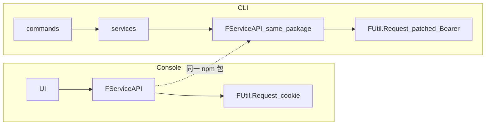

# 开发设计：技术选型（目标态 / 最佳实践）

> **立场**：2026 最佳实践 + Console 同源契约；**目标态 only**（已备份 → 工作树不保留旧 CLI 布局/双轨）。  
> 仓库 → [12-仓库与发布管理](./12-仓库与发布管理.md) · API → [API/API迁移清单](./API/API迁移清单.md)

---

## 0. 总原则

| # | 原则 | 定稿 |
|---|------|------|
| 1 | **安装官方包** | `dependencies` 安装 **`@freelog/tools-lib`**；除**签约 / 支付**外，业务 API **全部**走 `FServiceAPI`（与 Console 同包） |
| 2 | **只换传输层** | 启动时 patch `FUtil.Request` → Node Bearer；**禁止**再手写 Resource/Storage/User… 平行封装 |
| 3 | **Tool 适配** | `getSHA1Hash(File)` 浏览器专用；CLI 对路径文件用同算法 SHA-1 hex 辅助函数，上传链仍调 `FServiceAPI.Storage.*` |
| 4 | **薄命令、厚可测核心** | `commands` / `services` / `adapters` 分层 |
| 5 | **CI 优先** | flags + `--yes`；统一退出码 |



---

## 1. 平台契约层（最高优先级）

### 1.1 权威来源

| 优先级 | 来源 | 用途 |
|--------|------|------|
| 1 | **源码** `D:/appinside/freelogfe-web-repos/packages/@freelog/tools-lib/src`（`service-API/`、`utils/axios.ts`、`domain.ts`、`tools.ts`） | 函数签名、Body、域名；**优于** npm 打包产物（npm 可能缺 `domain.ts` / Rss 等） |
| 2 | **npm `@freelog/tools-lib@0.2.5`** | CLI 运行时；加载前须 stub `window`（旧包顶层读 `window.location`） |
| 3 | Console `…/console/src/pages/resource` + `models/resource*` | 调用序 / 门禁 / 参数组合 |
| 4 | 本仓库 [API 对照表](./API/Console资源页API对照表.md) · [权威源码路径](./API/权威源码路径.md) | 核对清单 |

**范围**：`FServiceAPI` 内 Resource / Storage / User / Policy / Collection / Draft / Rss… **全部直接调用**；**签约、支付本期不做**（不写命令、不手写替代）。

**禁止**手写第二套 `/v2/resources…` 封装替代 `FServiceAPI`。

### 1.2 模块形态（定稿）

```text
dependencies: "@freelog/tools-lib": "<与 Console 对齐的版本>"

src/platform/
  bootstrap.ts     # installToolsLibForNode()：替换 FUtil.Request、设 baseURL/token
  tool/getSHA1Hash.ts   # 仅路径/Buffer 适配（非再实现 Storage API）
```

业务代码：

```ts
import { FServiceAPI, FUtil } from '@freelog/tools-lib';
// bootstrap 已替换 FUtil.Request
await FServiceAPI.Resource.info({ resourceIdOrName });
```

### 1.3 Node 适配点（装包后仍须处理）

| 点 | 做法 |
|----|------|
| `FUtil.Request` 内 `window.location` | CLI 替换整个 `Request` 实现，错误映射为 `CliError`，**不**跳转 |
| cookie / withCredentials | 替换实现改为 Bearer（workspace/global auth） |
| `baseURL` | 按 `--test` / `FREELOG_ENV` 设 prod/test API 域 |
| `getSHA1Hash(File)` | 不直接调；用 CLI 路径版算 hex 后走 `FServiceAPI.Storage.fileIsExist` 等 |

**已废弃的错误设计**：「不安装包、手写镜像 `ServiceAPI`」。那是过度规避；正确做法是 **装包 + patch Request**。

---

## 2. SHA1：与 Console `FUtil.Tool.getSHA1Hash` 对齐

### 2.1 Console 现状（权威行为）

```ts
import { FServiceAPI, FUtil } from '@freelog/tools-lib';

const sha1 = await FUtil.Tool.getSHA1Hash(file); // File → SHA-1 → 小写 hex
await FServiceAPI.Storage.fileIsExist({ sha1 });
await FServiceAPI.Resource.getResourceBySha1({ fileSha1: sha1 });
```

实现（tools-lib `utils/tools.ts`）：`FileReader.readAsArrayBuffer` → `crypto.subtle.digest('SHA-1', …)` → hex。

### 2.2 CLI 目标 API（同包 + 路径 SHA1）

```ts
import { FServiceAPI } from '@freelog/tools-lib';
import { getSHA1Hash } from '../platform/tool/getSHA1Hash'; // 路径适配

const sha1 = await getSHA1Hash(absolutePath);
await FServiceAPI.Storage.fileIsExist({ sha1 });
await FServiceAPI.Resource.getResourceBySha1({ fileSha1: sha1 });
```

| 项 | 定稿 |
|----|------|
| 算法 | **SHA-1**（与 Web Crypto `SHA-1` 一致，非 MD5/SHA-256） |
| 输出 | 小写 hex 字符串（与 Console 一致） |
| 输入 | Node：`string` 路径或 `Uint8Array` / `Readable`；**不**要求 `File` |
| 实现 | 优先 `node:crypto` `createHash('sha1')` 流式读文件（大文件友好）；单测与 Console 对同一 fixture 字节比对 hex |
| 调用序 | 与 Console 上传链一致：sha1 → exist →（可选）getBySha1 → upload → createVersion |
| 禁止 | 另造 `md5` 当平台文件指纹；或跳过 exist 检查改变平台去重语义 |

验收：同一二进制文件，浏览器 `getSHA1Hash(File)` 与 CLI `getSHA1Hash(path)` **hex 全等**。

---

## 3. 运行时与语言

| 项 | 选型 | 理由 |
|----|------|------|
| Runtime | **Node.js ≥ 22**（LTS；最低兼容可写 ≥20） | 与现代 TS/工具链对齐；原生更好 ESM/`parseArgs` |
| 语言 | **TypeScript 5.x**，`strict: true` | 契约类型从 tools-lib 镜像 |
| 模块 | **仅 ESM**（`"type": "module"`） | 2026 CLI 默认；不做 CJS 双轨 |
| 包管理 | **pnpm** | workspace / 锁文件稳定 |
| 目标 OS | Windows / macOS / Linux 一等 | 资源作者多 Win；CI 至少 Win+Linux |
| 仓库形态 | **pnpm monorepo + Changesets** | 详见 **[12-仓库与发布管理](./12-仓库与发布管理.md)** |

---

## 4. CLI 框架与交互

| 项 | 选型 | 不选 / 备注 |
|----|------|-------------|
| 命令解析 | **citty**（`defineCommand` + 懒加载子命令） | oclif 过重；yargs 体积大。若团队强依赖现有 commander 生态可二选一，**新方案默认 citty** |
| 提示 | **@clack/prompts**（仅 TTY） | 替代沉重 inquirer 默认问卷；非 TTY / `--yes` 禁止进入 |
| 日志人读 | **consola** | 统一 success/info/warn/error；尊重 `NO_COLOR` |
| 进度 | **ora** 或 consola spinner | 仅 TTY；`--json` 禁用 |
| 表格 | **cli-table3** 或简洁列打印 | 列表类可选 |

工程约定仍服从 [08](./08-CLI工程约定.md)：exit 码、stdout/stderr 分流、`--json`。

---

## 5. HTTP / 鉴权 / 上传

| 项 | 选型 | 定稿 |
|----|------|------|
| HTTP 客户端 | **ofetch**（或 axios，二选一锁定） | 默认 **ofetch**：timeout、error 形态清晰；团队更熟 axios 亦可，**全仓唯一** |
| 鉴权 | **Bearer token**（workspace > global） | 不走浏览器 cookie；与 Console 会话模型不同，**仅传输层差异** |
| baseURL | 显式 env / login 写入（prod/test） | 禁止无 window 时静默锁 test |
| 上传 | **multipart**：Node `FormData` + `Blob`/`fs` 流 或 `form-data` | 字段名/路径对齐 `FServiceAPI.Storage.uploadFile` |
| 超时 | 普通 60s；可选链 上传/publish 300s | 见 08 |
| 错误 | 解析平台 `ret` / `errCode` / `msg` / `data` | 映射退出码见 09；**禁止** `window` 跳转 |

Request 适配器职责 = Console 侧 `FUtil.Request`：**同一套 ServiceAPI 函数只换 transport**。

---

## 6. 校验、配置、声明式文件

| 项 | 选型 |
|----|------|
| 运行时 schema | **Zod**（`policy.json`、`auth-map`、命令 flags 聚合校验） |
| YAML | **yaml**（`yaml` 包 parse/stringify；Phase5 `--policy-map`） |
| 本地 config | 继续 `freelog.*.config`（js/ts/cjs）；读写用原子 rename；**Zod 或类型守卫**校验关键字段 |
| semver | **semver** 包（与 Console 发版规则一致） |
| 指纹（草稿） | `node:crypto` createHash('sha256') + stable stringify（见 04） |

---

## 7. 构建、测试、质量

| 项 | 选型 | 理由 |
|----|------|------|
| 构建 | **tsdown** 或 **unbuild** | 现代 TS 库/CLI 打包；替代过时 father 默认路径 |
| 测试 | **Vitest** | 快、ESM 友好；单测 adapter/ServiceAPI mock |
| HTTP mock | **msw** 或 ofetch mock / nock | 契约测试按 tools-lib 路径断言 |
| E2E | `execa` 拉起 `node dist/bin` | 断言 exit code + stdout JSON |
| Lint/format | **ESLint** flat + **Prettier**（或 oxlint+oxfmt 若团队接受） | |
| CI | GitHub Actions：Node 22 × Ubuntu + Windows | 覆盖路径与 `--cwd` |

分层测试要求：ServiceAPI 契约测、getSHA1Hash 字节黄金样例、写管线 Owner/Sync、防抖 status 样例（见 04/07/08）。

---

## 8. 目标目录（实现骨架）

```text
src/
  bin/index.ts                 # shim → installToolsLibForNode → runMain
  commands/
  services/                    # 调 FServiceAPI.*（签约/支付除外）
  platform/
    shim-browser.ts            # import 前 window window
    bootstrap.ts               # patch FUtil.Request → Node Bearer
    tool/getSHA1Hash.ts        # 路径 SHA1
  adapters/
  config/
```

---

## 9. 历史脏层（承认现状，目标态不继承）

此前未按「与 Console 统一接口库」设计，下列均为**债务**，不是目标架构：

| 脏层 | 问题 | 清理 |
|------|------|------|
| 手写 `platform/service-api/*` 镜像 | 与「装官方包」冲突 | **删除**；改依赖 `@freelog/tools-lib` |
| 未 patch 就直接调 FUtil.Request | Node 崩 / cookie | 入口必须先 `bootstrap` |
| 旧 `src/api/**` | 分叉 | 删除 |

清单 → [API/API迁移清单](./API/API迁移清单.md)。

### 口径纠错

| 错误表述（已废） | 正确定稿 |
|------------------|----------|
| 「不安装 tools-lib，手写镜像」 | **安装** `@freelog/tools-lib`，业务用 `FServiceAPI` |
| 「CLI 自建全套 api」 | 只维护 Node `Request` patch + 路径 SHA1 |

---

## 10. 明确不做（技术向）

- 手写第二套与 `FServiceAPI` 平行的 Resource API  
- 用未 patch 的默认 `FUtil.Request`（会碰 `window`/cookie）  
- 复刻微应用 / fPolicyBuilder3 / SSE  
- MD5 或跳过 `fileIsExist`  
- Electron 内嵌 Console  

---

## 11. 验收（选型落地）

1. `package.json` 依赖含 `@freelog/tools-lib`；业务 import `FServiceAPI`。  
2. 无自维护的 `service-api/resource.ts` 类镜像层。  
3. 上传链：路径 sha1 → `FServiceAPI.Storage.*` → `FServiceAPI.Resource.createVersion`。  
4. 无 TTY + `--yes`；`--json` 无杂讯。  
5. 运行期不因 `window.location` 崩溃（Request 已替换）。
