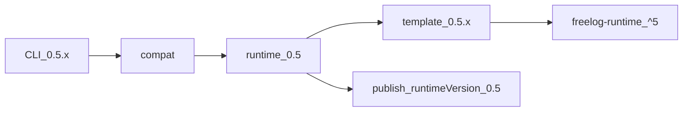

# 开发设计：脚手架与模板（`init`）

> 仓库：`docs/` · `templates/` · `packages/cli`（见 [12](./12-仓库与发布管理.md)）；旧 `freelog-cli-ts` **不保留**  
> 选型 → [10](./10-技术选型.md) · 命令面 → [产品/02](../产品设计/02-命令面.md)

`init` **不调**平台创建资源、**不写** owner；只落工程骨架 + 空 `freelog.*.config`。平台资源用后续 **`create`（按资源类型）**。

### 核心口径（防概念串味）

| 概念 | 定稿 |
|------|------|
| **资源** | 平台一等实体；类型来自 API（`listResourceTypesByGroup` / `getResourceTypeInfoByCode`），含主题、插件、前端库、图片、合集… |
| **主题 / 插件** | 只是资源类型中的两类（需挂 freelog **运行时档位**） |
| **工程模板** | 可选脚手架：给「需要本地工程」的类型用；**主题与插件共用同一套运行时模板**（不是两套产品） |
| **发行管线** | `create` → `updateVersion` → `publish` → `policy` → `online` **对所有资源类型通用**；与是否用过模板无关 |

```text
可选：init + 模板（仅部分类型有）
必经：create(--type <资源类型 code>) → … → publish（通用）
```

**版本是一等公民**（仅对「运行时类」资源有意义）：运行时档 → 模板 `0.4.x`/`0.5.x` → CLI `0.4.x`/`0.5.x`。权威见 freelog-runtime `guide/version.md`。

---

## 1. 职责边界

| 层 | 职责 | 非职责 |
|----|------|--------|
| `init` | 可选：拷模板 / 或只建空 config；写入 `resourceType` 意图 | **不**代替 `create`；不发版 |
| `templates/*` | 主题↔插件 **共用** 运行时工程、前端库工程 | 不是「主题专用发行通道」 |
| `create` / `publish` / … | **通用**资源生命周期（任意 `resourceTypeCode`） | 不关心目录是否来自某模板 |
| `platform/*` | ≅ FServiceAPI（含资源类型查询） | 拷贝脚手架文件 |

```text
init（本地，可选模板） → 空 config（含类型意图 / 可选 runtimeVersion）
create（平台，通用）   → ServiceAPI.Resource.create(resourceTypeCode) → owner
publish（平台，通用） → sha1 链 + createVersion（主题/插件额外带 runtimeVersion）
```

---

## 2. `templates/` 清单（源码仓）

每个目录结构大致：

```text
templates/<id>/
  package.json          # npm 名 @freelog-cli/template-*，可 pub
  template/             # 真正拷给用户的工程（含 EJS）
  template.manifest.json
```

| 目录 | 适用资源类型（平台） | tag（脚手架） | 说明 |
|------|----------------------|---------------|------|
| `vite-*` / `webpack-*`（8 个） | **主题与插件共用** | `runtime`（或同时标 `theme`+`widget`） | 内嵌 `freelog-runtime`；同一套模板 |
| `package-js/react/vue` | 前端库 | `package` | `meta.json` + nameSpace |
| （无模板） | 其余类型 / 合集 | — | `init` 只落 config + 选类型；用户自备文件 |

**定稿**：不要再维护「仅 theme / 仅 widget」两套互斥模板列表；选「主题」或「插件」都进 **同一 runtime 模板池**，差别只在写入的 `resourceType` / `resourceTypeCode`（及 create 时选的类型节点）。

工程共性（runtime 模板）：Vite `base: './'`、dev CORS、webpack `public-path`（微前端）。  
前端库：`meta.json` EJS 注入 `nameSpace`。

---

## 3. 现状 CLI 如何用模板（债务）

| 步骤 | 现状行为 | 问题 |
|------|----------|------|
| 注册表 | `getProjectTemplate()` **硬编码** 11 条 | 与 `templates/` 不同步；版本常写死 `1.0.0`，源包已到 `3.x` |
| 拉取 | `npm install @freelog-cli/template-*` → `~/.freelog-cli/template` | **不读**仓库内 `templates/`；离线/改本地模板需先 pub |
| 包名 | 多处 `template-webapck-*`（拼写错误） | 与目录 `webpack-*` / 正确 npm 名易不一致 |
| 渲染 | 拷 `template/` → EJS（`projectName`/`version`/`nameSpace`…） | 合理，可保留 |
| 依赖安装 | 用户选 npm/pnpm/yarn 再装项目依赖 | 可保留；默认建议 pnpm |
| config | 另写 `freelog.resource/version.config` | 须对齐新 Config（owner 留空） |
| 交互 | 全程 inquirer | 新方案：flags + `--yes` 可非交互 |

`init` 与资源类型：

| 用户意图 | 是否用工程模板 | 类型从哪来 |
|----------|----------------|------------|
| 主题 / 插件 | 是（**共用** runtime 模板池） | 平台类型树中对应节点（或 flag 传 code）；写入 config |
| 前端库 | 是（package 模板） | 前端库类型 code |
| 其余单品资源 | 否（空壳） | **`listResourceTypesByGroup`** 交互或 `--resource-type` |
| 合集 | 否（collection 空壳） | 合集类型 code |

发行侧**不再**分「模板通道 / 非模板通道」：一律 `create` + 通用 publish。

---

## 4. 版本统一策略（定稿：一律 `0.4.x` / `0.5.x` 开头）

平台运行时档位已是 **0.4 / 0.5**。为少混乱，**本仓库可控的版本号全部与档位对齐**：

| 对象 | 版本号规则 | 例子 |
|------|------------|------|
| 平台运行时档位（声明给节点） | 两位档：`0.4` \| `0.5` | config `runtimeVersion: "0.5"` |
| CLI `@freelog-cli/cli` | **`0.<档>.<patch>`**（semver） | 主推线 `0.5.3`；维护旧线则发 `0.4.x` 包 |
| 模板 `@freelog-cli/template-*` | **同档：`0.5.x` / `0.4.x`** | 0.5 主题模板 `0.5.2`；0.4 线模板 `0.4.1` |
| 前端库等无运行时模板 | 跟随时主推 CLI 档，或单独 `0.5.x` | `package-vue@0.5.0` |
| 资源发版 semver | **仍独立**（`1.0.0`…） | 与运行时档无关 |

**一眼法则**：看到 `0.5.*` → 服务运行时 **0.5**；`0.4.*` → 运行时 **0.4**。不再出现「CLI 1.2 + 模板 3.0 + 运行时 0.5」三套数字。

### 4.0 唯一例外：`freelog-runtime` npm 库

平台文档映射（库不在本仓改号则保持）：

| 运行时档 | npm 依赖 |
|----------|----------|
| 0.5 | `freelog-runtime@^5.x` |
| 0.4 | `freelog-runtime@^4.x` |

模板 `package.json` 里写 `^5` / `^4`；**对外沟通仍说「0.5 模板 / 0.5 CLI」**，在文档/compat 里写清 `freelogRuntimeRange`，用户不必记「5=0.5」。若日后库方也改成 `0.5.x` 发包，再同步改 range。

### 4.1 三层仍在，只是号码同源

| 层 | 名称 | 形态 | 谁消费 |
|----|------|------|--------|
| A | 平台运行时档位 | `0.4` / `0.5` | 节点加载；主题与插件同档 |
| B | CLI | `0.5.x` / `0.4.x` | 自带 compat；默认 runtime = 版本第二位 |
| C | 模板包 | 同档 `0.5.x` / `0.4.x` | 工程骨架 |

```text
CLI 0.5.3
  └─ defaultRuntime = 0.5（取自版本 0.5.*）
  └─ compat.runtimes["0.5"].templates["vite-vue-ts"] = @…/template-vite-vue-ts@0.5.2

CLI 0.4.1（旧线，若仍发布）
  └─ defaultRuntime = 0.4
  └─ 只解析 0.4.* 模板
```



| 规则 | 定稿 |
|------|------|
| 选 runtime 模板（主题或插件） | `--runtime` 默认 = CLI 第二位；主题/插件 **同一** `runtimes["0.5"].templates` |
| 主推 CLI | 只发 **`0.5.x`**；compat 以 0.5 runtime 模板为主 |
| 模板发包 | `0.5.*` / `0.4.*` 与档对齐；禁止再发 `1.x`/`3.x` |
| 同一 CLI | 只按本包 compat 拉模板 |
| **publish（通用）** | 任意资源类型同一套命令；**仅当**类型为主题/插件（或平台标明需运行时）时强制 `runtimeVersion`，否则不传 |

### 4.2 compat 表落点

```text
packages/cli/compat/template-compat.json
```

```json
{
  "schemaVersion": 1,
  "cliVersion": "0.5.3",
  "defaultRuntime": "0.5",
  "runtimes": {
    "0.5": {
      "freelogRuntimeRange": "^5.0.7",
      "templates": {
        "vite-vue-ts": { "npmName": "@freelog-cli/template-vite-vue-ts", "version": "0.5.2" },
        "vite-react-ts": { "npmName": "@freelog-cli/template-vite-react-ts", "version": "0.5.2" }
      }
    },
    "0.4": {
      "freelogRuntimeRange": "^4.1.9",
      "templates": {
        "vite-vue-ts": { "npmName": "@freelog-cli/template-vite-vue-ts", "version": "0.4.1" }
      }
    }
  },
  "noRuntime": {
    "templates": {
      "package-vue": { "npmName": "@freelog-cli/template-package-vue", "version": "0.5.0" }
    }
  }
}
```

校验（实现必做）：

- `cliVersion` 必须匹配 `^0\.(4|5)\.\d+`  
- `runtimes["0.5"].templates[*].version` 必须匹配 `^0\.5\.`  
- `runtimes["0.4"].templates[*].version` 必须匹配 `^0\.4\.`  
- 不一致 → 构建失败 / init exit 4  

解析：compat → `npmName@version` → 缓存；本地 `templates/` 开发时 manifest.`runtimeVersions` 须含所选档。

### 4.3 升级与发布纪律

| 变更 | 动作 |
|------|------|
| 模板小改（同档） | 模板 `0.5.x` patch++；compat 同条 bump；CLI 可只 patch 或不动 |
| 新运行时档（如未来 0.6） | CLI/模板开 `0.6.x` 线；compat 新键 `"0.6"` |
| 弃用 0.4 | 新 CLI `0.5.x` 的 compat 去掉 `"0.4"`；历史 `0.4.*` 包留在 npm 给旧用户 |
| 历史 npm 上的 `1.x`/`3.x` 模板 | **不再 bump**；compat 不再引用；新线从 `0.5.0` / `0.4.0` 重发 |

**禁止**：再引入与档位无关的 major（1/2/3…）作为 CLI 或模板主版本。

### 4.4 写入本地项目的字段

`init`（主题/插件）必须写入：

| 位置 | 字段 | 说明 |
|------|------|------|
| `freelog.version.config` | `runtimeVersion` | `"0.5"` / `"0.4"` |
| 同文件或 `.freelog/scaffold-meta.json` | `cliVersion` / `templateId` / `templateVersion` | 可追溯「谁脚手架的」 |
| 工程 `package.json` | `freelog-runtime` | 已由该档模板带好，勿再改成跨档 |

`publish`：主题/插件读取 `runtimeVersion` 传给平台（字段名与 Console 上传「目标版本」对齐；实现前在 API 对照表补一行）。漏传 = 平台当 0.4 → **exit 4 拒发**（theme/widget），不得靠平台默认。

---

## 5. 目标态（重写时定稿）

### 5.1 双源解析

```text
1. 用 compat 表解析 npmName@version（或本地 id）
2. 模板根：
   FREELOG_TEMPLATES_DIR / --templates-dir
   → <repo>/templates/<id>（开发，且 manifest 含该 runtime）
   → npm 安装 npmName@version → ~/.freelog-cli/template/...
```

### 5.2 manifest（每模板）

```json
{
  "id": "vite-vue-ts",
  "npmName": "@freelog-cli/template-vite-vue-ts",
  "title": "Vite Vue TS（主题/插件共用）",
  "tags": ["runtime", "theme", "widget"],
  "version": "0.5.2",
  "runtimeVersions": ["0.5"],
  "freelogRuntimeRange": "^5.0.7",
  "filePath": "dist",
  "startCommand": "pnpm start",
  "ejsIgnore": ["**/public/**"]
}
```

`version` 符合 `0.<档>.*`。`package-*`：tags `package`；走 compat.`noRuntime`。

### 5.3 命令面

```bash
# 主题：共用 runtime 模板 + 类型意图 theme
freelog-cli init my-theme --scaffold runtime --template vite-vue-ts --resource-type <主题code> --pm pnpm --yes

# 插件：同一模板池，换资源类型 code
freelog-cli init my-widget --scaffold runtime --template vite-vue-ts --resource-type <插件code> --yes

# 旧运行时档
freelog-cli init my-legacy --scaffold runtime --template vite-vue-ts --runtime 0.4 --resource-type <code> --yes

# 前端库模板
freelog-cli init my-lib --scaffold package --template package-vue --namespace foo --resource-type <前端库code> --yes

# 无模板：仅空 config + 平台类型（发行仍走通用 create/publish）
freelog-cli init my-photo --scaffold none --resource-type <图片code> --yes
```

| 选项 | 说明 |
|------|------|
| `--scaffold` | `runtime` \| `package` \| `none` \| `collection`（比「假装主题是另一套产品」更贴切） |
| `--template` | compat `id`（runtime/package 时） |
| `--resource-type` | 平台 **resourceTypeCode**（非交互必填；可与类型名 path 辅助） |
| `--runtime` | 仅 `--scaffold runtime`：`0.4` \| `0.5` |
| `--pm` / `--namespace` / `--skip-install` | 同前 |

不做「旧 `--type theme` 兼容层」；统一 `--scaffold` + `--resource-type`。

### 5.4 与 platform

- `init` 不 create；config 写类型意图；runtime 类写 `runtimeVersion`  
- `create --type <code>`：**所有类型同一命令**（内部 `ServiceAPI.Resource.create`）  
- `publish`：**所有类型同一命令**；是否带 `runtimeVersion` 由类型/config 决定  
- 资源类型列表：`ServiceAPI` 对齐 `listResourceTypesByGroup` / `getResourceTypeInfoByCode`  
- sha1 链见 [10](./10-技术选型.md)

### 5.5 模板工程建议

| 项 | 建议 |
|----|------|
| 默认 | 新模板只维护 **0.5** 线；0.4 模板冻结在旧 npm 版本 |
| webpack | legacy；compat 可逐步摘掉 |
| EJS | `projectName` `version` `className` `nameSpace` `initType` `runtimeVersion` |

---

## 6. 重写分期（脚手架）

| 阶段 | 内容 | 验收 |
|------|------|------|
| S0 | `template-compat.json` + manifest（含 runtimeVersions）+ flags `init --runtime` | 0.5 init 写入 runtimeVersion；拉 compat 指定模板版 |
| S1 | 本地 templates/ + npm 精确版本缓存 | 旧 CLI 包内旧 compat 仍指向旧模板 |
| S2 | 主题/插件共用 runtime 模板池；publish 按类型决定是否强制 runtimeVersion | 插件 init 不再「未找到模板」；非运行时资源 publish 不误传档位 |
| S3 | `scaffold none/collection` + 类型 API；去掉 batch 文案 | 任意类型可 create/publish |

---

## 7. 验收清单

| # | 场景 | 期望 |
|---|------|------|
| 1 | CLI `0.5.x` + `--template vite-vue-ts --yes` | 拉 `template@0.5.*`；config.runtimeVersion=`0.5`；依赖 freelog-runtime^5 |
| 2 | `--runtime 0.4`（compat 有） | 拉 `template@0.4.*`；freelog-runtime^4 |
| 3 | compat 误写模板 `3.0.0` | 构建/init 校验失败 |
| 4 | theme publish 无 runtimeVersion | exit 4 |
| 5 | 本地改 templates 且 manifest 含 0.5 | 开发源生效 |
| 6 | package / scaffold none | 不要求 `--runtime` |
| 7 | 同一 `vite-vue-ts` 分别 init 主题 code 与插件 code | 工程相同；config 类型不同；均可通用 publish |
| 8 | 图片等类型 create→publish | 无模板也能走通；无 runtimeVersion |
| 9 | init 后无 owner；create 后有 owner | Owner 原则 |
