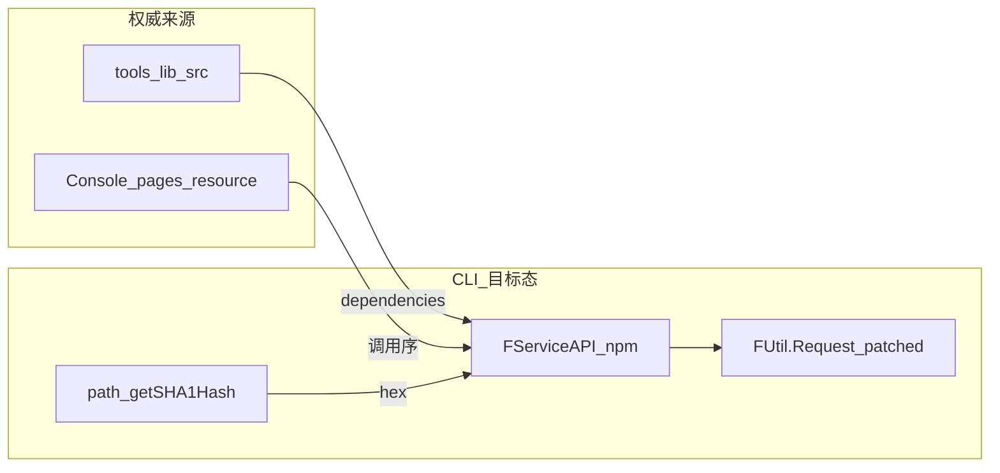

# API 迁移清单：统一为 Console 同源接口库

> 归属：`docs/新方案/开发设计/API/` · 入口：[../../README.md](../../README.md)  
> 对照表：[Console资源页API对照表.md](./Console资源页API对照表.md) · 选型：[../10-技术选型.md](../10-技术选型.md)  
> **用户命令面无旧兼容**。目标态 = npm `@freelog/tools-lib` 的 `FServiceAPI`（**签约/支付本期不做**）；只 patch `FUtil.Request`。  
> **对照源码**（优先于打包产物）：[权威源码路径.md](./权威源码路径.md)

---

## 目录

1. [背景：历史脏层](#1-背景历史脏层)
2. [安装 tools-lib（除签约/支付）](#2-安装-tools-lib除签约支付)
3. [目标：统一接口库](#3-目标统一接口库)
4. [目标目录结构](#4-目标目录结构)
5. [Console 资源相关 API 全量清单](#5-console-资源相关-api-全量清单)
6. [历史脏层清单（须清除）](#6-历史脏层清单须清除)
7. [错误接口明细（必须修复）](#7-错误接口明细必须修复)
8. [缺失接口明细（必须新增）](#8-缺失接口明细必须新增)
9. [实施步骤](#9-实施步骤)
10. [验收标准](#10-验收标准)

---

## 1. 背景：历史脏层

此前 CLI **未按与 Console 统一接口库**设计：`src/api/**` 多按旧文档手写，与 `@freelog/tools-lib` 的 `FServiceAPI` 在路径 / Method / Body 上分叉。另有独立 hash / 上传编排，未对齐 `FUtil.Tool.getSHA1Hash` + Storage 链。

后果：

- 同操作 Console 成功、CLI 404 / 参数错  
- `pull` / Owner / 草稿无法建立在正确契约上  
- 文档与实现各写一套「伪 API」

**定稿方向**：

1. `dependencies` 安装 `@freelog/tools-lib`；对照 [权威源码路径](./权威源码路径.md)  
2. services/commands **只**调 `FServiceAPI.*`（签约/支付除外）  
3. `platform/` 仅保留 shim + Request patch + 路径 SHA1；**禁止**手写镜像 API  

---

## 2. 安装 tools-lib（除签约/支付）

> 完整选型 → [../10-技术选型.md](../10-技术选型.md)。  
> **定稿**：**npm 安装 `@freelog/tools-lib`**；业务 `import { FServiceAPI, FUtil }`；启动 **patch `FUtil.Request`**。签名以 **源码** `service-API/*` 为准。

| 点 | 做法 |
|----|------|
| `window.location` / cookie | stub window + 替换 `FUtil.Request` |
| `getSHA1Hash(File)` | CLI 路径版算 hex → `FServiceAPI.Storage.*` |
| 签约 / 支付 | **本期不做**（包内有 API，CLI 不封装命令） |
| React / i18n | 随包装入，业务路径不用 |

**结论**：装包 + patch Request = 与 Console 同一接口库。

---

## 3. 目标：统一接口库



### 3.1 原则

| 原则 | 说明 |
|------|------|
| **装官方包** | `@freelog/tools-lib`；对照源码目录见 [权威源码路径](./权威源码路径.md) |
| **全量直调** | Resource/Storage/User/Policy/Collection/Draft/Rss… 直接 `FServiceAPI.*` |
| **本期排除** | 签约、支付 |
| **只换 Request** | `installToolsLibForNode()` |
| **无镜像层** | 禁止 `platform/service-api/*` |

### 3.2 业务侧用法（与 Console 同构）

```typescript
import { FServiceAPI } from '@freelog/tools-lib';
import { getSHA1Hash } from '../platform/tool/getSHA1Hash';
import { unwrapData } from '../platform/bootstrap';

const sha1 = await getSHA1Hash(filePath);
await FServiceAPI.Storage.fileIsExist({ sha1 });
const info = unwrapData(await FServiceAPI.Resource.info({ resourceIdOrName: id }));
```

---

## 4. 目标目录结构

```text
src/platform/
├── shim-browser.ts               # import 前 stub window（域名对齐 domain.ts）
├── bootstrap.ts                  # installToolsLibForNode + unwrapData
├── index.ts                      # re-export FServiceAPI / FUtil
└── tool/
    └── getSHA1Hash.ts
```

**清理对象**：手写 `platform/service-api/**`、`platform/request.ts`、旧 `src/api/**`。

---

## 5. Console 资源相关 API 全量清单

以下从 Console `pages/resource` + `models/resource*` + `models/collection*` 梳理，**均为 tools-lib `FServiceAPI.Resource.*` 方法**。

### 5.1 单品创建与编辑（creator + sidebar）

| tools-lib 方法 | HTTP | 路径 | Console 使用场景 |
|---------------|------|------|-----------------|
| `info` | GET | `/v2/resources/{id}` | 所有编辑页 mount、查重 |
| `create` | POST | `/v2/resources` | creator Step1 |
| `createVersion` | POST | `/v2/resources/{id}/versions` | creator Step2、versionCreator |
| `update` | PUT | `/v2/resources/{id}` | Step3 策略、Step4 上架、sidebar 改信息 |
| `lookDraft` | GET | `/v2/resources/{id}/versions/drafts` | Step2/versionCreator mount |
| `saveVersionsDraft` | POST | `/v2/resources/{id}/versions/drafts` | Step2 自动/手动存草稿 |
| `deleteResourceDraft` | DELETE | `/v2/resources/{id}/versions/drafts` | 丢弃草稿 |
| `resourceVersionInfo1` | GET | `/v2/resources/{id}/versions/{version}` | 版本详情、syncv |
| `updateResourceVersionInfo` | PUT | `/v2/resources/{id}/versions/{version}` | versionEditor 编辑已有版本 |
| `getVersionListByResourceID` | GET | `/v2/resources/{id}/versions` | dependency 页版本列表 |
| `getResourceTypeInfoByCode` | GET | `/v2/resources/types/getInfoByCode` | 上传方式、属性解析 |
| `getAttrsInfoByKey` | GET | `/v2/resources/attrs/getInfoByKey` | 系统属性解析 |
| `getResourceBySha1` | GET | `/v2/resources/files/{sha1}` | 文件占用检测 |
| `cycleDependencyCheck` | POST | `/v2/resources/{id}/versions/cycleDependencyCheck` | 依赖循环检查 |
| `resolveResources` | GET | `/v2/resources/{id}/resolveResources` | 依赖解析 |
| `batchSetContracts` | PUT | `/v2/resources/{id}/versions/batchSetContracts` | 策略签约版本 |
| `batchAuth` | GET | `/v2/auths/resources/batchAuth/results` | 侧栏授权状态 |

### 5.2 批量创建（creatorBatch）

| tools-lib 方法 | HTTP | 路径 | Console 使用场景 |
|---------------|------|------|-----------------|
| `createBatch` | POST | `/v2/resources/createBatch` | 批量提交 |
| `generateResourceNames` | POST | `/v2/resources/generateResourceNames` | 名称去重 |
| `batchInfo` | GET | `/v2/resources/list` | 批量查详情 |
| `getResourceTypeInfoByCode` | GET | `/v2/resources/types/getInfoByCode` | 类型配置 |

### 5.3 合集（collectionCreator + collectionSidebar）

| tools-lib 方法 | HTTP | 路径 | Console 使用场景 |
|---------------|------|------|-----------------|
| `create` (subjectType=4) | POST | `/v2/resources` | 合集 Step1 |
| `updateCollection` | PUT | `/v2/resources/catalogue/{id}` | Step2 提交、versionInfo 发布 |
| `getCollectionItems_Draft` | GET | `/v2/resources/catalogues/drafts/{id}/items` | 单品列表（草稿） |
| `addResourceItems_Draft` | POST | `/v2/resources/catalogues/drafts/{id}/items` | 添加单品 |
| `updateCollectionItemsInfo_Draft` | PUT | `/v2/resources/catalogues/drafts/{id}/items` | 改单品标题 |
| `deleteCollectionItems_Draft` | DELETE | `/v2/resources/catalogues/drafts/{id}/items?removeCollectionItemIds=` | 删除单品 |
| `reorderCollectionItems_Draft` | PUT | `/v2/resources/catalogues/drafts/{id}/reorder` | 重置排序 |
| `setCollectionItemsSortID_Draft` | PUT | `/v2/resources/catalogues/drafts/{id}/manualSort` | 拖拽排序 |
| `getCollectionItemsAuth_Draft` | GET | `/v2/resources/catalogues/drafts/{id}/items/batchAuth` | 单品授权状态 |
| `setItemsTitle` | PUT | `/v2/resources/catalogue/{id}/items` | 单品授权排除项 |
| `getCollectionCollectRules` | GET | `/v2/resources/catalogue/{id}/items/collectRules` | 自动收录规则 |
| `setCollectRules` | POST | `/v2/resources/catalogue/{id}/items/collectRules` | 设置自动收录 |
| `bindRssFeed` | POST | `/v2/resources/rss/{id}/bindFeed` | RSS 绑定 |
| `getCollectionUpdateLogs` | GET | `/v2/resources/catalogue/{id}/updateLogs` | 变更日志 |

### 5.4 存储（上传/解析）

| tools-lib 方法 | HTTP | 路径 | Console 使用场景 |
|---------------|------|------|-----------------|
| `Storage.uploadFile` | POST | `/v2/storages/files/upload` | 本地上传 |
| `Storage.uploadImage` | POST | `/v2/storages/files/uploadImage` | 封面上传 |
| `Storage.fileIsExist` | GET | `/v2/storages/files/fileIsExist` | 文件是否存在 |
| `Storage.filesListInfo` | GET | `/v2/storages/files/list/info` | 按 sha1 解析属性 |
| `Storage.filesInfo` | GET | `/v2/storages/files/info` | 无文件时默认属性 |
| `Storage.batchObjectList` | GET | `/v2/storages/objects/list` | 存储空间导入 |

### 5.5 RSS

| tools-lib 方法 | HTTP | 路径 | Console 使用场景 |
|---------------|------|------|-----------------|
| `Rss.sendVerificationCode` | POST | `/v2/rss/bindings/sendVerificationCode` | RSS 验证码 |
| `Rss.getSyncProgress` | GET | `/v2/rss/bindings/{id}/progress` | 同步进度 |
| `Rss.syncBinding` | PUT | `/v2/rss/bindings/{id}/sync` | 手动同步 |

### 5.6 策略与签约

| tools-lib 方法 | HTTP | 路径 | 说明 |
|---------------|------|------|------|
| `Policy.policyTemplates` | POST | `/v2/translate/translate-config/list4Client` | CLI 已有，基本对齐 |
| `Policy.policyReCompile` | POST | `/v2/translate/reCompile` | CLI 已有 |
| `Policy.policyTranslation` | POST | `/v2/translate/translate` | CLI 已有 |
| `Contract.batchContracts` | GET | — | sidebar 签约页 |
| `Contract.contracts` | GET | — | 签约查询 |

---

## 6. 历史脏层清单（须清除）

> 下表描述 **现状债务**，不是目标设计。每行清完标准：调用方改走 `ServiceAPI.*`，旧封装删除。

图例：✅ 对齐 · ⚠️ 部分对齐 · ❌ 错误 · ⬜ 缺失

### 6.1 Resource 核心

| tools-lib | CLI 现有 | 状态 | 说明 |
|-----------|---------|------|------|
| `create` POST `/v2/resources` | `createResource` | ✅ | |
| `update` PUT `/v2/resources/{id}` | `updateResource` | ✅ | CLI 额外做 resourceName 格式化 |
| `info` GET `/v2/resources/{id}` | `getResourceInfo` | ✅ | |
| `batchInfo` GET `/v2/resources/list` | `getResourceInfoList` | ✅ | |
| `createBatch` POST `/v2/resources/createBatch` | `batchCreateResources` POST `/v2/resources/batch` | ❌ | **路径和 body 均错误** |
| `batchUpdate` PUT `/v2/resources/updateBatch` | `batchUpdateResources` PUT `/v2/resources/batch` | ❌ | **路径和 body 均错误** |
| `list` GET `/v2/resources` | — | ⬜ | 资源列表 |
| `resourceTypes` | `listResourceTypesByGroup` | ✅ | |
| `getResourceTypeInfoByCode` | — | ⬜ | init/create 需要 |
| `generateResourceNames` | — | ⬜ | batch 需要 |
| `getResourceBySha1` | `getResourcesByFileSha1` | ✅ | 在 storage.ts |
| `resolveResources` | — | ⬜ | 依赖签约 |
| `batchAuth` | — | ⬜ | 授权状态 |
| `batchSetContracts` | — | ⬜ | 策略版本签约 |

### 6.2 Version

| tools-lib | CLI 现有 | 状态 | 说明 |
|-----------|---------|------|------|
| `createVersion` | `createResourceVersion` | ✅ | |
| `resourceVersionInfo1` | `getResourceVersionInfo` | ✅ | |
| `resourceVersionInfo2` GET `/v2/resources/versions/detail` | — | ⬜ | 按 versionId 查 |
| `getVersionListByResourceID` | `getResourceVersionInfoList` | ✅ | |
| `getVersionList` | `getBatchResourceVersionList` | ✅ | |
| `updateResourceVersionInfo` | — | ⬜ | **编辑已有版本，Console 必用** |
| `lookDraft` | `getResourceVersionDraft` | ✅ | |
| `saveVersionsDraft` POST | `saveResourceVersionDraft` PUT | ❌ | **HTTP 方法错误** |
| `deleteResourceDraft` DELETE | — | ⬜ | |
| `cycleDependencyCheck` | `checkCycleDependency` | ✅ | |

### 6.3 Collection

| tools-lib | CLI 现有 | 状态 | 说明 |
|-----------|---------|------|------|
| `updateCollection` PUT `/v2/resources/catalogue/{id}` | `updateCollectionResource` | ✅ | body 字段需核对 |
| `getCollectionItems` | `getCollectionItems` | ⚠️ | CLI 用 page/pageSize，tools-lib 用 skip/limit |
| `getCollectionItems_Draft` | — | ⬜ | **合集核心，完全缺失** |
| `addResourceItems_Draft` POST `.../drafts/{id}/items` | `batchAddCollectionItemsDraft` POST `.../items/batch` | ❌ | **路径错误** |
| `updateCollectionItemsInfo_Draft` PUT `.../items` | `batchUpdateCollectionItemsDraft` PUT `.../items/batch` | ❌ | **路径和 body 结构错误** |
| `deleteCollectionItems_Draft` | `batchDeleteCollectionItemsDraft` | ⚠️ | 路径接近，需核对 query |
| `setCollectionItemsSortID_Draft` | `setCollectionItemsSortDraft` | ✅ | |
| `reorderCollectionItems_Draft` | `resetCollectionItemsSortDraft` | ✅ | 参数名 sortType vs orderType 需核对 |
| `getCollectionItemsAuth` GET `/v2/auths/resources/{id}/items/batchAuth` | `batchQueryItemAuth` POST `.../items/auth/batch` | ❌ | **方法+路径错误** |
| `getCollectionCollectRules` GET `.../items/collectRules` | `getAutoIncludeRules` GET `.../auto-include-rules` | ❌ | **路径错误** |
| `setCollectRules` POST `.../items/collectRules` | `createOrUpdateAutoIncludeRule` POST `.../auto-include-rules` | ❌ | **路径+body 结构错误** |
| `bindRssFeed` | — | ⬜ | |
| `getCollectionUpdateLogs` | — | ⬜ | |

### 6.4 Storage

| tools-lib | CLI 现有 | 状态 |
|-----------|---------|------|
| `uploadFile` | `uploadFile` | ✅ |
| `uploadImage` | `uploadImage` | ✅ |
| `fileIsExist` | `checkFileExists` | ✅ |
| `filesListInfo` | — | ⬜ |
| `filesInfo` | — | ⬜ |
| `batchObjectList` | — | ⬜ |

### 6.5 RSS

| tools-lib | CLI 现有 | 状态 |
|-----------|---------|------|
| 全部 5 个方法 | — | ⬜ 整个模块缺失 |

---

## 7. 错误接口明细（必须修复）

### 7.1 批量创建 — 最严重

```diff
# tools-lib (Console 实际)
- POST /v2/resources/createBatch
- body: { resourceTypeCode, createResourceObjects: [...] }

# CLI 当前（错误）
+ POST /v2/resources/batch
+ body: { resources: [...] }
```

**影响**：`batch create` 若走 `batchCreateResources` 必然失败。

### 7.2 批量更新

```diff
# tools-lib
- PUT /v2/resources/updateBatch
- body: { resourceIds: string[], status?, addPolicies? }

# CLI 当前（错误）
+ PUT /v2/resources/batch
+ body: { resources: [...] }
```

### 7.3 版本草稿保存

```diff
# tools-lib
- POST /v2/resources/{id}/versions/drafts

# CLI 当前（错误）
+ PUT /v2/resources/{id}/versions/drafts
```

### 7.4 合集自动收录

```diff
# tools-lib
- GET/POST /v2/resources/catalogue/{id}/items/collectRules
- body: { status, conditionType, filterConditions, serializeStatus? }

# CLI 当前（错误）
+ GET/POST /v2/resources/catalogue/{id}/auto-include-rules
+ body: { ruleName, enabled, conditions: [...] }  // 完全不同结构
```

### 7.5 合集单品授权查询

```diff
# tools-lib
- GET /v2/auths/resources/{resourceId}/items/batchAuth?itemIds=

# CLI 当前（错误）
+ POST /v2/resources/catalogue/{resourceId}/items/auth/batch
+ body: { resourceIds: [...] }
```

### 7.6 合集 draft 单品增删改

多个 CLI 函数使用了不存在的 `/items/batch` 路径，tools-lib 统一为 `/catalogues/drafts/{id}/items`。

---

## 8. 缺失接口明细（必须新增）

按 Console 资源流程优先级排序：

### P0 — 阻塞主流程

| 方法 | 用途 |
|------|------|
| `createBatch` | 批量创建（修正后） |
| `getCollectionItems_Draft` | 合集 pull、单品列表 |
| `addResourceItems_Draft` | 添加单品到合集 |
| `updateResourceVersionInfo` | 编辑已有版本 |
| `getResourceTypeInfoByCode` | 创建/发布时类型配置 |
| `deleteResourceDraft` | 清理草稿 |

### P1 — 同步与编辑

| 方法 | 用途 |
|------|------|
| `saveVersionsDraft` | 修正 HTTP 方法后 |
| `setCollectRules` / `getCollectionCollectRules` | 合集自动收录 |
| `updateCollectionItemsInfo_Draft` | 改单品标题 |
| `deleteCollectionItems_Draft` | 删单品 |
| `reorderCollectionItems_Draft` | 排序 |
| `getCollectionItemsAuth_Draft` | 授权状态 |
| `filesListInfo` / `filesInfo` | 属性解析 |
| `generateResourceNames` | 批量名称去重 |

### P2 — 高级能力

| 方法 | 用途 |
|------|------|
| `bindRssFeed` + `Rss.*` | RSS 合集 |
| `resolveResources` | 依赖签约 |
| `batchSetContracts` | 策略版本 |
| `batchAuth` | 授权检查 |
| `getCollectionUpdateLogs` | 变更日志 |
| `setItemsTitle` | 单品授权排除 |
| `resourceVersionInfo2` | 按 versionId 查询 |

---

## 9. 实施步骤

### Step 1：对照表 + 选型 ✅

[对照表](./Console资源页API对照表.md) · [10-技术选型](../10-技术选型.md)

### Step 2：搭建 `src/platform/`（空壳可跑）

| 源（tools-lib） | 目标 |
|-----------------|------|
| `service-API/resources.ts` | `platform/service-api/resource.ts` |
| `service-API/storages.ts` | `platform/service-api/storage.ts` |
| `service-API/rss.ts` | `platform/service-api/rss.ts` |
| `service-API/policies.ts` / `contracts.ts` | 同名模块 |
| `utils/tools.ts#getSHA1Hash` | `platform/tool/getSHA1Hash.ts`（Node 路径入参） |
| `FUtil.Request` | `platform/request.ts`（Bearer） |

优先落地 Console 实际调用的 40+ 方法；导出 `ServiceAPI` / `PlatformTool`。

### Step 3：按 §7 在 **新库** 上写对（勿先改旧文件凑合）

createBatch、saveVersionsDraft POST、合集 draft/collectRules 路径等——直接在 `ServiceAPI` 正确实现。

### Step 4：切换调用方（services 优先）

| 调用方 | 改为 |
|--------|------|
| publish / upload 编排 | `PlatformTool.getSHA1Hash` → `ServiceAPI.Storage.*` → `ServiceAPI.Resource.createVersion` |
| pull / status / Owner | `ServiceAPI.Resource.info` 等 |
| collection * | `ServiceAPI.Resource.*_Draft` / `updateCollection` |
| draft * | `saveVersionsDraft` / `lookDraft` / `deleteResourceDraft` |

**禁止**新代码继续依赖 `src/api`。用户面向的 `batch *` 命令删除（见产品命令面）；内部若用 createBatch，只走 `ServiceAPI.Resource.createBatch`。

### Step 5：删脏层

- 删除或清空 `src/api/**` 错误封装  
- 契约测试锁定 method/url/body  
- sha1 黄金样例：与 Console 同文件 hex 一致  

### Step 6：集成验证

```bash
freelog-cli --test login
# create → updateVersion → publish（含 sha1 链）
# create --from-dir（内部 createBatch）
# collection create → item add → publish
```

---

## 10. 验收标准

| # | 标准 |
|---|------|
| 1 | Console `pages/resource` 用到的 Resource/Storage/Rss API，均在 `ServiceAPI` 有同名方法 |
| 2 | URL + Method + 关键 Body 字段与 tools-lib 一致（契约测） |
| 3 | 上传链与 Console 一致：`getSHA1Hash` → `fileIsExist` → … → `createVersion` |
| 4 | `createBatch` / 合集 draft 等不再走错误路径 |
| 5 | **无**活跃代码 import 旧 `src/api` 错误封装 |
| 6 | **无**「CLI 自创路径」与 tools-lib 并存的双轨 API |
| 7 | sha1：同文件 CLI hex === Console `FUtil.Tool.getSHA1Hash` |

---

## 附录：tools-lib 源文件索引

| 模块 | 路径 |
|------|------|
| Resource（含 Collection 子 API） | `packages/@freelog/tools-lib/src/service-API/resources.ts` |
| Storage | `packages/@freelog/tools-lib/src/service-API/storages.ts` |
| RSS | `packages/@freelog/tools-lib/src/service-API/rss.ts` |
| Policy | `packages/@freelog/tools-lib/src/service-API/policies.ts` |
| Contract | `packages/@freelog/tools-lib/src/service-API/contracts.ts` |
| Tool.getSHA1Hash | `packages/@freelog/tools-lib/src/utils/tools.ts` |
| 入口 | `packages/@freelog/tools-lib/src/service-API/index.ts` |

---

*关联：[10-技术选型](../10-技术选型.md) · [新方案 README](../../README.md) · [命令规格](../02-命令规格.md)*
