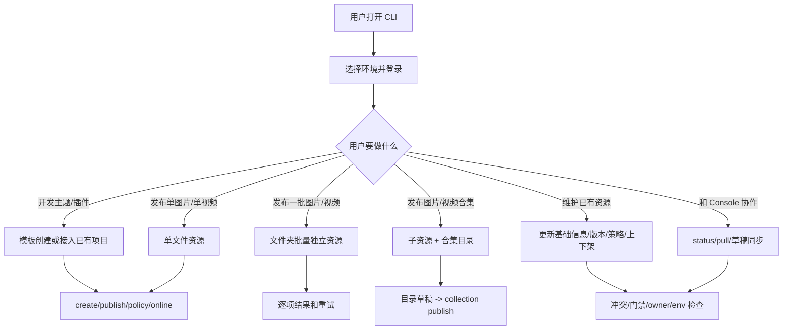

# 用户场景与问题清单

最后更新：2026-08-05

本文独立记录真实用户会如何使用 Freelog Runtime CLI、每个场景可能遇到什么问题、CLI 应该如何限制或兜底。命令细节看 [CLI使用说明与Console差异](./CLI使用说明与Console差异.md)，工程设计看 [CLI脚手架设计](./CLI脚手架设计.md)，字段契约看 [CLI字段账本](./CLI字段账本.md)。

核心思想：CLI 要让用户在没有 Console UI 的情况下完成完整资源操作；但 CLI 不复制页面交互，而是把页面输入转成命令、manifest、JSON/YAML 文件和明确失败提示。

## 1. 场景总览



## 2. 基础使用场景

### 2.1 第一次使用 CLI

用户目标：

1. 选择 dev/test/prod 环境。
2. 登录账号。
3. 确认登录态和当前目录状态。
4. 查询资源类型和模板。

标准流程：

```bash
freelog-cli login --env dev
freelog-cli status --env dev
freelog-cli type search 主题 --env dev
freelog-cli template list --env dev
```

可能问题：

| 问题 | CLI 行为 | 设计原因 |
|---|---|---|
| 用户不传 `--env`，默认走生产 | 默认 production；文档和测试一律显式 `--env dev` | 避免隐式修改非目标环境 |
| dev 登录后资源接口 401 | login 必须保存 Cookie，不只保存 tokenSn | dev 接口鉴权依赖 Cookie |
| 登录 dev 后切到 test/prod 执行写命令 | 失败，提示凭据环境不一致 | 防止跨环境误写 |
| logout 后项目文件被删除 | 不允许；logout 只清 auth | 登录态和项目状态必须分离 |
| status 未登录时报错 | 不应报错；应显示未登录和当前环境 | status 是诊断入口 |

### 2.2 脚本/CI 使用

用户目标：

1. 非交互登录。
2. 自动执行发布流程。
3. 用 JSON 判断成功失败。

标准流程：

```bash
freelog-cli login --env dev --login-name freelog-test11 --password freelog-test1111 --yes --json
freelog-cli publish --env dev --yes --json
```

可能问题：

| 问题 | CLI 行为 | 设计原因 |
|---|---|---|
| 非交互缺少 `--yes` | 失败并提示加 `--yes` | 避免脚本里隐式确认危险写入 |
| 失败输出难解析 | JSON 输出 `{ ok:false, code, message, hint }` | CI 需要稳定协议 |
| debug 暴露密码或 cookie | 必须脱敏 | 凭据安全 |
| workspace 测试污染用户登录态 | 支持 `FREELOG_AUTH_PATH_WORKSPACE` | 测试隔离 |

## 3. 主题/插件开发者

### 3.1 通过模板创建新项目

用户目标：

1. 从 CLI 查看可用模板。
2. 创建 React 主题或 Vue 插件项目。
3. 构建后压缩发布。

标准流程：

```bash
freelog-cli template list --scaffold runtime --runtime 0.5 --env dev
freelog-cli init my-theme --scaffold runtime --template vite-react-ts --resource-type <themeCode> --runtime 0.5 --yes --env dev
cd my-theme
pnpm build
freelog-cli create --yes --env dev
freelog-cli publish --yes --env dev
freelog-cli policy apply --from-file ./policy.free.json --yes --env dev
freelog-cli online --yes --env dev
```

可能问题：

| 问题 | CLI 行为 | 设计原因 |
|---|---|---|
| 用户不知道可用模板 | `template list` 必须可用 | 模板是脚手架基础能力 |
| runtime 版本选错 | `init` 校验模板兼容 runtime | 避免生成不能运行的项目 |
| publish 前未构建 | `publish` 不自动构建，文件不存在时失败 | 构建属于项目自己的脚本 |
| 主题/插件传了单文件 | 按资源类型要求构建目录；不符合时失败 | 主题/插件应发布压缩包 |
| 构建目录很大或格式不符 | 按平台资源类型限制校验 | 与 Console 最终结果一致 |

### 3.2 接入已有主题/插件项目

用户目标：

1. 不复制模板。
2. 在已有项目目录生成 manifest。
3. 构建并发布。

标准流程：

```bash
cd my-existing-theme
freelog-cli init . --scaffold none --resource-type <themeCode> --runtime 0.5 --yes --env dev
pnpm build
freelog-cli create --yes --env dev
freelog-cli version set --version 1.0.0 --file dist --runtime 0.5 --env dev
freelog-cli publish --yes --env dev
```

可能问题：

| 问题 | CLI 行为 | 设计原因 |
|---|---|---|
| 已有项目被模板覆盖 | `--scaffold none` 不复制模板 | 保护用户代码 |
| 用户忘记 create 直接 publish | 失败并提示先 create | 平台需要资源壳 |
| 版本号不大于 latestVersion | publish 失败 | 平台版本约束 |
| dist 路径写错 | 文件处理阶段失败并指明路径 | 可快速修复 |

## 4. 图片/视频作者

### 4.1 发布单图片或单视频

用户目标：

1. 用一个本地文件创建独立资源。
2. 添加策略并上架。
3. 视频可指定版本封面。

标准流程：

```bash
freelog-cli init . --scaffold none --resource-type <imageOrVideoCode> --yes --env dev
freelog-cli create --yes --env dev
freelog-cli version set --version 1.0.0 --file ../photo.png --env dev
freelog-cli publish --yes --env dev
freelog-cli policy apply --from-file ./policy.free.json --yes --env dev
freelog-cli online --yes --env dev
```

可能问题：

| 问题 | CLI 行为 | 设计原因 |
|---|---|---|
| 图片/视频传目录 | 非压缩类型传目录且无 filename 时失败 | 单文件资源应明确文件 |
| 文件格式不支持 | 按资源类型配置失败 | 与平台限制一致 |
| 视频希望 CLI 转码 | 不做转码，只上传原文件 | Console 也不是转码工具 |
| 视频预览 | CLI 给出资源详情路径或由用户去浏览器验证 | 命令行不承担播放体验 |
| 版本封面是本地路径 | publish/draft push 时上传图片转 URL | 无 UI 也能填封面字段 |

### 4.2 文件夹批量发布为多个独立资源

用户目标：

1. 一个文件夹内每个文件成为一个独立资源。
2. 可零配置，也可逐项配置标题、封面、标签、策略。
3. 部分失败时能重试。

标准流程：

```bash
freelog-cli resource import-dir ./photos --resource-type <imageCode> --title-prefix "照片 " --yes --env dev
freelog-cli resource import-dir ./photos --config freelog.batch.json --yes --env dev
```

可能问题：

| 问题 | CLI 行为 | 设计原因 |
|---|---|---|
| 文件夹里有不支持格式 | 该项失败并报告，成功项保留 | 批量任务不能因一项失败不可追踪 |
| 批量配置缺 `filePath` | 失败并指出具体 item | 声明式配置必须可定位 |
| 每个文件元数据不同 | 用 `freelog.batch.json/yaml` 的 items 覆盖 | 适合资源作者批量管理 |
| createBatch 不支持某些字段 | 自动 fallback 到逐个 create/createVersion | 保证功能正确优先 |
| 用户想回头单独维护某个资源 | 成功项生成子目录 manifest/state | 后续可独立 update/publish/policy |

## 5. 合集作者

### 5.1 文件夹作为合集

用户目标：

1. 文件夹里的图片/视频成为合集条目。
2. 每个条目背后是独立子资源。
3. 合集发布后可上架。

标准流程：

```bash
freelog-cli init photo-album --scaffold collection --resource-type <collectionCode> --yes --env dev
cd photo-album
freelog-cli collection create --yes --env dev
freelog-cli collection item import-dir ../photos --config ../photos/freelog.batch.json --yes --env dev
freelog-cli collection version set --description "首版合集" --env dev
freelog-cli collection publish --yes --env dev
freelog-cli collection policy apply --from-file ./policy.free.json --yes --env dev
freelog-cli online --yes --env dev
```

可能问题：

| 问题 | CLI 行为 | 设计原因 |
|---|---|---|
| 用户以为合集是上传整个文件夹 | 文档和命令明确：文件夹合集 = 子资源 + 合集目录 | 对齐平台模型 |
| 子资源没有版本或策略 | 阻断加入或发布，提示补策略/上架 | 合集目录项需要可授权 |
| 合集本身没有策略 | `collection publish` 可成功，`online` 失败 | publish 与 online 分离 |
| 目录项很多 | 读取目录草稿必须分页 | 不能只处理前 500 条 |
| 只改目录后执行 `draft push --collection` | 不应保存目录草稿 | 发版表单草稿和目录草稿分离 |

### 5.2 维护合集目录

用户目标：

1. 添加已有资源。
2. 修改条目标题。
3. 调整排序。
4. 删除条目。

标准流程：

```bash
freelog-cli collection item add <resourceId> --title "条目标题" --env dev
freelog-cli collection item update <itemId> --title "新标题" --env dev
freelog-cli collection item reorder --from <itemId> --to <targetItemId> --env dev
freelog-cli collection item remove <itemId> --yes --env dev
freelog-cli collection publish --yes --env dev
```

可能问题：

| 问题 | CLI 行为 | 设计原因 |
|---|---|---|
| 添加的资源不是当前账号资源 | 按平台和 owner 规则校验 | 避免不可管理资源进入目录 |
| 删除条目误操作 | 需要确认；非交互必须 `--yes` | 目录草稿写入有破坏性 |
| 改完目录 Console 还看不到正式版本变化 | 需要 `collection publish` | 目录草稿和正式合集版本分离 |
| 条目授权缺口 | publish 前检查并失败提示 | 不发布不可用合集 |

## 6. 维护已有资源

### 6.1 更新基础信息

用户目标：

1. 修改标题、简介、封面、标签。
2. 与 Console 修改协作。

标准流程：

```bash
freelog-cli status --env dev
freelog-cli pull --env dev
freelog-cli update --title "新标题" --cover ./cover.png --env dev
```

可能问题：

| 问题 | CLI 行为 | 设计原因 |
|---|---|---|
| Console 和本地都改了 listing | 默认冲突 | 防止静默覆盖 |
| 用户想采用 Console 值 | `pull --apply-listing --force` | 显式覆盖本地意图 |
| 本地封面路径 | 上传后写 URL | 无 UI 也能填封面 |
| update 里夹带上架状态 | 禁止用 update 做软上架 | 上架必须走 `online` 门禁 |

### 6.2 发布新版本

用户目标：

1. 修改下一版文件和说明。
2. 发布正式版本。

标准流程：

```bash
freelog-cli pull --env dev
freelog-cli version set --version 1.1.0 --file dist --description "新功能" --env dev
freelog-cli publish --yes --env dev
```

可能问题：

| 问题 | CLI 行为 | 设计原因 |
|---|---|---|
| 版本号已存在 | publish 失败 | 平台版本不可重复 |
| 本地依赖授权未完成 | publish 失败 code 5 | 不发布不可授权版本 |
| 用户只想改已发布版本说明 | 用 `version edit` | 不重新上传文件 |
| 用户以为 publish 会自动上架 | 不自动上架 | 策略和上架是独立步骤 |

### 6.3 草稿协作

用户目标：

1. 和 Console 发版页草稿协作。
2. 保存远端草稿或拉取远端草稿。
3. 避免覆盖别人改动。

标准流程：

```bash
freelog-cli draft pull --env dev
freelog-cli draft push --env dev
freelog-cli draft discard --yes --env dev
freelog-cli draft pull --collection --env dev
```

可能问题：

| 问题 | CLI 行为 | 设计原因 |
|---|---|---|
| Console 自动保存了远端草稿 | status 提示远端有草稿且本地未同步 | Console 有防抖保存，CLI 没有 |
| 本地和远端草稿都改了 | `draft push` 冲突失败 | 防止覆盖 |
| 用户确认覆盖远端 | `draft push --force --yes` | 必须显式确认 |
| 单品 `draft pull` 丢本地 filePath | 不允许；应保留 filePath | 远端没有用户本地路径 |
| `draft discard --collection` 删除目录草稿 | 不允许 | 合集发版表单草稿和目录草稿分离 |

### 6.4 策略和上下架

用户目标：

1. 新增策略。
2. 启停策略。
3. 上架或下架资源。

标准流程：

```bash
freelog-cli policy apply --from-file ./policy.free.json --yes --env dev
freelog-cli policy list --env dev
freelog-cli policy set <policyId> 1 --env dev
freelog-cli online --yes --env dev
freelog-cli offline --yes --env dev
```

可能问题：

| 问题 | CLI 行为 | 设计原因 |
|---|---|---|
| 没有策略就 publish | 允许 | 资源可以先发布版本 |
| 没有策略就 online | 失败 | 上架必须可授权 |
| 没有版本就 online | 失败 | 上架必须有 latestVersion |
| 已上架且只有一条启用策略时停用 | 失败 | 防止上架资源无可用策略 |
| 用户想修改已有策略正文 | 不支持；新增策略再切换启用，或回 Console | CLI 不做策略 Builder |

## 7. 高级测试人员视角

必测维度：

| 维度 | 用例 |
|---|---|
| 环境 | dev 登录后用 test/prod 写命令；dev state 下切 prod/test |
| 凭据 | login、logout、workspace auth、JSON 登录、过期凭据 |
| owner | 非 owner 对资源执行 update/publish/policy/online |
| 同步 | status、pull、pull --apply-listing、listing 冲突 |
| 文件 | 文件不存在、目录/文件类型不匹配、格式不支持、超大小 |
| 批量 | 缺字段、部分失败、重复资源名、fallback 逐个创建 |
| 合集 | 子资源未发布、无策略、未上架、目录项分页、publish 合并 |
| 草稿 | 远端已有、本地已改、双边冲突、force、discard 不误删目录 |
| 策略 | 无策略上架、停用最后启用策略、策略文本非法 |
| 输出 | human、json、debug 脱敏、错误码 |

测试结论必须记录：

1. 命令。
2. 环境。
3. 输入文件或配置。
4. 平台 resourceId。
5. Console 可见结果。
6. CLI 输出和 exit code。
7. 是否符合本文对应场景的预期。

## 8. 设计未覆盖时如何处理

遇到新场景时按这个顺序判断：

1. 它是否属于“没有 UI 也应该能完成”的资源生命周期能力。
2. Console 最终写入了哪些平台字段或调用了哪些接口。
3. CLI 输入应该是 flag、manifest、JSON/YAML 文件，还是显式失败。
4. 是否涉及支付、验证码、复杂人机确认。
5. 是否会影响 manifest/state/auth 的边界。
6. 是否会引入批量部分成功、owner、env、草稿冲突。
7. 先更新本文和 [CLI字段账本](./CLI字段账本.md)，再改代码。
