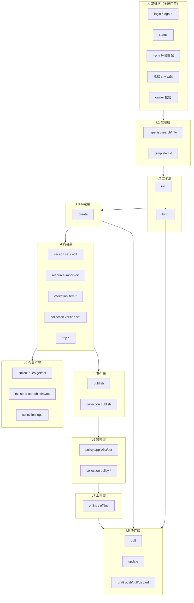
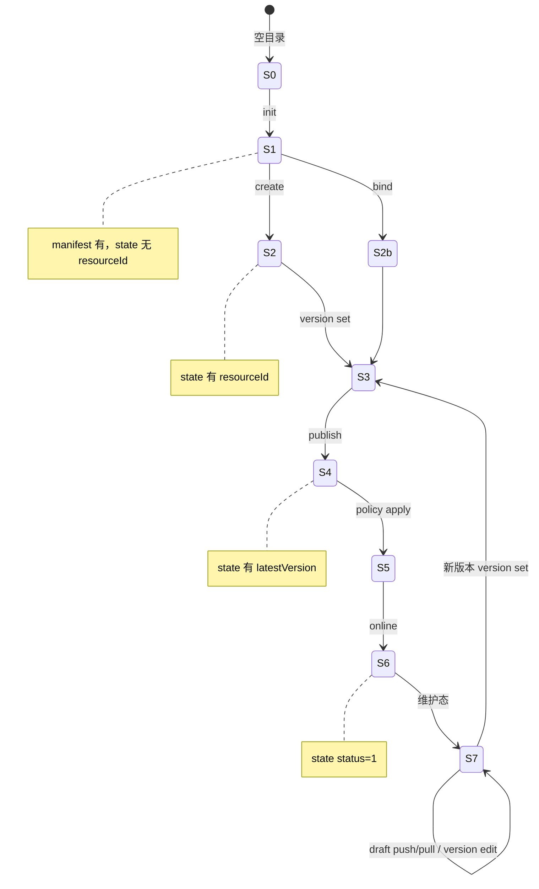
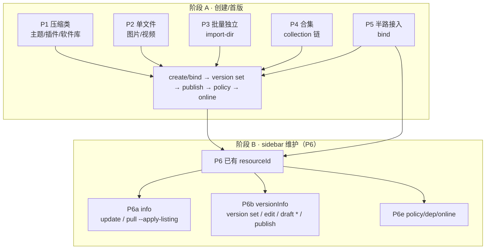
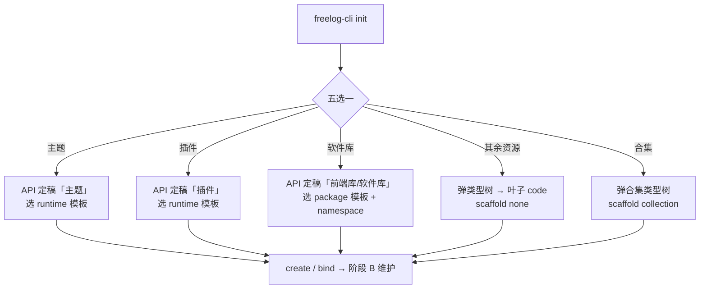

# 用户场景与问题清单（流程拓扑版）

最后更新：2026-08-06（方案 A + Console 创建/维护两阶段）

## ⚠️ 先读：Console 两阶段与 CLI 全生命周期

Console 对资源的数据操作**不只是创建**，还包括 **sidebar 维护**：更新基础信息（info）、更新版本与草稿（versionInfo）、策略、依赖、上下架。CLI 须 parity，见 [CLI脚手架设计 §1.8–§1.9](./CLI脚手架设计.md#18-console-两阶段创建creator与维护sidebar)。

```text
阶段 A · 创建/首版     creator / creatorBatch / collectionCreator
阶段 B · 长期维护       resourceSidebar / collectionSidebar / versionCreator
         ├─ info              → update / pull --apply-listing
         ├─ versionInfo       → version set / edit / draft * / publish
         ├─ policy            → policy *
         ├─ dependency          → dep *
         └─ 上下架              → online / offline
```

脚手架始终围绕**本地文件**：`version set --file <本地路径>` → `publish` 上传；listing 封面 `--cover ./本地图`；策略 `--from-file`。

### 交互终端（方案 A：用命令选发行模式）

```bash
freelog-cli login --env dev
# 发行模式由选的命令决定（不在 init 内三选一）：
#   ① 发行单个资源  →  freelog-cli init <dir>     → init 五选一（§脚手架设计 1.6）
#   ② 批量发行资源  →  freelog-cli resource import-dir <文件夹>
#   ③ 发行合集      →  init 选「合集」或 --scaffold collection → collection create → …
```

**init 五选一**（工程立项）：主题 | 插件 | 软件库 | 其余资源 | 合集。  
只有「其余资源」和「合集」才弹资源类型树；前三项 API 定稿展示名 + 选工程模板。

示例 — 发行单个资源：

```bash
freelog-cli init my-project --env dev   # 交互：类型在 Step1 等价环节选择
freelog-cli create --yes --env dev
freelog-cli version set --version 1.0.0 --file dist --runtime 0.5 --env dev
freelog-cli publish --yes --env dev
```

详见 [CLI脚手架设计 §1](./CLI脚手架设计.md#1-流程console-发行模式--cli-命令)。

**阶段 B 示例 — 维护基础信息 + 发新版 + 草稿：**

```bash
freelog-cli status --env dev
freelog-cli update --title "新标题" --intro "…" --cover ./cover.png --tags "tag1" --env dev
freelog-cli pull --env dev
freelog-cli version set --version 1.1.0 --file dist --description "新功能" --env dev
freelog-cli draft push --env dev
freelog-cli publish --yes --env dev
freelog-cli version edit --version 1.0.0 --description "修正首版文案" --env dev
```

**与 Console 草稿协作：**

```bash
freelog-cli draft pull --env dev
freelog-cli draft push --force --yes --env dev   # 冲突时
freelog-cli draft discard --yes --env dev
```

仅选类型、不 init：

```bash
freelog-cli login --env dev
freelog-cli type pick --env dev
# 输出 resourceTypeCode + 建议 scaffold
```

### 脚本 / CI（必须自己传 code，无交互）

```bash
# 先 type list / type info 查平台 code（dev/test 当前：主题 RT001、插件 RT002、前端库 RT029，见 §脚手架设计 0.5.3）
freelog-cli init my-project --scaffold runtime --template vite-react-ts \
  --resource-type <themeCode> --runtime 0.5 --yes --env dev
freelog-cli create --yes --env dev
```

**缺 `--resource-type` + `--yes` = 直接失败**，不会从目录名猜类型。

### create 为什么必须要有 resourceTypeCode

平台 `Resource.create` 接口必填 `resourceTypeCode`。manifest 里没有 code → `create` 失败。  
旧脚手架在 init 里就把类型选完写进配置；新 CLI 交互 init 现已恢复同样行为。

### 产品原则（与 Console 关系）

脚手架面向**本地文件**发版；Console creator/sidebar 能**写入平台 API** 的数据操作，CLI 必须 parity（清单见 [CLI脚手架设计 §1.9](./CLI脚手架设计.md#19-console-数据操作-parity-清单必须有)）。  
Console 列表、收藏、节点运营、消费详情**不在**脚手架 parity 范围。

---

本文用**拓扑方式**穷举全部流程、场景与问题。读法：先选**主路径**（§1）→ 沿**节点链**走（§3）→ 查**问题矩阵**（§4）→ 看**命令实例**（§5）。

关联文档：[CLI脚手架设计](./CLI脚手架设计.md)（工程拓扑）、[CLI使用说明与Console差异](./CLI使用说明与Console差异.md)（命令细节）、[CLI字段账本](./CLI字段账本.md)（字段契约）。

---

## 0. 拓扑读法

### 0.1 五个正交维度

任何用户操作 = 以下维度的**交叉点**：

| 维度 | 取值 | 决定什么 |
|---|---|---|
| **D1 环境** | dev / test / prod | API 地址、auth/state 绑定 |
| **D2 资源形态** | 压缩类独立资源 / 单文件独立资源 / 批量独立 / 合集 / 半路接入 | 文件处理方式、命令分支 |
| **D3 立项方式** | runtime 模板 / package 模板 / none 接入 / collection / 无 init（批量） | init 参数 |
| **D4 生命周期阶段** | 发现 → 立项 → 绑定 → **首版** → 策略 → 上架 → **维护**（listing / 新版本 / 草稿） | 当前可用命令 |

### 0.4 Console 页面 ↔ CLI 命令（创建 + 维护）

| Console 区域 | 页面/Tab | 数据操作 | CLI | parity |
|---|---|---|---|---|
| creatorEntry | 三卡片 | 选发行模式 | **方案 A：选命令**（init / import-dir / collection 链） | 流程不同 |
| resourceCreator | Step1 | 创建壳 | `init` → `create` | **必须有** |
| resourceCreator | Step2 | 首版文件、版本、说明、**草稿** | `version set` → `draft push` → `publish` | **必须有** |
| resourceCreator | Step3–4 | 策略、listing、上架 | `policy apply` → `update` → `online` | **必须有** |
| resourceSidebar | **info** | 改标题/简介/封面/标签 | `update`；`pull --apply-listing` | **必须有** |
| resourceSidebar | **versionInfo** | 发新版、改说明、**草稿**、publish | `version set` / `version edit` / `draft *` / `publish` | **必须有** |
| versionCreator | 发新版页 | 同 versionInfo | 同左 | **必须有** |
| resourceSidebar | policy | 策略 | `policy *` | **必须有** |
| resourceSidebar | dependency | 依赖 | `dep *` | **必须有** |
| collectionSidebar | versionInfo | 目录单品 + 合集发版草稿 | `collection item *` + `draft * --collection` + `collection publish` | **必须有** |
| collectionSidebar | info | 合集 listing、RSS | `collection update` + `collection rss *` | **必须有** |

**不在 parity：** 资源列表搜索、收藏、加节点、contract 只读（待实现）、云存储选文件（待实现）。

| **D5 协作模式** | 纯 CLI / Console 混合 / CI 脚本 | 是否用 draft/pull/bind |

### 0.2 三层拓扑栈



### 0.3 本地状态机（manifest + state）



**合集额外状态：** S1c（collection init）→ create → item *（目录草稿）→ collection version set → collection publish → policy → online。

### 0.6 资源类型拓扑（平台定稿 + 旧脚手架对照）

主题、插件、前端库在平台里是**定好的资源类型**（按展示名匹配），不是用户随便起的名字。旧脚手架 `init` 第一层五选一；**只有「其余资源」和「合集」才走 API 树形递归选择**。

**权威来源：** [CLI脚手架设计 §0.5](./CLI脚手架设计.md#05-可验证事实不靠猜)（展示名常量、dev/test 实测 code、复验命令）。

#### 0.6.1 平台类型树（API 模型）

接口：`GET /v2/resources/types/listSimpleByGroup`（CLI：`type list` → `Resource.resourceTypes`，默认 `status: 1`）。

| 字段 | 含义 |
|---|---|
| `code` | **resourceTypeCode**（create/init 必填，写入 manifest） |
| `name` | 显示名（如「主题」「插件」「前端库」） |
| `parentCode` | 父类型 code；空 = 一级 |
| `children[]` | 子类型；**「其余资源」须选到叶子**；主题/前端库定稿项可为父节点 |
| `category` | 1=基础类型，2=自定义类型（挂在某基础类型下） |
| `status` | 1=启用；2=停用（如 dev/test 的「软件库」RT027，init **不会**定稿到停用项） |

**subjectType（标的物）：**

| 值 | 用途 | 说明 |
|---|---|---|
| 1 | **独立资源**（subjectType=1） | 可单独发布；合集里的**子资源**也是此类 |
| 4 | **合集** | `type list --subject collection` |
| 2 | 集合（旧枚举） | 已对齐为 4 |

**tools-lib `predefined.ts` 英文 code（`theme`/`widget`/`image`/…）：** 平台内置 category **hint**，与 dev 的 `RT001` **不是同一字符串**；CLI 定稿走展示名，见 §脚手架设计 0.5.2。

#### 0.6.2 init 第一层（五选一，对齐旧脚手架）

来源：`backup/.../init.ts` 选项；新 CLI `pickInitCategory` 已实现 **五选一**（`INIT_CATEGORY_OPTIONS`）。

| init 交互选项 | 是否走类型树 | resourceTypeCode 来源 | 模板 | 压缩发布 |
|---|---|---|---|---|
| **主题** | 否 | API 展示名 `主题` → dev/test 当前 **`RT001`** | runtime 8 选 1 | 是（目录→zip） |
| **插件** | 否 | API 展示名 `插件` → dev/test **`RT002`** | runtime 8 选 1 | 是 |
| **前端库 / 软件库** | 否 | 优先 `前端库` → dev/test **`RT029`**；fallback `软件库`（当前环境 RT027 停用） | package 3 选 1 + namespace | 是 |
| **其余资源** | **是，递归到叶子** | 用户选到的**叶子 code** | 无 | 看 `type info` |
| **合集** | **是，递归** | 合集叶子 code | 无 | 条目类型见 §0.1 术语 |

**复验（不靠记忆 RT 码）：**

```bash
freelog-cli login --env dev --yes
freelog-cli type list --env dev --json
freelog-cli type info RT001 --env dev    # 看 compress / fileMaxSize 等
```

#### 0.6.3 压缩类 vs 单文件（代码定稿）

来源：`packages/cli/src/services/processFile.ts` — 按 **manifest 类型路径展示名** 或 code hint 判断：

| 类型 | 匹配规则 | publish 时 filePath |
|---|---|---|
| 主题 / 插件 / 软件库 | 展示名 `主题`/`插件`/`软件库`，或 code 含 `theme`/`widget`/`plugin` | **目录** → zip |
| 图片/视频等 | `image`/`video` 等叶子类型 | **单文件** |

主题/插件还需 `--runtime 0.4|0.5`（`publishService.ts` 校验；写入 `createVersion.inputAttrs`）。

#### 0.6.4 新 CLI 与旧脚手架（类型选型）

| 能力 | 旧脚手架 | 新 CLI |
|---|---|---|
| 第一层五选一 | init 交互 | **`init` 交互（TTY 且未传 `--resource-type`）** |
| 递归选子类型 | 自动弹树 | **`type pick` 或 init 内「其余/合集」分支** |
| 主题/插件/软件库 code | API 展示名定稿（非硬编码 theme/widget/package） | 同左 |
| 脚本模式 | 配置里已有 code | **必须 `--resource-type <code> --yes`** |

**交互创建（默认走通路径）：**

```bash
freelog-cli login --env dev
freelog-cli init my-project --env dev
freelog-cli create --yes --env dev
```

**仅选类型：**

```bash
freelog-cli type pick --env dev
```

#### 0.6.5 类型选型常见问题

| 问题 | 原因 | 处理 |
|---|---|---|
| 主题 init 用了图片 code | 未走 init 五选一「主题」 | 压缩类须 API 定稿「主题/插件/软件库」code，不是 image 等单文件类型 |
| 选了父节点 code 有 children | 未选到叶子 | 继续进 children，或 Console 对照 |
| type search 多个结果 | 同名自定义类型 | `type info` 看 parentCode / category |
| 前端库 vs 软件库名称混用 | 旧 UI 写「前端库」，压缩逻辑写「软件库」 | 同一类；以 `type info` 的 compress 配置为准 |
| 期望 init 一级级选类型 | init（TTY）| 已实现；脚本模式须 `--resource-type` |

---

## 1. 主路径拓扑（6 条，穷举入口）

每条路径 = 从用户意图到上架的**完整节点链**。路径之间在 L4 之后收敛到同一发布骨架。



### P1 压缩类独立资源（主题 / 插件 / 软件库）

| 分支 | 节点链 | 关键差异 |
|---|---|---|
| P1a 从零 + runtime 模板 | login → type → template list → init runtime → build → create → version set --file dist → publish → policy → online | 目录→zip |
| P1b 从零 + package 模板 | login → type → template list package → init package --namespace → build → create → … | 需 namespace |
| P1c 已有代码仓 | login → type → init none → build → create → … | 不复制模板 |
| P1d 发新版 | pull → version set → publish | 版本号 > latestVersion |

**upload 形态：** `processFile.ts` 把 `filePath` **目录**打 zip 上传。

### P2 单文件独立资源（图片 / 视频）

| 节点链 |
|---|
| login → type info → init none → create → version set --file \<path\> → publish → policy → online |

**upload 形态：** 原文件上传，不 zip。视频封面本地路径在 publish/draft push 时上传转 URL。

### P3 批量独立资源（文件夹 → 多个**独立资源**，无单品）

与 [CLI脚手架设计 §0.1 术语](./CLI脚手架设计.md#01-术语必读勿混用) 一致：**不是合集，不产生单品**。

| 节点链 |
|---|
| login → type info → **无父目录 init** → resource import-dir → （每项子目录 manifest/state）→ 逐项 policy/online |

**约束：** 只扫**顶层文件**；部分失败 exit code 4 + `retry.batch.json`。

### P4 合集（文件夹 → **子资源** + **单品**目录）

| 节点链 |
|---|
| login → type → init collection → collection create → collection item import-dir → collection version set → collection publish → collection policy → online |

**三类草稿分离：** 独立资源发版表单 / 合集发版表单 / 合集目录（**单品**列表）（见 §3.9）。

**扩展分支：** collect-rules、RSS（验证码人工）、logs。

### P5 半路接入（Console 已建壳）

| 节点链 |
|---|
| login → init none（--resource-name 对齐）→ **bind** \<resourceId\> → status |

**不能 create**（授权标识已占用）。合集 bind 内部走 pull --collection。

### P6 维护已有资源（sidebar 阶段 B）

Console 从资源列表进入 **sidebar**，不是 creator。CLI 在已有 `resourceId`（create/bind 后）执行：

| 子场景 | Console 位置 | 节点链 | CLI 命令 |
|---|---|---|---|
| P6a 改 listing | sidebar **info** | status → pull → update 或 pull --apply-listing | `update --title/intro/cover/tags` |
| P6b 发新版 | sidebar **versionInfo** / versionCreator | pull → version set（本地 file）→ draft push? → publish | `version set` → `draft push` → `publish` |
| P6c 改已发版说明 | versionInfo 已发布版本 | version edit | `version edit --version --description` |
| P6d 草稿协作 | versionInfo 草稿区 | draft pull → 本地改 → draft push | `draft pull/push/discard` |
| P6e 策略/依赖 | policy / dependency | policy apply；dep auth | `policy *`；`dep *` |
| P6f 上下架 | Sider 开关 | online / offline | `online` / `offline` |
| P6g 换环境 | — | login → 删 state → bind | 见 §5.10 |
| P6h 合集维护 | collectionSidebar | collection update；item *；draft --collection | 见 §5.6 之后 |

**与创建的区别：** P1–P5 走 **阶段 A**（含 create）；P6 假定 **state 已有 resourceId**，不再 create。

---

## 2. init 子拓扑（工程立项五选一）

**先读 §0.6：** 主题/插件/软件库 **API 定稿展示名**；只有「其余资源」「合集」弹类型树。

**方案 A：** `init` **仅**五选一，不含批量/文件夹合集（见 §0.3）。



| scaffold | 五选一选项 | 类型树 | 模板 |
|---|---|---|---|
| `runtime` | 主题、插件 | 否 | **必选** |
| `package` | 软件库 | 否 | **必选** + namespace |
| `none` | 其余资源、已有仓、半路接入 | **是**（其余） | 否 |
| `collection` | 合集 | **是**（合集类型） | 否 |

**方案 A 已对齐代码：** init 五选一；批量 → `resource import-dir`；文件夹合集 → `collection init-from-folder`。

**runtime 0.5 模板 id（8）：** vite-vue-ts, vite-vue, vite-react-ts, vite-react, webpack-vue-ts, webpack-vue, webpack-react-ts, webpack-react

**package 模板 id（3）：** package-js, package-react, package-vue

---

## 3. 命令节点拓扑（全量穷举）

每个节点：**前置 → 命令 → 状态变化 → 后继 → 典型失败**。

### 3.1 L0 基础层

| 节点 | 前置 | 命令 | 状态变化 | 后继 | 典型失败 |
|---|---|---|---|---|---|
| N-login | 无 | `login [--env] [--login-name --password --yes]` | 写用户级 auth | 所有写命令 | 未传 --yes 非交互；dev 缺 Cookie→401；code 2 |
| N-logout | 无 | `logout` | 删 auth | login | 误删 manifest（不应发生） |
| N-status | 无 | `status [--env]` | 只读 | 诊断后任意 | 未登录不应报错 |

**全局门禁（所有写命令）：** env 匹配 state.env；auth.env 匹配 --env；owner 匹配；必要时 ensureSynced。

### 3.2 L1 发现层

| 节点 | 命令 | 输出 | 后继 | 典型失败 |
|---|---|---|---|---|
| N-type-list | `type list` | 类型列表 | type info | 未登录 code 2 |
| N-type-search | `type search <kw>` | 过滤类型 | type info | 无结果 |
| N-type-info | `type info <code>` | 上传限制、是否压缩 | init / import-dir | code 无效 |
| N-template-list | `template list [--scaffold] [--runtime]` | 模板 id 列表 | init | runtime 缺 --runtime |

### 3.3 L2 立项层

| 节点 | 命令 | 状态变化 | 后继 | 典型失败 |
|---|---|---|---|---|
| N-init | `init <dir> --scaffold … --resource-type …` | 写 manifest；可选复制模板 | create / bind | 缺 resource-type；非空+runtime；code 4 |
| N-bind | `bind <id\|user/name> [--apply-listing]` | 写 state + pull | status / 维护 | 非 owner code 2；同名 create 冲突 |

### 3.4 L3 绑定层

| 节点 | 命令 | 状态变化 | 后继 | 典型失败 |
|---|---|---|---|---|
| N-create | `create [--yes]` | state.resourceId | version set | 无 manifest；已 bind；授权名冲突 code 4 |

### 3.5 L4 内容层 — 独立资源

| 节点 | 命令 | 状态变化 | 后继 | 典型失败 |
|---|---|---|---|---|
| N-version-set | `version set --version --file [--runtime]` | manifest.version | publish / draft push | 文件不存在；目录/文件与类型不符 |
| N-version-edit | `version edit` | 改已发布版说明 | — | 无 latestVersion |
| N-import-dir | `resource import-dir <dir>` | 每项子目录 manifest/state | 逐项 publish | 部分失败 code 4；非顶层文件 |

### 3.6 L4 内容层 — 合集

| 节点 | 命令 | 状态变化 | 后继 | 典型失败 |
|---|---|---|---|---|
| N-coll-create | `collection create` | state.resourceId | item * | 重复 create |
| N-item-add | `collection item add <id>` | 目录草稿 | publish | 非 owner 资源 |
| N-item-import | `collection item import-dir` | 子资源+目录草稿 | collection publish | 子资源无策略/未上架 |
| N-item-update | `collection item update` | 目录草稿 | publish | 缺 title |
| N-item-reorder | `collection item reorder` | 目录草稿 | publish | 缺 order |
| N-item-remove | `collection item remove` | 目录草稿 | publish | 需 --yes |
| N-coll-version | `collection version set` | manifest.collection | collection publish | — |
| N-coll-update | `collection update` | manifest listing | update 流程 | 简介超 1000 字 |

### 3.7 L5–L7 发布 / 策略 / 上架

| 节点 | 命令 | 门禁 | 典型失败 |
|---|---|---|---|
| N-publish | `publish [--yes]` | 有 resourceId；version 意图；文件处理 | 版本≤latest；dep 未完成 code 5；未构建 |
| N-coll-publish | `collection publish` | 目录草稿；子资源可授权 | 条目缺策略/版本 |
| N-policy-apply | `policy apply --from-file` | 有 resourceId | 策略文本非法 |
| N-policy-set | `policy set <id> 0\|1` | — | 停用最后启用策略且已上架 |
| N-online | `online [--yes]` | latestVersion + ≥1 启用策略 | 无版本；无策略；已冻结 code 4 |
| N-offline | `offline [--yes]` | — | — |

### 3.8 L8 协作层

| 节点 | 命令 | 典型失败 |
|---|---|---|
| N-pull | `pull [--apply-listing] [--force] [--collection] [--all]` | listing 冲突 code 3 |
| N-update | `update --title/intro/cover/tags` | 冲突；禁止改 status |
| N-draft-push | `draft push [--collection] [--force]` | 远端已有草稿冲突 code 3 |
| N-draft-pull | `draft pull [--collection]` | — |
| N-draft-discard | `draft discard [--yes]` | collection 不误删目录草稿 |

### 3.9 三类草稿边界（必考）

| 草稿类型 | 写入命令 | 合并命令 | 禁止混淆 |
|---|---|---|---|
| 独立资源发版表单 | version set → draft push | publish | draft push 不写合集目录（单品） |
| 合集发版表单 | collection version set → draft push --collection | collection publish | — |
| 合集目录 | collection item * | collection publish | draft discard 不删目录草稿 |

### 3.10 L9 合集扩展

| 节点 | 命令 | 人工环节 | 典型失败 |
|---|---|---|---|
| N-rules-get/set | `collection collect-rules get/set` | — | JSON 非法 |
| N-rss-send | `collection rss send-code` | 邮箱收码 | — |
| N-rss-bind | `collection rss bind --code` | **用户输入验证码** | 缺 --code |
| N-rss-sync | `collection rss sync` | 等待 ≤300s | 超时 code 1 |
| N-logs | `collection logs` | — | — |

### 3.11 L4 依赖授权

| 节点 | 命令 | 典型失败 |
|---|---|---|
| N-dep-list | `dep list` | — |
| N-dep-add/remove/update | `dep add/remove/update` | — |
| N-dep-auth | `dep auth [--from-file]` | 付费/复杂授权→Console；未完成 block publish code 5 |

---

## 4. 问题矩阵（节点 × 问题 × 应对）

按**生命周期阶段**汇总；细节命令见 §3。

### 4.1 L0 基础 / 环境 / 凭据

| 问题 | 触发节点 | CLI 行为 | code |
|---|---|---|---|
| 默认 prod 误操作 | 任意写命令 | 文档/测试显式 --env dev | — |
| dev 401 | login 后 API | login 须存 Cookie | 2 |
| 凭据 env ≠ 命令 env | 写命令 | 失败提示重新 login | 2 |
| state.env ≠ 命令 env | 写命令 | 失败防串环境 | 4 |
| logout 删项目 | logout | 只删 auth | — |
| CI 缺 --yes | 写命令 | 失败提示 | 4 |
| debug 泄露密码 | --debug | 脱敏 | — |

### 4.2 L1–L2 发现 / init / 类型树

| 问题 | 触发 | CLI 行为 | code |
|---|---|---|---|
| 不知道主题/插件 code | init 五选前三项 | API 展示名定稿，不问树 | — |
| 期望 init 内三选一批量/合集 | init | **方案 A：用 import-dir / collection 命令** | — |
| 选了有 children 的父类型 | create/publish | 平台可能拒或行为异常 | 4 |
| init 五选一选「其余资源」才弹树 | init | 主题/插件/软件库不弹树 | — |
| 缺 --resource-type | init | 失败 | 4 |
| 非空目录 + runtime/package | init | 失败 | 4 |
| 模板与 scaffold 不匹配 | init | 校验失败 | 4 |
| package 缺 namespace | init | 失败 | 4 |

### 4.3 L3 绑定

| 问题 | 触发 | CLI 行为 | code |
|---|---|---|---|
| Console 已有壳再 create | create | 授权名冲突 | 4 |
| bind owner 不符 | bind | 失败 | 2 |
| 忘记 create 就 publish | publish | 提示先 create/bind | 4 |
| 换环境只改 state.env | 写命令 | 须删 state + bind | 4 |

### 4.4 L4 内容与文件

| 问题 | 触发 | CLI 行为 | code |
|---|---|---|---|
| publish 前未 build | publish | 路径不存在 | 4 |
| 主题传单文件 | version set | 类型要求目录 | 4 |
| 图片传目录 | version set | 须明确文件 | 4 |
| 格式/大小不符 | publish | 平台限制 | 4 |
| 视频要转码 | — | 不支持 | — |
| 版本号 ≤ latestVersion | publish | 失败 | 4 |
| 批量非顶层文件 | import-dir | 忽略或失败 | 4 |
| 批量部分失败 | import-dir | code 4 + retry.batch.json | 4 |
| 批量缺 filePath | import-dir | 指出 item | 4 |

### 4.5 L5–L7 发布 / 策略 / 上架

| 问题 | 触发 | CLI 行为 | code |
|---|---|---|---|
| dep 未完成 | publish | 失败 | 5 |
| 无策略就 publish | publish | 允许 | — |
| 无策略就 online | online | 失败 | 4 |
| 无版本就 online | online | 失败 | 4 |
| 停用最后启用策略 | policy set | 失败（已上架） | 4 |
| 修改已有策略正文 | policy | 不支持 Builder | — |
| publish 以为自动上架 | online | 分离步骤 | — |

### 4.6 L8 协作 / 维护（sidebar info + versionInfo）

| 问题 | 触发 | CLI 行为 | code |
|---|---|---|---|
| 只改 listing 未发版 | sidebar **info** | `update` 直接写 API，无需 publish | — |
| 改已发布版本说明 | sidebar **versionInfo** 历史版本 | `version edit --version --description` | — |
| 发新版未 build | version set | 本地 `--file` 不存在 | 4 |
| Console 自动保存远端草稿 | status | 提示未同步 | — |
| draft 双边冲突 | draft push | 失败 | 3 |
| 强制覆盖远端 | draft push --force | 须 --yes | 3 |
| draft pull 丢本地 filePath | draft pull | 保留 filePath | — |
| listing 双边改 | pull/update | 冲突 | 3 |
| 采用 Console listing | pull --apply-listing --force | 显式覆盖 | — |
| 维护期误 create | create | 已有 resourceId 应走 update/version | 4 |

### 4.7 L4 合集专项

| 问题 | 触发 | CLI 行为 | code |
|---|---|---|---|
| 以为合集=上传文件夹 | — | 文档：子资源+目录 | — |
| 子资源无策略/版本 | item import / coll publish | 阻断 | 4/5 |
| 合集无策略就 online | online | 失败 | 4 |
| 目录项 >500 | pull/publish | 须分页 | — |
| draft push --collection 改目录 | draft push | 不应写目录草稿 | — |
| RSS 验证码 | rss bind | 人工 --code | 4 |
| RSS sync 超时 | rss sync | 300s 重试 | 1 |

### 4.8 错误码总表

| code | 含义 | 常见节点 |
|---|---|---|
| 1 | 平台/未分类 | publish, rss sync |
| 2 | 鉴权/owner | login, bind, 跨账号 |
| 3 | 冲突 | pull, draft push |
| 4 | 参数/门禁 | init, online, 文件 |
| 5 | dep 未完成 | publish |

---

## 5. 场景实例库（路径 × 完整命令）

### 5.1 P1a — 新建 React 主题（交互 init 或脚本传 code）

**交互（推荐）：** init 五选一「主题」→ API 定稿 code → 选 runtime 模板。

```bash
freelog-cli login --env dev --yes ...
freelog-cli init my-project --env dev          # 选「主题」→ 模板 vite-react-ts
cd my-project && pnpm install && pnpm build
freelog-cli create --yes --env dev
freelog-cli version set --version 1.0.0 --file dist --runtime 0.5 --env dev
freelog-cli publish --yes --env dev
freelog-cli policy apply --from-file ./policy.free.json --yes --env dev
freelog-cli online --yes --env dev
```

**脚本 / CI：** 须先 `type info` 查目标环境 code（dev/test 当前：主题 `RT001`、插件 `RT002`、前端库 `RT029`，见 [§0.5.3](./CLI脚手架设计.md#053-dev--test-实测-resourcetypecode2026-08-06可复验)）。

```bash
freelog-cli type info <themeCode> --env dev
freelog-cli init my-project --scaffold runtime --template vite-react-ts \
  --resource-type <themeCode> --runtime 0.5 --yes --env dev
# …同上 create → publish 链
```

### 5.2 P1c — 已有 Vue 插件接入

**交互：** init 五选一「插件」→ API 定稿 code → `init . --scaffold none` 等价于选插件后已有代码分支。

```bash
cd my-existing-plugin
freelog-cli init . --env dev                    # 选「插件」；或脚本：
# freelog-cli init . --scaffold none --resource-type <widgetCode> --runtime 0.5 --yes --env dev
pnpm build
freelog-cli create --yes --env dev
freelog-cli version set --version 1.0.0 --file dist --runtime 0.5 --env dev
freelog-cli publish --yes --env dev
```

### 5.3 P1b — 新建 package 软件库

```bash
freelog-cli type info <libTypeCode> --env dev
freelog-cli template list --scaffold package --env dev
freelog-cli init my-lib --scaffold package --template package-vue --namespace myNs \
  --resource-type <libTypeCode> --yes --env dev
```

### 5.4 P2 — 单张图片

```bash
mkdir photo-a && cd photo-a
freelog-cli init . --scaffold none --resource-type <imageTypeCode> --yes --env dev
freelog-cli create --yes --env dev
freelog-cli version set --version 1.0.0 --file ../photo.png --env dev
freelog-cli publish --yes --env dev
```

### 5.5 P3 — 批量图片 + 重试

```bash
freelog-cli resource import-dir ./photos --resource-type <imageCode> --yes --json --env dev
# 失败项见 details.failures / retry.batch.json
freelog-cli resource import-dir ./photos --config retry.batch.json --yes --env dev
```

### 5.6 P4 — 文件夹合集

```bash
freelog-cli init photo-album --scaffold collection --resource-type <collectionCode> --yes --env dev
cd photo-album
freelog-cli collection create --yes --env dev
freelog-cli collection item import-dir ../photos --config ../photos/freelog.batch.json --yes --env dev
freelog-cli collection version set --description "首版" --env dev
freelog-cli collection publish --yes --env dev
freelog-cli collection policy apply --from-file ./policy.free.json --yes --env dev
freelog-cli online --yes --env dev
```

### 5.7 P5 — Console 半路接入

```bash
freelog-cli init . --scaffold none --resource-type <code> --resource-name <shortname> --yes --env dev
freelog-cli bind <resourceId> --apply-listing --env dev
freelog-cli status --env dev
```

### 5.8 P6a — 更新 listing（sidebar info）

```bash
freelog-cli status --env dev
freelog-cli update --title "新标题" --intro "介绍" --cover ./cover.png --tags "a,b" --env dev
```

### 5.9 P6b — 发新版 + 草稿（sidebar versionInfo）

```bash
pnpm build
freelog-cli pull --env dev
freelog-cli version set --version 1.2.0 --file dist --description "第二版" --env dev
freelog-cli draft push --env dev
freelog-cli publish --yes --env dev
```

### 5.10 P6c — 改已发布版本说明

```bash
freelog-cli version edit --version 1.0.0 --description "修正首版说明" --env dev
```

### 5.11 P6d — Console 已改草稿，CLI 合并

```bash
freelog-cli draft pull --env dev
freelog-cli version set --version 1.2.0 --file dist --env dev
freelog-cli draft push --yes --env dev              # 冲突则 --force --yes
freelog-cli draft discard --yes --env dev           # 放弃本地草稿时
```

### 5.12 P6e — listing 与 Console 冲突

```bash
freelog-cli status --env dev
freelog-cli pull --env dev                    # 冲突 code 3
freelog-cli pull --apply-listing --force --env dev   # 采用 Console
# 或
freelog-cli update --title "本地标题" --env dev
```

### 5.13 P6f — 换环境

```bash
freelog-cli login --env test --yes ...
# 删除 .freelog/state.json
freelog-cli bind <testEnvResourceId> --env test
```

### 5.14 CI 脚本

```bash
freelog-cli login --env dev --login-name ... --password ... --yes --json
freelog-cli publish --env dev --yes --json
```

---

## 6. Console 对照拓扑（数据 parity：创建 + 维护）

溯源详表见 [CLI脚手架设计 §1.10](./CLI脚手架设计.md#110-console-页面--api--cli-溯源维护期必读)。下列为场景文档速查。

**阶段 A — 创建/首版**

| Console | 数据操作 | CLI | 须一致 |
|---|---|---|---|
| creator Step1 | 创建壳 + typeCode | `init` → `create` / `bind` | resourceId、typeCode |
| creator Step2 | 首版本文件 + 版本号 + 说明 | `version set` + `publish` | latestVersion、fileSha1 |
| creator Step2 | 发版表单草稿 | `draft push/pull/discard` | 远端草稿对象 |
| creator Step3–4 | 策略 + listing + 上架 | `policy apply` + `update` + `online` | policies、status |
| creatorBatch | 批量 create | `resource import-dir` | N 个 resourceId |
| collectionCreator | 合集 + 目录 | §1.4 命令链 | 合集 + 单品 |

**阶段 B — sidebar 维护**

| Console Tab | 数据操作 | CLI | 须一致 |
|---|---|---|---|
| **info** | 标题/简介/封面/标签 | `update`；`pull --apply-listing` | listing 字段 |
| **versionInfo** | 下一版文件 + 版本号 | `version set`（本地 `--file`） | 版本意图 |
| **versionInfo** | 发版草稿 | `draft push/pull/discard` | saveVersionsDraft |
| **versionInfo** | 发布新版本 | `publish` | latestVersion 递增 |
| **versionInfo** | 改已发版说明 | `version edit` | description |
| **versionInfo** | 视频封面 | `version set --video-cover` | videoCover |
| **policy** | 策略 | `policy apply/list/set` | policies |
| **dependency** | 依赖 + 签约 | `dep *` + `dep auth` | dependencies |
| **Sider** | 上下架 | `online` / `offline` | status |
| collectionSidebar **versionInfo** | 目录单品 | `collection item *` | catalogueDraft |
| collectionSidebar **versionInfo** | 合集发版草稿 | `draft * --collection` | 合集版本草稿 |
| collectionSidebar **versionInfo** | 发布合集版 | `collection publish` | 合集 latestVersion |

**流程可不同、结果须相同：** Console 防抖自动存草稿 → CLI 显式 `draft push`；Console 表单 → CLI manifest + 本地文件路径。

---

## 7. 测试覆盖拓扑

**维度 × 必测节点**（与 §4 问题矩阵对齐）：

| 维度 | 必测路径/节点 |
|---|---|
| D1 环境 | dev 登录→test 写；state.env 不匹配 |
| 凭据 | login/logout/workspace auth/过期 |
| owner | 非 owner：update/publish/policy/online/bind |
| 同步 | status/pull/apply-listing/冲突/force |
| 文件 | 不存在/目录文件不匹配/格式/大小 |
| P1 | runtime+none+package；zip 发布 |
| P2 | 单文件+封面 |
| P3 | 部分失败/retry/子目录 state |
| P4 | 子资源门禁/分页/publish 合并/三类草稿 |
| P5 | bind/create 冲突/apply-listing |
| P6 | info listing / version edit / draft 冲突 / force / discard | 
| 策略 | 无策略上架/停用最后策略 |
| 输出 | human/json/debug 脱敏/exit code |

**记录模板：** 命令、环境、输入、resourceId、Console 结果、CLI 输出、是否符合 §4 预期。

---

## 8. 新场景接入规则

遇到文档未覆盖场景：

1. 映射到 §1 六条主路径之一，或新增路径并说明收敛点。
2. 在 §3 补命令节点（前置/后继/失败）。
3. 在 §4 补问题行。
4. 在 §5 补至少一条完整命令实例。
5. 同步 [CLI字段账本](./CLI字段账本.md) 与 [CLI脚手架设计](./CLI脚手架设计.md)。

**禁止：** 无拓扑定位的散文场景；声称 init 含批量/文件夹合集选项（方案 A 已禁止）；忽略 sidebar **info/versionInfo** 维护阶段。
