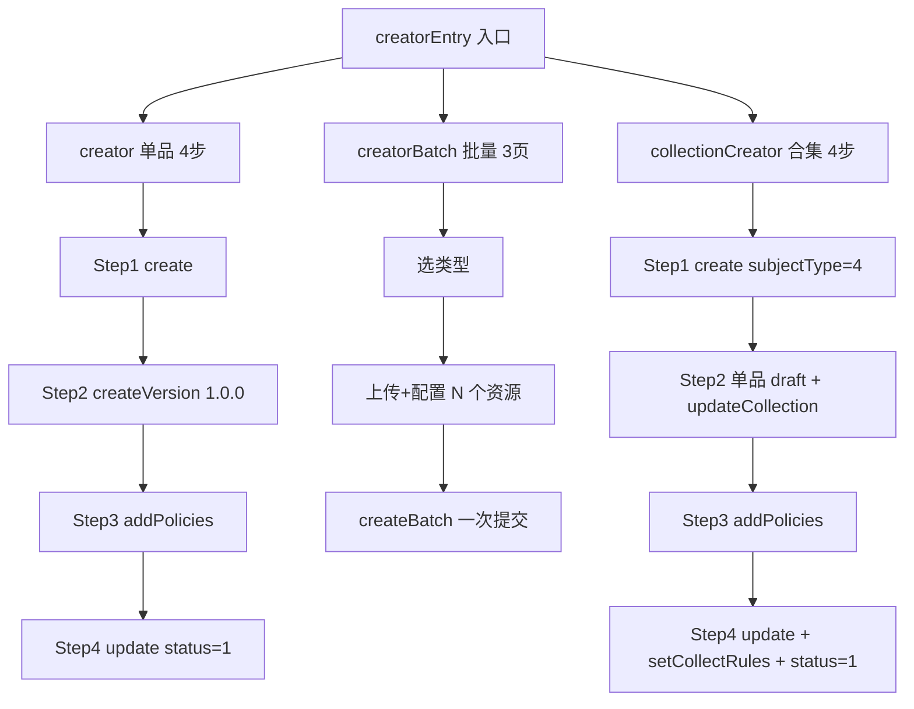
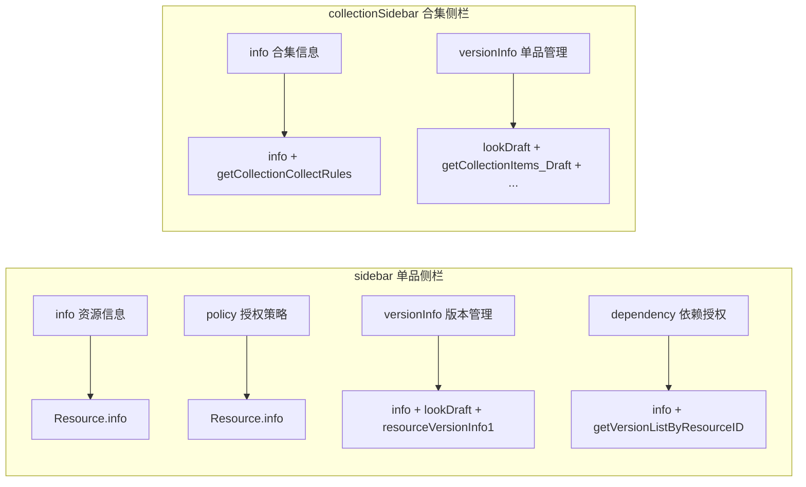
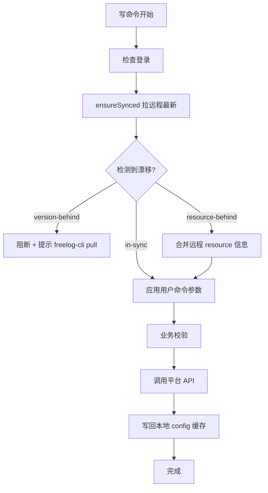
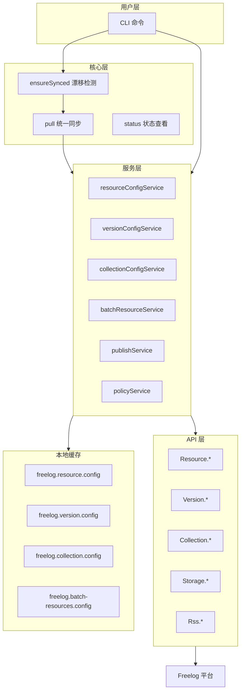
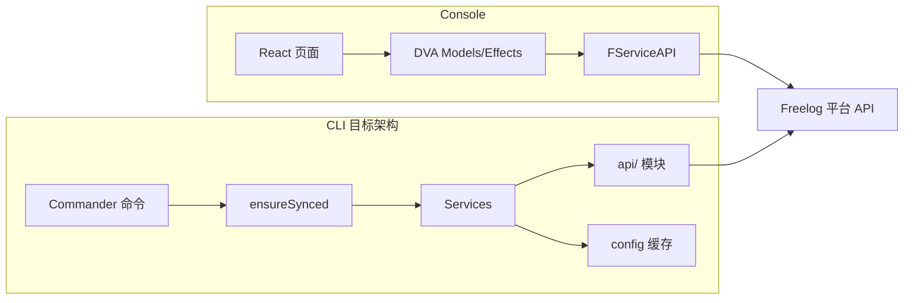
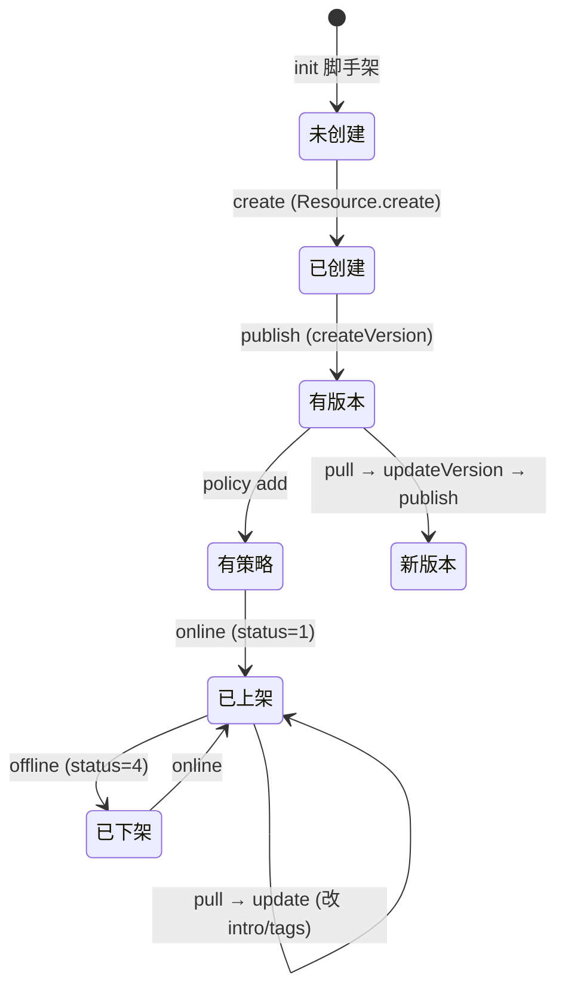
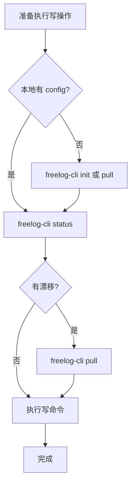

# Freelog CLI 与 Console 对齐方案

> 版本：v1.0（历史细节附录）  
> **讲解与评审请以 [脚手架对齐Console完整方案.md](./脚手架对齐Console完整方案.md)（v3.5）为准**；本文仅作补充，冲突时以主方案为准（尤其 §2.4 CLI 层原则）。  
> 适用范围：`freelog-cli-ts` 与 Console `packages/console/src/pages/resource`  
> 目标：CLI 在业务能力上与 Console 对齐，流程可不同，但**操作语义、API 调用、数据一致性**必须与 Console 等价。

---

## 目录

1. [背景与目标](#1-背景与目标)
2. [Console 业务梳理（核对版）](#2-console-业务梳理核对版)
3. [核心设计原则](#3-核心设计原则)
4. [整体架构](#4-整体架构)
5. [数据模型与配置文件定位](#5-数据模型与配置文件定位)
6. [同步机制：平台优先](#6-同步机制平台优先)
7. [Console 操作 → CLI 命令映射](#7-console-操作--cli-命令映射)
8. [标准工作流](#8-标准工作流)
9. [现状差距与改造清单](#9-现状差距与改造清单)
10. [分期实施计划](#10-分期实施计划)
11. [附录：API 对照表](#11-附录api-对照表)

---

## 1. 背景与目标

### 1.1 问题

Freelog 资源可通过 **Console（Web 工作台）** 或 **CLI（开发者命令行）** 管理。两者调用同一套平台 API，但当前 CLI 存在以下问题：

1. **本地配置文件被当作用户编辑入口**，容易与线上数据漂移。
2. **写操作不强制以线上最新状态为起点**——Console 每次打开编辑页都会拉 API，CLI 的 `updateVersion` / `publish` 等命令只读本地配置。
3. **线上版本超前时**，若未先同步就修改，会导致版本号冲突、策略覆盖、依赖列表错误等问题。
4. **合集 draft/published 双层状态**、RSS、自动收录等 Console 能力，CLI 覆盖不完整。

### 1.2 目标

| 目标 | 说明 |
|------|------|
| **业务对齐** | Console 能做的事，CLI 都能做（API 等价） |
| **平台优先** | 平台 API 是权威数据源，本地配置是 CLI 自动维护的缓存 |
| **先同步再修改** | 任何写操作前，必须确保本地状态不落后于线上 |
| **纯命令驱动** | 用户不手改 `freelog.resource.config` / `freelog.version.config` / `freelog.collection.config` |
| **流程可不同** | CLI 不必模拟 4 步向导，但每步操作语义与 Console 一致 |

### 1.3 非目标

- 不在 CLI 中复刻 Console 的 UI 交互（上传组件、Markdown 编辑器等）。
- 不在 CLI 中实现浏览器端草稿自动保存（`saveVersionsDraft` 的 300ms 防抖）；CLI 用 `pull` 替代「打开页面」。

---

## 2. Console 业务梳理（核对版）

以下基于 Console 源码逐项核对，路径：`packages/console/src/pages/resource` 及 `src/models`。

### 2.1 三种创建流程



#### 2.1.1 单品 `creator`（4 步）

| 步骤 | 用户操作 | 进入时 Load API | 提交时 Save API |
|------|---------|----------------|----------------|
| Step1 | 选类型、填标题、生成授权标识 | `Resource.info`（查重） | `Resource.create` → `getResourceTypeInfoByCode` |
| Step2 | 上传文件、填属性/依赖 | `Storage.filesListInfo` / 属性解析；Markdown 场景 `lookDraft` | `Resource.createVersion`（**固定 version=1.0.0**） |
| Step3 | 添加授权策略 | — | `Resource.update`（addPolicies）→ `Resource.info` 刷新 |
| Step4 | 封面、简介、标签、上架 | `Resource.info`（取封面） | `Resource.update`（tags, coverImages, intro, **status=1**） |

**不可变字段（创建后）**：`resourceName`（授权标识）、`resourceTypeCode`（资源类型）。侧栏 info 页显示锁图标，无 update 路径修改。

#### 2.1.2 批量 `creatorBatch`（3 页）

| 阶段 | 用户操作 | API |
|------|---------|-----|
| 选类型 | 选择 batch 资源类型 | 无 API |
| 上传配置 | 最多 20 个文件，逐个填标题/封面/标签/策略/依赖 | `createBatch`（含 version=1.0.0、fileSha1、policies 等） |
| 完成 | 查看结果、可选加入合集 | `batchInfo` |

限制：视频 ≤1GB，其他 ≤200MB。

#### 2.1.3 合集 `collectionCreator`（4 步）

| 步骤 | 用户操作 | Load API | Save API |
|------|---------|----------|----------|
| Step1 | 选合集类型、填标题 | `Resource.info`（查重） | `Resource.create`（**subjectType: 4**） |
| Step2 | 添加单品、展示样式、RSS 导入 | `getCollectionItems_Draft` → `batchInfo` → `getCollectionItemsAuth_Draft` | `updateCollection`（catalogueProperty、dependencies、**isMergeCatalogueDraft**） |
| Step3 | 添加策略 | `Resource.info` | `Resource.update`（addPolicies） |
| Step4 | 封面/简介/标签/自动收录/上架 | — | `Resource.update` → **`setCollectRules`** → `Resource.update`（**status=1**） |

**Step2 添加单品的方式**：
- 资源库添加：`addResourceItems_Draft`（含签约流程）
- RSS 导入：`Rss.sendVerificationCode` → `Resource.bindRssFeed`
- 单品编辑：`updateCollectionItemsInfo_Draft`、`deleteCollectionItems_Draft`
- 排序：`reorderCollectionItems_Draft`、`setCollectionItemsSortID_Draft`

### 2.2 创建后的编辑流程（Sidebar）

Console 编辑已有资源时，**各子页面 mount 时从服务端拉取最新数据**（非全局缓存复用）：



| 侧栏 Tab | 每次 mount 是否拉远程 | Load API | Save API |
|---------|---------------------|----------|----------|
| info（单品） | ✅ 每次 `info` | `Resource.info` | `Resource.update`（resourceTitle, intro, coverImages, tags） |
| policy | ✅ 每次 | `Resource.info` | `Resource.update`（addPolicies / updatePolicies） |
| versionInfo | ✅ 每次 | `info` + `lookDraft` + `resourceVersionInfo1` | `updateResourceVersionInfo`（编辑已有版本） |
| dependency | ✅ 每次 | `info` + `getVersionListByResourceID` | 只读展示 |
| collection info | ✅ | `info` + `getCollectionCollectRules` | `update` + `setCollectRules` |
| collection versionInfo | ✅ | `lookDraft` + `getCollectionItems_Draft` + ... | `updateCollection`（**isMergeCatalogueDraft**） |

**关键事实**：Console 的「打开编辑页」= 从平台拉最新数据。这是 CLI 必须对齐的核心行为。

### 2.3 新版本创建 `versionCreator`

| 操作 | API |
|------|-----|
| 进入页面 | `Resource.info`（isLoadLatestVersionInfo=1）→ `lookDraft` → 有 latest 时 `resourceVersionInfo1` 继承上一版 |
| 版本号初始值 | `semver.inc(latestVersion, 'patch')` 或 `'1.0.0'` |
| 存草稿 | `lookDraft` → `saveVersionsDraft` |
| 发行 | `Resource.createVersion`（version 取自用户输入） |

### 2.4 草稿机制（Console 特有）

| API | 用途 |
|-----|------|
| `lookDraft` | 读取未发布的版本草稿 |
| `saveVersionsDraft` | 保存草稿（Step2 自动 300ms 防抖 + 手动保存） |
| `deleteResourceDraft` | 丢弃草稿 |

合集草稿额外字段：`collectionItemsChanged`、`otherChanged`、`collectionItemsSetting`。

**CLI 策略**：不实现浏览器端草稿自动保存。用 `pull`（拉线上最新）+ 本地 git 管理代码变更。合集 draft 通过 `updateCollection` + `isMergeCatalogueDraft` 提交。

### 2.5 合集 Items：Draft vs Published

| 状态 | API | 使用场景 |
|------|-----|---------|
| **Draft（编辑中）** | `getCollectionItems_Draft`、`addResourceItems_Draft`、`updateCollectionItemsInfo_Draft`、`deleteCollectionItems_Draft`、`reorderCollectionItems_Draft` | 创建向导 Step2、collectionSidebar versionInfo |
| **Published（已发布）** | `getCollectionItems`、`getCollectionItemsAuth` | 合集详情展示页 |
| **合并发布** | `updateCollection` + `isMergeCatalogueDraft: 1` | 将 draft 单品合并到正式目录 |

### 2.6 状态流转

| status 值 | 含义 | Console UI |
|-----------|------|-----------|
| 0 | 待发行 | unreleased |
| 1 | 上架 | online |
| 2 | 冻结 | freeze（跳转冻结页） |
| 4 | 下架 | offline |

**上架前置条件**（`resourceOnline` 辅助函数）：
- 必须有 `latestVersion`
- 必须有至少一条启用的授权策略

| 操作 | API | 入口 |
|------|-----|------|
| 上架 | `Resource.update`（status=1） | 创建 Step4、侧栏开关 ON、添加策略后 |
| 下架 | `Resource.update`（status=4） | 侧栏开关 OFF |

策略状态独立于资源 status：`updatePolicies: [{ policyId, status: 0|1 }]`。

### 2.7 Console 暂未覆盖 / CLI 需注意

| 能力 | Console API | CLI 现状 |
|------|------------|---------|
| RSS 绑定 | `bindRssFeed` | ❌ 未实现 |
| RSS 同步 | `Rss.syncBinding` | ❌ 未实现 |
| 自动收录规则 | `setCollectRules` / `getCollectionCollectRules` | ❌ 未实现 |
| 编辑已有版本（非新发） | `updateResourceVersionInfo` | ❌ 未实现 |
| 视频封面 videoCover | createVersion 参数 | ❌ Console 自身 TODO |

---

## 3. 核心设计原则

### 3.1 平台优先（Remote-First）

```text
┌─────────────────────────────────────────┐
│           平台 API（权威数据源）           │
└─────────────────┬───────────────────────┘
                  │ pull（同步下来）
                  ▼
┌─────────────────────────────────────────┐
│   本地 config 缓存（CLI 自动维护，只读）    │
│   freelog.resource.config               │
│   freelog.version.config                │
│   freelog.collection.config             │
│   freelog.batch-resources.config        │
└─────────────────┬───────────────────────┘
                  │ 写命令提交用户意图的增量
                  ▼
┌─────────────────────────────────────────┐
│           平台 API（提交变更）             │
└─────────────────────────────────────────┘
```

### 3.2 先同步，再修改（Sync-Before-Write）

**Console 等价关系**：

```text
Console:  打开编辑页 → API Load → 用户编辑 → API Save
CLI:      pull       → 检测漂移 → 命令+参数  → API Save → 写回缓存
```

所有**会改变平台数据**的命令，执行前必须经过 `ensureSynced()`：



### 3.3 配置文件是缓存，不是编辑入口

| 规则 | 说明 |
|------|------|
| 用户不手改 config | 所有字段变更通过 CLI 命令 |
| CLI 自动写回 | API 成功后更新 config（resourceId、versionId、policies 等） |
| 查看状态用 `status` | 不打开 config 文件判断同步情况 |
| `init` 只生成空壳 | 后续字段全部由命令填充 |

### 3.4 流程可不同，语义必须一致

| 维度 | Console | CLI |
|------|---------|-----|
| 步骤形态 | 4 步向导，强制顺序 | 独立命令，灵活组合 |
| 草稿 | 浏览器自动 saveVersionsDraft | 不需要；用 pull + git |
| 文件上传 | 浏览器上传组件 | 本地 filePath 直传/压缩 |
| 批量创建 | 单次 createBatch | batch create + publish（或未来对齐 createBatch） |
| 打开编辑 | 每次 mount 拉 API | `pull` 命令 |

---

## 4. 整体架构

### 4.1 CLI 分层架构



### 4.2 Console 与 CLI 对照架构



### 4.3 单品资源生命周期



---

## 5. 数据模型与配置文件定位

### 5.1 四类配置文件

| 文件 | 类型定义 | 对应 Console 状态 | 写入时机 |
|------|---------|------------------|---------|
| `freelog.resource.config` | `public/freelog.resource.ts` | 资源条目（sidebar info + policy） | create / pull / update / policy / online |
| `freelog.version.config` | `public/freelog.version.ts` | 版本详情（versionCreator 数据） | pull / updateVersion / publish / dep |
| `freelog.collection.config` | `public/freelog.collection.ts` | 合集条目 + items draft | collection create / pull / collection update |
| `freelog.batch-resources.config` | `public/freelog.batch-resources.ts` | 批量单品列表 | batch init / batch create / pull --batch |

### 5.2 字段分类

#### 不可变（创建后 CLI 不应提供修改命令）

| 字段 | Console 证据 |
|------|-------------|
| `resourceName` | 侧栏锁图标；无 update name 路径 |
| `resourceTypeCode` | 创建时写入；侧栏只读 |
| `resourceId` | 平台分配 |
| `itemId` / `sortId`（合集单品） | 后端分配 |

#### 平台回填（用户不填，命令自动写入）

| 字段 | 回填命令 |
|------|---------|
| `resourceId` | create / collection create |
| `versionId` / `fileSha1` | publish |
| `policyId` | policy add |
| `itemId` | collection item add / add-to-collection |

#### 用户通过命令修改

| 字段 | 命令 |
|------|------|
| `resourceTitle` | `update --title`（待实现） |
| `intro` / `coverImages` / `tags` | `update --intro/--cover/--tags` |
| `version` / `description` / `filePath` | `updateVersion` |
| `dependencies` | `dep add/remove/update` |
| `policies` | `policy add` / `policy list` |
| `status` | `online` / `offline` |
| `catalogueProperty` | `collection update` |
| `items` | `batch add-to-collection` / `collection item *` |

#### 仅本地使用（不同步到平台，或 publish 时透传后清空）

| 字段 | 说明 |
|------|------|
| `filePath` | 本地构建产物路径 |
| `baseUpcastResources` | publish 时透传，成功后清空 |
| `batchSignContracts` | publish 时透传，成功后清空 |
| `inputAttrs` | publish 时透传，成功后清空 |
| `authExcludedItems` | publish 时透传，成功后清空 |

---

## 6. 同步机制：平台优先

### 6.1 统一同步命令 `pull`

将现有 `syncr`、`syncv`、`batch sync` 收敛为统一入口（旧命令保留为别名）：

```bash
# 单品：同步资源 + 最新版本
freelog-cli pull

# 同步指定版本
freelog-cli pull --version 1.2.0

# 合集：同步合集信息 + items draft + collectRules
freelog-cli pull --collection

# 批量：同步所有已创建单品
freelog-cli pull --batch

# 全量（合集项目）
freelog-cli pull --all
```

#### pull 内部 API 调用

| 范围 | Load API | 写入缓存 |
|------|----------|---------|
| resource | `Resource.info` | `freelog.resource.config` |
| version (latest) | `Resource.info`(isLoadLatestVersionInfo=1) 或 `resourceVersionInfo1` | `freelog.version.config` |
| collection | `Resource.info` + `getCollectionItems_Draft` + `getCollectionCollectRules` | `freelog.collection.config` |
| batch 每项 | 对每个 resourceId 执行上述 resource + version | `freelog.batch-resources.config` |

**等价 Console 操作**：

| pull 范围 | Console 等价 |
|-----------|-------------|
| `pull` | 打开 sidebar/info + versionInfo |
| `pull --collection` | 打开 collectionSidebar/info + versionInfo |
| `pull --batch` | 对每个单品打开 sidebar |

### 6.2 同步状态检测 `status`

```bash
freelog-cli status
```

输出示例：

```text
=== 同步状态 ===

项目类型: 单品

资源  my-theme (abc123def456)
  资源信息: ✅ 已同步
  版本:     ⚠️  本地 1.0.0  |  线上最新 1.2.0 (versionId: xyz789)
  策略:     ✅ 已同步（2 条启用）
  依赖:     ⚠️  本地 3 条  |  线上 5 条
  状态:     已上架 (status=1)

建议: freelog-cli pull
```

#### 漂移类型

| 状态 | 检测条件 | 写操作处理 |
|------|---------|-----------|
| `in-sync` | 本地与线上一致 | 允许 |
| `version-behind` | `semver.gt(remote.latest, local.version)` 或 `versionId` 不一致 | **阻断**，提示 pull |
| `resource-behind` | policies 数量/ID、status、intro 等与远程不一致 | 写前自动 merge 或要求 pull |
| `conflict` | 本地有未推送修改且线上也有更新 | 提示选择策略 |

### 6.3 ensureSynced 服务（待实现）

所有写命令复用的公共服务：

```typescript
// src/services/syncGuardService.ts（待新建）

interface SyncGuardOptions {
  scope: 'resource' | 'version' | 'collection' | 'batch';
  mode: 'block' | 'auto-pull';  // 默认 block
}

async function ensureSynced(options: SyncGuardOptions): Promise<SyncResult> {
  // 1. 拉远程最新
  // 2. 与本地缓存比对
  // 3. version-behind → 抛错或自动 pull
  // 4. resource-behind → merge 远程 policies/status
  // 5. 返回可用于写操作的基础状态
}
```

### 6.4 各写命令的同步要求

| 命令 | 必须同步的范围 | 当前行为 | 目标行为 |
|------|--------------|---------|---------|
| `update` | resource | ✅ 会 getResourceInfo | 增加 version-behind 警告 |
| `updateVersion` | version | ❌ 只写本地 | **必须先 ensureSynced(version)** |
| `publish` | version + resource | ❌ 不比对线上版本 | **校验 newVersion > remote.latest** |
| `policy add` | resource (policies) | ✅ 会比对远程 | 保持 |
| `dep add/update` | version (dependencies) | ❌ 读本地 | **先 pull version** |
| `online/offline` | resource (status) | ✅ 会 getResourceInfo | 保持 |
| `collection update` | collection + items | ⚠️ 只拉 resource | **pull --collection** |
| `batch publish` | 每项 version | ❌ 不检查 | **每项 ensureSynced** |

---

## 7. Console 操作 → CLI 命令映射

### 7.1 创建流程映射

#### 单品 creator

| Console 步骤 | Console Save API | CLI 命令 | 前置条件 |
|-------------|-----------------|---------|---------|
| Step1 创建授权条目 | `Resource.create` | `freelog-cli create` | init 完成 |
| Step2 提交资源文件 | `Resource.createVersion` (v1.0.0) | `updateVersion --version 1.0.0 --filePath ./dist` + `publish` | create 完成 |
| Step3 添加策略 | `Resource.update`(addPolicies) | `policy add` | publish 完成 |
| Step4 完善并上架 | `Resource.update`(status=1) | `update --intro "..." --tags "..."` + `online` | policy 完成 |

#### 批量 creatorBatch

| Console 阶段 | Console API | CLI 命令 |
|-------------|------------|---------|
| 选类型 | — | `batch init ./dir`（交互选类型） |
| 上传配置 | 本地 state | `batch add` / `batch edit` |
| 批量提交 | `Resource.createBatch` | `batch create --force` + `batch publish --force` |

> 未来可考虑新增 `batch submit` 直接调用 `createBatch` API，与 Console 完全一致。

#### 合集 collectionCreator

| Console 步骤 | Console API | CLI 命令 |
|-------------|------------|---------|
| Step1 创建合集 | `Resource.create`(subjectType=4) | `collection create` |
| Step2 添加单品 | `addResourceItems_Draft` 等 | `batch create/publish` + `batch add-to-collection` |
| Step3 添加策略 | `Resource.update`(addPolicies) | `collection policy add` |
| Step4 完善上架 | `update` + `setCollectRules` + `update`(status=1) | `collection update` + `collection publish` |

### 7.2 编辑流程映射（创建后）

| Console 页面 | Console Load | Console Save | CLI 流程 |
|-------------|-------------|-------------|---------|
| sidebar/info | `Resource.info` | `update`(title/intro/cover/tags) | `pull` → `update --intro/--tags/--cover` |
| sidebar/policy | `Resource.info` | `update`(addPolicies/updatePolicies) | `pull` → `policy add` / `policy list` |
| versionCreator | `info` + `lookDraft` + `resourceVersionInfo1` | `createVersion` | `pull` → `updateVersion` → `publish` |
| versionEditor | `resourceVersionInfo1` | `updateResourceVersionInfo` | `pull --version X` → `version edit`（待实现） |
| sidebar 上下架 | `Resource.info` | `update`(status) | `pull` → `online` / `offline` |
| collectionSidebar/info | `info` + `getCollectionCollectRules` | `update` + `setCollectRules` | `pull --collection` → `collection update` |
| collectionSidebar/versionInfo | `getCollectionItems_Draft` | `updateCollection`(isMergeCatalogueDraft) | `pull --all` → `batch publish` → `collection publish` |

### 7.3 依赖管理映射

| Console 操作 | Console 位置 | CLI 命令 |
|-------------|-------------|---------|
| Step2 添加依赖声明 | creator Step2 更多设置 | `pull` → `dep add <id>` |
| 查看依赖树 | sidebar/dependency（只读） | `dep list --tree` |
| 更新依赖版本 | versionEditor | `pull` → `dep update <id> -v ^2.0.0` |
| 合集依赖 | collection Step2 | `collection dep add` |

---

## 8. 标准工作流

### 8.1 首次发行（单品主题/插件）

```bash
# 1. 初始化项目（仅生成代码 + 空配置）
freelog-cli init my-theme && cd my-theme
pnpm install && pnpm build

# 2. 创建资源（对齐 creator Step1）
freelog-cli create

# 3. 发布首版（对齐 creator Step2，固定 1.0.0）
freelog-cli updateVersion --version 1.0.0 --description "初始版本" --filePath ./dist
freelog-cli publish

# 4. 添加策略（对齐 creator Step3）
freelog-cli policy add

# 5. 完善信息并上架（对齐 creator Step4）
freelog-cli update --intro "主题介绍" --tags "Vue,主题"
freelog-cli online
```

### 8.2 发新版（线上可能已超前）

```bash
# 1. 检查同步状态
freelog-cli status
# ⚠️  本地 1.0.0 | 线上最新 1.2.0

# 2. 同步线上最新（对齐 versionCreator 打开页面）
freelog-cli pull
# 本地已更新为 1.2.0

# 3. 构建并发新版
pnpm build
freelog-cli updateVersion --version 1.3.0 --description "新功能" --filePath ./dist
freelog-cli publish
# publish 内部校验：1.3.0 > 1.2.0 ✅
```

### 8.3 Console 改过，回到 CLI 继续

```bash
# 1. 发现漂移
freelog-cli status
# ⚠️  resource-behind: 线上 intro 已更新
# ⚠️  version-behind: 线上版本 1.2.0

# 2. 拉取 Console 上的所有变更
freelog-cli pull

# 3. 在最新状态上继续操作
freelog-cli update --tags "Vue,主题,暗色"
```

### 8.4 合集全流程

```bash
freelog-cli init my-novel          # 选「合集」
freelog-cli collection create      # Step1
freelog-cli batch init ./chapters  # Step2 准备单品
freelog-cli batch create --force
freelog-cli batch publish --force
freelog-cli batch add-to-collection
freelog-cli collection policy add  # Step3
freelog-cli collection update --intro "小说合集"
freelog-cli collection publish     # Step4（含 isMergeCatalogueDraft）
```

### 8.5 合集维护（线上已有人改过）

```bash
freelog-cli status                 # 检查 collection + batch 漂移
freelog-cli pull --all             # 同步合集 + 所有单品
freelog-cli batch publish chapter-10
freelog-cli batch add-to-collection
freelog-cli collection publish
```

### 8.6 决策流程图



---

## 9. 现状差距与改造清单

### 9.1 同步机制（P0 — 最优先）

| 编号 | 差距 | 改造 | 对齐 Console |
|------|------|------|-------------|
| S1 | 无统一 `pull` 命令 | 新建 `pull`，整合 syncr/syncv/batch sync | 打开编辑页 |
| S2 | 无 `status` 漂移检测 | 新建 `status`，比对本地 vs 远程 | — |
| S3 | `publish` 不校验版本 | 发布前比对 `remote.latestVersion` | versionCreator 版本号校验 |
| S4 | `updateVersion` 不拉远程 | 执行前 `ensureSynced(version)` | versionCreator mount |
| S5 | `dep` 不拉远程 version | 执行前 pull version | Step2 依赖基于最新版 |
| S6 | 无 `collection pull` | `pull --collection` 拉 items draft | collectionSidebar mount |
| S7 | 写命令不默认 ensureSynced | 所有写命令接入 syncGuard | 每次 mount 拉 API |

### 9.2 命令能力（P1）

| 编号 | 差距 | 改造 | 对齐 Console |
|------|------|------|-------------|
| C1 | `update` 无 `--title` | 新增 `--title` flag | sidebar/info 改标题 |
| C2 | `batch update` 无 flags | 补 `--intro/--cover/--tags` | creatorBatch Card |
| C3 | 无 `version edit` | 新增，调 `updateResourceVersionInfo` | versionEditor |
| C4 | 无 `collection item update/reorder` | 新增 | collection Step2 排序/改标题 |
| C5 | 无 `setCollectRules` | `collection collect-rules set` | collection Step4 |
| C6 | 无 RSS 命令 | `collection rss bind/sync` | collection Step2 RSS |
| C7 | `policy add` 无法脚本化 | `--from-file` 支持 | — |
| C8 | 无 `batch skip` | `batch skip/unskip <name>` | — |

### 9.3 现有命令同步行为审计

| 命令 | 拉远程? | 写回缓存? | 需改造 |
|------|--------|----------|--------|
| `create` | ❌（新建） | ✅ | — |
| `update` | ✅ getResourceInfo | ✅ | 加 version-behind 警告 |
| `updateVersion` | ❌ | ✅ 仅本地 | **S4** |
| `publish` | ⚠️ 部分 | ✅ | **S3** |
| `policy add` | ✅ | ✅ | — |
| `dep add` | ❌ | ✅ | **S5** |
| `online/offline` | ✅ | ✅ | — |
| `syncr` | ✅ | ✅ | 合并为 pull |
| `syncv` | ✅ | ✅ | 合并为 pull |
| `collection update` | ✅ resource only | ✅ | **S6** |
| `collection publish` | ⚠️ | ✅ | 加 items draft 检查 |
| `batch create/publish` | ❌ | ✅ | **S7** |
| `batch sync` | ✅ | ✅ | 合并为 pull --batch |

---

## 10. 分期实施计划

### Phase 1：同步基础设施（1-2 周）

**目标**：建立「先同步再修改」的硬性约束。

- [ ] 新建 `src/services/syncGuardService.ts`（ensureSynced + 漂移检测）
- [ ] 新建 `freelog-cli pull` 命令（整合 syncr + syncv）
- [ ] 新建 `freelog-cli status` 命令（漂移报告）
- [ ] `publish` 接入版本校验（S3）
- [ ] `updateVersion` 接入 ensureSynced（S4）
- [ ] `dep add/update` 接入 version pull（S5）
- [ ] `syncr` / `syncv` 保留为 `pull` 的别名
- [ ] 文档更新

### Phase 2：合集同步 + 批量对齐（2-3 周）

- [ ] `pull --collection`（拉 items draft + collectRules）（S6）
- [ ] `pull --batch`（批量同步所有单品）
- [ ] `pull --all`
- [ ] `batch publish` 每项 ensureSynced（S7）
- [ ] `batch update` 补 CLI flags（C2）
- [ ] `update --title`（C1）

### Phase 3：编辑能力补齐（3-4 周）

- [ ] `version edit`（C3，对齐 versionEditor）
- [ ] `collection item update/reorder`（C4）
- [ ] `collection collect-rules set/get`（C5）
- [ ] `collection rss bind/sync`（C6）
- [ ] `policy add --from-file`（C7）

### Phase 4：体验优化

- [ ] 写命令默认 `--pull`（执行前自动 pull，可 `--no-pull` 跳过）
- [ ] `publish --bump patch/minor/major`（基于线上最新自动 +1）
- [ ] `pull` 后显示 diff 摘要
- [ ] `freelog-cli wizard`（一键跑 creator 四步，给新手）
- [ ] CI 模式：`--yes --pull` 全自动
- [ ] 手改 config 检测 + 警告

---

## 11. 附录：API 对照表

### 11.1 单品资源

| Console 操作 | FServiceAPI 方法 | CLI 命令 | CLI api/ 模块 |
|-------------|-----------------|---------|--------------|
| 创建资源 | `Resource.create` | `create` | `api/resource.ts` |
| 发布版本 | `Resource.createVersion` | `publish` | `api/version.ts` |
| 更新资源信息 | `Resource.update` | `update` | `api/resource.ts` |
| 获取资源详情 | `Resource.info` | `pull` / `syncr` | `api/resource.ts` |
| 获取版本详情 | `Resource.resourceVersionInfo1` | `pull` / `syncv` | `api/version.ts` |
| 编辑已有版本 | `Resource.updateResourceVersionInfo` | `version edit`（待实现） | 待建 |
| 添加策略 | `Resource.update`(addPolicies) | `policy add` | `services/policyService.ts` |
| 上架 | `Resource.update`(status=1) | `online` | `api/resource.ts` |
| 下架 | `Resource.update`(status=4) | `offline` | `api/resource.ts` |
| 查看草稿 | `Resource.lookDraft` | —（CLI 不需要） | — |
| 保存草稿 | `Resource.saveVersionsDraft` | —（CLI 不需要） | — |

### 11.2 批量资源

| Console 操作 | API | CLI 命令 |
|-------------|-----|---------|
| 批量创建 | `Resource.createBatch` | `batch create` + `batch publish` |
| 批量资源详情 | `Resource.batchInfo` | `batch list` |
| 生成资源名 | `Resource.generateResourceNames` | `batch init` 内部 |

### 11.3 合集资源

| Console 操作 | API | CLI 命令 |
|-------------|-----|---------|
| 创建合集 | `Resource.create`(subjectType=4) | `collection create` |
| 更新合集 | `Resource.updateCollection` | `collection publish` |
| 获取单品 draft | `getCollectionItems_Draft` | `pull --collection`（待实现） |
| 添加单品 draft | `addResourceItems_Draft` | `batch add-to-collection` |
| 编辑单品 draft | `updateCollectionItemsInfo_Draft` | `collection item update`（待实现） |
| 删除单品 draft | `deleteCollectionItems_Draft` | `collection item remove` |
| 排序单品 | `reorderCollectionItems_Draft` | `collection item reorder`（待实现） |
| 自动收录 | `setCollectRules` | `collection collect-rules`（待实现） |
| RSS 绑定 | `bindRssFeed` | `collection rss bind`（待实现） |
| RSS 同步 | `Rss.syncBinding` | `collection rss sync`（待实现） |

### 11.4 存储

| Console 操作 | API | CLI 实现 |
|-------------|-----|---------|
| 本地上传 | `Storage.uploadFile` | `publishService.checkAndUploadFile` |
| 文件 SHA1 查询 | `Storage.filesListInfo` | publish 内部 |
| 文件占用检测 | `Resource.getResourceBySha1` | publish 内部 |
| 主题/插件 ZIP | 压缩后上传 | `publishService.processFileForPublish` |

---

## 总结

本方案的核心是：

1. **Console 每次打开编辑页都从平台拉最新数据** → CLI 用 `pull` + `ensureSynced` 等价实现。
2. **线上版本超前时，必须先同步才能修改** → `status` 检测漂移，`publish`/`updateVersion`/`dep` 强制校验。
3. **配置文件是 CLI 自动维护的缓存，用户不手改** → 所有变更通过命令，命令成功后写回缓存。
4. **流程可以不同，API 语义必须一致** → 每个 Console 操作都有明确的 CLI 命令映射。
5. **分期实施，P0 优先解决同步机制** → 这是避免数据不一致的根本。

---

*相关文档：[使用指南](./使用指南.md) · [命令参考](./命令参考/) · [平台基础概念](./平台/基础概念.md)*
