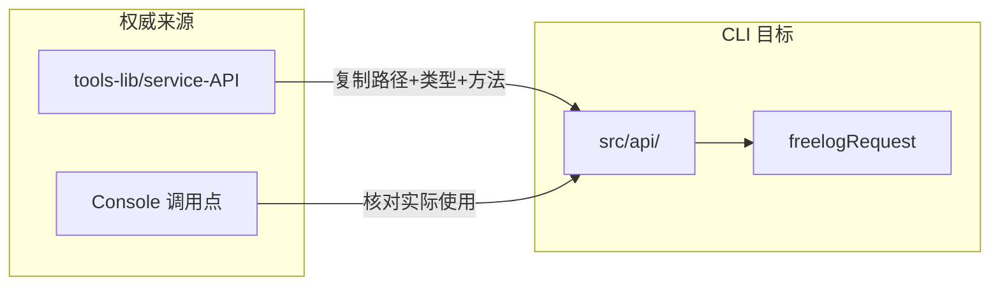

# API 迁移清单：从 tools-lib 对齐 Console

> 归属：`docs/新方案/开发设计/API/` · 入口：[../../README.md](../../README.md)  
> 对照表：[Console资源页API对照表.md](./Console资源页API对照表.md)。  
> **用户命令面无旧兼容**（见产品命令面）。下文「@deprecated」仅指 **CLI 内部** 旧 API 封装函数的过渡，不是对外保留 batch/syncr 等。

---

## 目录

1. [背景](#1-背景)
2. [为什么不能直接依赖 tools-lib 包](#2-为什么不能直接依赖-tools-lib-包)
3. [迁移策略](#3-迁移策略)
4. [目标目录结构](#4-目标目录结构)
5. [Console 资源相关 API 全量清单](#5-console-资源相关-api-全量清单)
6. [CLI 现状 vs tools-lib 差异对照](#6-cli-现状-vs-tools-lib-差异对照)
7. [错误接口明细（必须修复）](#7-错误接口明细必须修复)
8. [缺失接口明细（必须新增）](#8-缺失接口明细必须新增)
9. [实施步骤](#9-实施步骤)
10. [验收标准](#10-验收标准)

---

## 1. 背景

当前 `freelog-cli-ts/src/api` 基于旧版 Freelog 文档手写，与 Console 实际调用的 `@freelog/tools-lib` **存在路径、HTTP 方法、请求体结构不一致**的问题。

这会导致：

- 部分 CLI 命令调用失败（404 / 参数错误）
- 与 Console 行为不一致（同一操作结果不同）
- 后续 `pull` / `ensureSynced` 无法建立在正确的 API 之上

**第一步**：从 tools-lib 提取 Console 实际使用的 API，迁移到 CLI，作为后续命令层对齐的基础。

---

## 2. 为什么不能直接依赖 tools-lib 包

`@freelog/tools-lib`（v0.2.5）的 `FUtil.Request` 依赖浏览器环境：

| 依赖 | 问题 |
|------|------|
| `window.location` | 登录跳转、文件下载 |
| `js-cookie` | 浏览器 cookie 认证 |
| `react` / `html-react-parser` | UI 相关，CLI 不需要 |

CLI 已有独立的 `freelogRequest`（`src/core/http.ts`），支持 Token 认证、errCode 处理。

**结论**：不直接 `npm install @freelog/tools-lib`，而是 **移植 `service-API/*.ts` 的接口定义和路径**，底层统一走 `freelogRequest`。

---

## 3. 迁移策略



### 3.1 原则

| 原则 | 说明 |
|------|------|
| **tools-lib 为准** | URL、HTTP Method、请求体字段以 tools-lib 为准 |
| **Console 验证** | 仅迁移 Console `pages/resource` 及相关 models 实际调用的接口 |
| **薄封装** | 每个函数 = tools-lib 同名方法 + freelogRequest 适配 |
| **类型同构** | 请求/响应类型从 tools-lib 复制，去掉 `any` 草稿字段时再细化 |
| **向后兼容** | 旧函数名保留 alias，标记 `@deprecated`，逐步替换调用方 |

### 3.2 适配层模板

tools-lib 写法：

```typescript
// tools-lib
export function info({ resourceIdOrName, ...params }: InfoParamsType) {
  return FUtil.Request({
    method: 'GET',
    url: `/v2/resources/${encodeURIComponent(resourceIdOrName)}`,
    params,
  });
}
```

CLI 目标写法：

```typescript
// freelog-cli-ts/src/api/resource/info.ts
export function info({ resourceIdOrName, ...params }: InfoParamsType) {
  return freelogRequest.get(
    `/v2/resources/${encodeURIComponent(resourceIdOrName)}`,
    { params }
  );
}
```

> 注意：tools-lib 的 `FUtil.Request` 返回 `{ ret, errCode, data, msg }` 整包；CLI 的 `freelogRequest` 已提取 `data`。移植时只改传输层，不改业务层期望。

---

## 4. 目标目录结构

按 tools-lib 模块拆分，与 Console `FServiceAPI` 命名一致：

```
src/api/
├── index.ts                 # 导出 FServiceAPI 同名对象（可选）
├── types/
│   ├── common.ts            # CommonReturn 等
│   ├── resource.ts          # 从 tools-lib resources.ts 提取
│   ├── storage.ts
│   ├── rss.ts
│   └── contract.ts
├── resource/
│   ├── create.ts
│   ├── update.ts
│   ├── info.ts
│   ├── version.ts           # createVersion, resourceVersionInfo1, ...
│   ├── draft.ts             # lookDraft, saveVersionsDraft, deleteResourceDraft
│   ├── collection.ts        # updateCollection, getCollectionItems_Draft, ...
│   ├── batch.ts             # createBatch, batchUpdate, batchInfo
│   └── type.ts              # getResourceTypeInfoByCode, resourceTypes, ...
├── storage/
│   └── index.ts             # uploadFile, filesListInfo, ...
├── rss/
│   └── index.ts
├── contract/
│   └── index.ts
├── policy/
│   └── index.ts             # 已基本对齐，微调
└── user/
    └── index.ts
```

过渡期保留旧文件，新代码走新路径，旧函数加 `@deprecated` 指向新函数。

---

## 5. Console 资源相关 API 全量清单

以下从 Console `pages/resource` + `models/resource*` + `models/collection*` 梳理，**均为 tools-lib `FServiceAPI.Resource.*` 方法**。

### 5.1 单品创建与编辑（creator + sidebar）

| tools-lib 方法 | HTTP | 路径 | Console 使用场景 |
|---------------|------|------|-----------------|
| `info` | GET | `/v2/resources/{id}` | 所有编辑页 mount、查重 |
| `create` | POST | `/v2/resources` | creator Step1 |
| `createVersion` | POST | `/v2/resources/{id}/versions` | creator Step2、versionCreator |
| `update` | PUT | `/v2/resources/{id}` | Step3 策略、Step4 上架、sidebar 改信息 |
| `lookDraft` | GET | `/v2/resources/{id}/versions/drafts` | Step2/versionCreator mount |
| `saveVersionsDraft` | POST | `/v2/resources/{id}/versions/drafts` | Step2 自动/手动存草稿 |
| `deleteResourceDraft` | DELETE | `/v2/resources/{id}/versions/drafts` | 丢弃草稿 |
| `resourceVersionInfo1` | GET | `/v2/resources/{id}/versions/{version}` | 版本详情、syncv |
| `updateResourceVersionInfo` | PUT | `/v2/resources/{id}/versions/{version}` | versionEditor 编辑已有版本 |
| `getVersionListByResourceID` | GET | `/v2/resources/{id}/versions` | dependency 页版本列表 |
| `getResourceTypeInfoByCode` | GET | `/v2/resources/types/getInfoByCode` | 上传方式、属性解析 |
| `getAttrsInfoByKey` | GET | `/v2/resources/attrs/getInfoByKey` | 系统属性解析 |
| `getResourceBySha1` | GET | `/v2/resources/files/{sha1}` | 文件占用检测 |
| `cycleDependencyCheck` | POST | `/v2/resources/{id}/versions/cycleDependencyCheck` | 依赖循环检查 |
| `resolveResources` | GET | `/v2/resources/{id}/resolveResources` | 依赖解析 |
| `batchSetContracts` | PUT | `/v2/resources/{id}/versions/batchSetContracts` | 策略签约版本 |
| `batchAuth` | GET | `/v2/auths/resources/batchAuth/results` | 侧栏授权状态 |

### 5.2 批量创建（creatorBatch）

| tools-lib 方法 | HTTP | 路径 | Console 使用场景 |
|---------------|------|------|-----------------|
| `createBatch` | POST | `/v2/resources/createBatch` | 批量提交 |
| `generateResourceNames` | POST | `/v2/resources/generateResourceNames` | 名称去重 |
| `batchInfo` | GET | `/v2/resources/list` | 批量查详情 |
| `getResourceTypeInfoByCode` | GET | `/v2/resources/types/getInfoByCode` | 类型配置 |

### 5.3 合集（collectionCreator + collectionSidebar）

| tools-lib 方法 | HTTP | 路径 | Console 使用场景 |
|---------------|------|------|-----------------|
| `create` (subjectType=4) | POST | `/v2/resources` | 合集 Step1 |
| `updateCollection` | PUT | `/v2/resources/catalogue/{id}` | Step2 提交、versionInfo 发布 |
| `getCollectionItems_Draft` | GET | `/v2/resources/catalogues/drafts/{id}/items` | 单品列表（草稿） |
| `addResourceItems_Draft` | POST | `/v2/resources/catalogues/drafts/{id}/items` | 添加单品 |
| `updateCollectionItemsInfo_Draft` | PUT | `/v2/resources/catalogues/drafts/{id}/items` | 改单品标题 |
| `deleteCollectionItems_Draft` | DELETE | `/v2/resources/catalogues/drafts/{id}/items?removeCollectionItemIds=` | 删除单品 |
| `reorderCollectionItems_Draft` | PUT | `/v2/resources/catalogues/drafts/{id}/reorder` | 重置排序 |
| `setCollectionItemsSortID_Draft` | PUT | `/v2/resources/catalogues/drafts/{id}/manualSort` | 拖拽排序 |
| `getCollectionItemsAuth_Draft` | GET | `/v2/resources/catalogues/drafts/{id}/items/batchAuth` | 单品授权状态 |
| `setItemsTitle` | PUT | `/v2/resources/catalogue/{id}/items` | 单品授权排除项 |
| `getCollectionCollectRules` | GET | `/v2/resources/catalogue/{id}/items/collectRules` | 自动收录规则 |
| `setCollectRules` | POST | `/v2/resources/catalogue/{id}/items/collectRules` | 设置自动收录 |
| `bindRssFeed` | POST | `/v2/resources/rss/{id}/bindFeed` | RSS 绑定 |
| `getCollectionUpdateLogs` | GET | `/v2/resources/catalogue/{id}/updateLogs` | 变更日志 |

### 5.4 存储（上传/解析）

| tools-lib 方法 | HTTP | 路径 | Console 使用场景 |
|---------------|------|------|-----------------|
| `Storage.uploadFile` | POST | `/v2/storages/files/upload` | 本地上传 |
| `Storage.uploadImage` | POST | `/v2/storages/files/uploadImage` | 封面上传 |
| `Storage.fileIsExist` | GET | `/v2/storages/files/fileIsExist` | 文件是否存在 |
| `Storage.filesListInfo` | GET | `/v2/storages/files/list/info` | 按 sha1 解析属性 |
| `Storage.filesInfo` | GET | `/v2/storages/files/info` | 无文件时默认属性 |
| `Storage.batchObjectList` | GET | `/v2/storages/objects/list` | 存储空间导入 |

### 5.5 RSS

| tools-lib 方法 | HTTP | 路径 | Console 使用场景 |
|---------------|------|------|-----------------|
| `Rss.sendVerificationCode` | POST | `/v2/rss/bindings/sendVerificationCode` | RSS 验证码 |
| `Rss.getSyncProgress` | GET | `/v2/rss/bindings/{id}/progress` | 同步进度 |
| `Rss.syncBinding` | PUT | `/v2/rss/bindings/{id}/sync` | 手动同步 |

### 5.6 策略与签约

| tools-lib 方法 | HTTP | 路径 | 说明 |
|---------------|------|------|------|
| `Policy.policyTemplates` | POST | `/v2/translate/translate-config/list4Client` | CLI 已有，基本对齐 |
| `Policy.policyReCompile` | POST | `/v2/translate/reCompile` | CLI 已有 |
| `Policy.policyTranslation` | POST | `/v2/translate/translate` | CLI 已有 |
| `Contract.batchContracts` | GET | — | sidebar 签约页 |
| `Contract.contracts` | GET | — | 签约查询 |

---

## 6. CLI 现状 vs tools-lib 差异对照

图例：✅ 对齐 · ⚠️ 部分对齐 · ❌ 错误 · ⬜ 缺失

### 6.1 Resource 核心

| tools-lib | CLI 现有 | 状态 | 说明 |
|-----------|---------|------|------|
| `create` POST `/v2/resources` | `createResource` | ✅ | |
| `update` PUT `/v2/resources/{id}` | `updateResource` | ✅ | CLI 额外做 resourceName 格式化 |
| `info` GET `/v2/resources/{id}` | `getResourceInfo` | ✅ | |
| `batchInfo` GET `/v2/resources/list` | `getResourceInfoList` | ✅ | |
| `createBatch` POST `/v2/resources/createBatch` | `batchCreateResources` POST `/v2/resources/batch` | ❌ | **路径和 body 均错误** |
| `batchUpdate` PUT `/v2/resources/updateBatch` | `batchUpdateResources` PUT `/v2/resources/batch` | ❌ | **路径和 body 均错误** |
| `list` GET `/v2/resources` | — | ⬜ | 资源列表 |
| `resourceTypes` | `listResourceTypesByGroup` | ✅ | |
| `getResourceTypeInfoByCode` | — | ⬜ | init/create 需要 |
| `generateResourceNames` | — | ⬜ | batch 需要 |
| `getResourceBySha1` | `getResourcesByFileSha1` | ✅ | 在 storage.ts |
| `resolveResources` | — | ⬜ | 依赖签约 |
| `batchAuth` | — | ⬜ | 授权状态 |
| `batchSetContracts` | — | ⬜ | 策略版本签约 |

### 6.2 Version

| tools-lib | CLI 现有 | 状态 | 说明 |
|-----------|---------|------|------|
| `createVersion` | `createResourceVersion` | ✅ | |
| `resourceVersionInfo1` | `getResourceVersionInfo` | ✅ | |
| `resourceVersionInfo2` GET `/v2/resources/versions/detail` | — | ⬜ | 按 versionId 查 |
| `getVersionListByResourceID` | `getResourceVersionInfoList` | ✅ | |
| `getVersionList` | `getBatchResourceVersionList` | ✅ | |
| `updateResourceVersionInfo` | — | ⬜ | **编辑已有版本，Console 必用** |
| `lookDraft` | `getResourceVersionDraft` | ✅ | |
| `saveVersionsDraft` POST | `saveResourceVersionDraft` PUT | ❌ | **HTTP 方法错误** |
| `deleteResourceDraft` DELETE | — | ⬜ | |
| `cycleDependencyCheck` | `checkCycleDependency` | ✅ | |

### 6.3 Collection

| tools-lib | CLI 现有 | 状态 | 说明 |
|-----------|---------|------|------|
| `updateCollection` PUT `/v2/resources/catalogue/{id}` | `updateCollectionResource` | ✅ | body 字段需核对 |
| `getCollectionItems` | `getCollectionItems` | ⚠️ | CLI 用 page/pageSize，tools-lib 用 skip/limit |
| `getCollectionItems_Draft` | — | ⬜ | **合集核心，完全缺失** |
| `addResourceItems_Draft` POST `.../drafts/{id}/items` | `batchAddCollectionItemsDraft` POST `.../items/batch` | ❌ | **路径错误** |
| `updateCollectionItemsInfo_Draft` PUT `.../items` | `batchUpdateCollectionItemsDraft` PUT `.../items/batch` | ❌ | **路径和 body 结构错误** |
| `deleteCollectionItems_Draft` | `batchDeleteCollectionItemsDraft` | ⚠️ | 路径接近，需核对 query |
| `setCollectionItemsSortID_Draft` | `setCollectionItemsSortDraft` | ✅ | |
| `reorderCollectionItems_Draft` | `resetCollectionItemsSortDraft` | ✅ | 参数名 sortType vs orderType 需核对 |
| `getCollectionItemsAuth` GET `/v2/auths/resources/{id}/items/batchAuth` | `batchQueryItemAuth` POST `.../items/auth/batch` | ❌ | **方法+路径错误** |
| `getCollectionCollectRules` GET `.../items/collectRules` | `getAutoIncludeRules` GET `.../auto-include-rules` | ❌ | **路径错误** |
| `setCollectRules` POST `.../items/collectRules` | `createOrUpdateAutoIncludeRule` POST `.../auto-include-rules` | ❌ | **路径+body 结构错误** |
| `bindRssFeed` | — | ⬜ | |
| `getCollectionUpdateLogs` | — | ⬜ | |

### 6.4 Storage

| tools-lib | CLI 现有 | 状态 |
|-----------|---------|------|
| `uploadFile` | `uploadFile` | ✅ |
| `uploadImage` | `uploadImage` | ✅ |
| `fileIsExist` | `checkFileExists` | ✅ |
| `filesListInfo` | — | ⬜ |
| `filesInfo` | — | ⬜ |
| `batchObjectList` | — | ⬜ |

### 6.5 RSS

| tools-lib | CLI 现有 | 状态 |
|-----------|---------|------|
| 全部 5 个方法 | — | ⬜ 整个模块缺失 |

---

## 7. 错误接口明细（必须修复）

### 7.1 批量创建 — 最严重

```diff
# tools-lib (Console 实际)
- POST /v2/resources/createBatch
- body: { resourceTypeCode, createResourceObjects: [...] }

# CLI 当前（错误）
+ POST /v2/resources/batch
+ body: { resources: [...] }
```

**影响**：`batch create` 若走 `batchCreateResources` 必然失败。

### 7.2 批量更新

```diff
# tools-lib
- PUT /v2/resources/updateBatch
- body: { resourceIds: string[], status?, addPolicies? }

# CLI 当前（错误）
+ PUT /v2/resources/batch
+ body: { resources: [...] }
```

### 7.3 版本草稿保存

```diff
# tools-lib
- POST /v2/resources/{id}/versions/drafts

# CLI 当前（错误）
+ PUT /v2/resources/{id}/versions/drafts
```

### 7.4 合集自动收录

```diff
# tools-lib
- GET/POST /v2/resources/catalogue/{id}/items/collectRules
- body: { status, conditionType, filterConditions, serializeStatus? }

# CLI 当前（错误）
+ GET/POST /v2/resources/catalogue/{id}/auto-include-rules
+ body: { ruleName, enabled, conditions: [...] }  // 完全不同结构
```

### 7.5 合集单品授权查询

```diff
# tools-lib
- GET /v2/auths/resources/{resourceId}/items/batchAuth?itemIds=

# CLI 当前（错误）
+ POST /v2/resources/catalogue/{resourceId}/items/auth/batch
+ body: { resourceIds: [...] }
```

### 7.6 合集 draft 单品增删改

多个 CLI 函数使用了不存在的 `/items/batch` 路径，tools-lib 统一为 `/catalogues/drafts/{id}/items`。

---

## 8. 缺失接口明细（必须新增）

按 Console 资源流程优先级排序：

### P0 — 阻塞主流程

| 方法 | 用途 |
|------|------|
| `createBatch` | 批量创建（修正后） |
| `getCollectionItems_Draft` | 合集 pull、单品列表 |
| `addResourceItems_Draft` | 添加单品到合集 |
| `updateResourceVersionInfo` | 编辑已有版本 |
| `getResourceTypeInfoByCode` | 创建/发布时类型配置 |
| `deleteResourceDraft` | 清理草稿 |

### P1 — 同步与编辑

| 方法 | 用途 |
|------|------|
| `saveVersionsDraft` | 修正 HTTP 方法后 |
| `setCollectRules` / `getCollectionCollectRules` | 合集自动收录 |
| `updateCollectionItemsInfo_Draft` | 改单品标题 |
| `deleteCollectionItems_Draft` | 删单品 |
| `reorderCollectionItems_Draft` | 排序 |
| `getCollectionItemsAuth_Draft` | 授权状态 |
| `filesListInfo` / `filesInfo` | 属性解析 |
| `generateResourceNames` | 批量名称去重 |

### P2 — 高级能力

| 方法 | 用途 |
|------|------|
| `bindRssFeed` + `Rss.*` | RSS 合集 |
| `resolveResources` | 依赖签约 |
| `batchSetContracts` | 策略版本 |
| `batchAuth` | 授权检查 |
| `getCollectionUpdateLogs` | 变更日志 |
| `setItemsTitle` | 单品授权排除 |
| `resourceVersionInfo2` | 按 versionId 查询 |

---

## 9. 实施步骤

### Step 1：建立 API 对照表（本文档）✅

### Step 2：创建 `src/api/resource/` 模块

从 tools-lib 复制以下文件内容，改写 `FUtil.Request` → `freelogRequest`：

| 源文件 | 目标 |
|--------|------|
| `tools-lib/src/service-API/resources.ts` | `src/api/resource/index.ts`（拆分或单文件） |
| `tools-lib/src/service-API/rss.ts` | `src/api/rss/index.ts` |
| `tools-lib/src/service-API/storages.ts` | `src/api/storage/index.ts`（合并现有） |

**优先移植 Console 实际调用的 40+ 个方法**，不必一次搬完全部 80+ 个 Resource 方法。

### Step 3：修正错误接口

| 任务 | 文件 |
|------|------|
| 修复 `createBatch` / `batchUpdate` | `resource/batch.ts` |
| 修复 `saveVersionsDraft` 为 POST | `resource/draft.ts` |
| 修复合集 collectRules 路径 | `resource/collection.ts` |
| 修复合集 items draft 路径 | `resource/collection.ts` |
| 修复 items auth 为 GET | `resource/collection.ts` |

### Step 4：更新调用方

| 调用方 | 需检查的 API |
|--------|-------------|
| `commands/publish.ts` | createVersion, uploadFile |
| `commands/batch/create.ts` | createBatch（改后） |
| `commands/collection/*` | getCollectionItems_Draft, updateCollection |
| `services/publishService.ts` | Storage.* |
| `services/dependencyAddService.ts` | resolveResources, cycleDependencyCheck |

### Step 5：类型对齐

从 tools-lib 复制 `CreateVersionParamsType`、`UpdateCollectionParamsType` 等到 `src/api/types/`，替换 `public/freelog.*.ts` 中手工维护的重复类型（长期）。

### Step 6：集成测试

对每个修正的接口，用 Console 同等参数在测试环境验证：

```bash
freelog-cli --test login
# 单品 create → publish
# batch create
# collection create → add items → publish
```

---

## 10. 验收标准

| # | 标准 |
|---|------|
| 1 | Console `pages/resource` 用到的 Resource/Storage/Rss API，CLI 均有对应函数 |
| 2 | 所有 API 的 URL + Method 与 tools-lib 完全一致 |
| 3 | 请求体字段名与 tools-lib interface 一致 |
| 4 | `batch create` 调用 `POST /v2/resources/createBatch` 成功 |
| 5 | `collection pull` 可调用 `getCollectionItems_Draft` 拿到与 Console 一致的 items |
| 6 | 旧 API 函数有 `@deprecated` 注释和迁移指引 |
| 7 | 无引用旧错误路径的活跃代码 |

---

## 附录：tools-lib 源文件索引

| 模块 | 路径 |
|------|------|
| Resource（含 Collection 子 API） | `packages/@freelog/tools-lib/src/service-API/resources.ts` |
| Storage | `packages/@freelog/tools-lib/src/service-API/storages.ts` |
| RSS | `packages/@freelog/tools-lib/src/service-API/rss.ts` |
| Policy | `packages/@freelog/tools-lib/src/service-API/policies.ts` |
| Contract | `packages/@freelog/tools-lib/src/service-API/contracts.ts` |
| 入口 | `packages/@freelog/tools-lib/src/service-API/index.ts` |

---

*关联：[新方案 README](../../README.md) · [命令规格](../02-命令规格.md) · [归档 CLI对齐](../../../archive/CLI与Console对齐方案.md)*
