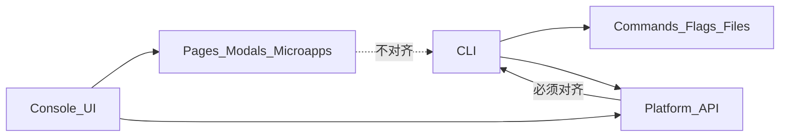
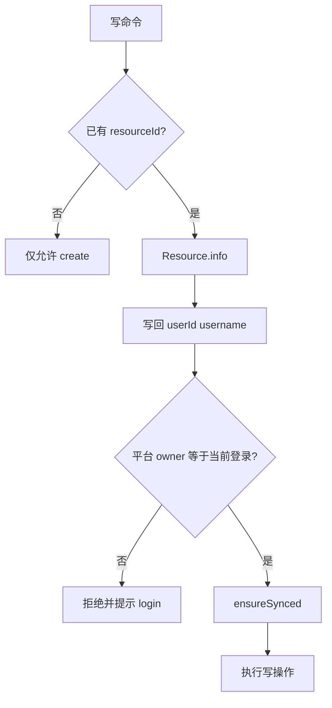
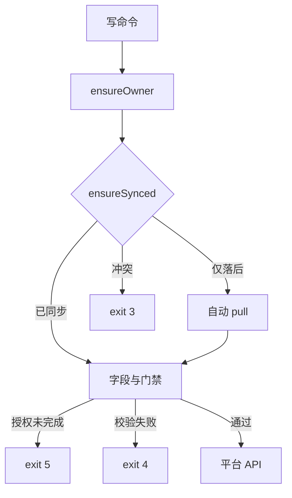
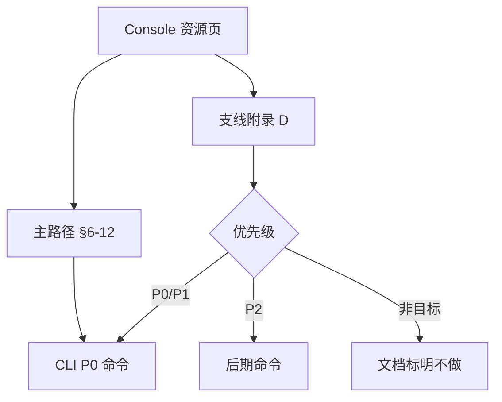

# Freelog CLI 脚手架对齐 Console 完整方案

> 版本：v3.5（讲解稿）  
> 本文档从一开始按「原则（含 CLI 层纠偏）→ Owner → 命令体系 → 项目结构 → 完整业务流程 → 字段约束 → 全页面支线」组织，可直接用于讲解与评审。  
> **讲解与评审以本文为准**；[CLI与Console对齐方案.md](./CLI与Console对齐方案.md) 为历史细节附录，冲突时以本文为准。  
> **对齐边界**：平台 API 语义 + 业务门禁 + 字段约束；**不对齐** Console 页面结构 / 弹窗 / 草稿防抖 / 微应用 UI（见 [§2.4](#24-cli-层设计原则相对-console)）。  
> API 参数明细见：[Console资源页API对照表.md](./Console资源页API对照表.md)  
> 表单字段约束见：[附录 C](#附录-cconsole-表单字段约束cli-必须对齐)  
> Console 全页面支线见：[附录 D](#附录-dconsole-全页面流程对照含支线)（对照用，实施以 §2.4 为准）

---

## 目录

1. [方案结论](#1-方案结论)
2. [设计原则](#2-设计原则)（含 [§2.4 CLI 层](#24-cli-层设计原则相对-console)）
3. [所属用户（Owner）](#3-所属用户owner)
4. [目标命令体系（讲解主轴）](#4-目标命令体系讲解主轴)
5. [项目与目录约定](#5-项目与目录约定)
6. [流程一：单品首次发布](#6-流程一单品首次发布)
7. [流程二：单品发新版](#7-流程二单品发新版)
8. [流程三：单品信息 / 策略 / 上下架更新](#8-流程三单品信息--策略--上下架更新)
9. [流程四：多文件一次发行（简化后的「批量」）](#9-流程四多文件一次发行简化后的批量)
10. [流程五：合集首次发布](#10-流程五合集首次发布)
11. [流程六：合集维护与更新](#11-流程六合集维护与更新)
12. [流程七：Console 与 CLI 交替使用](#12-流程七console-与-cli-交替使用)
13. [同步机制（贯穿所有写操作）](#13-同步机制贯穿所有写操作)
14. [API 层要求（实施前提）](#14-api-层要求实施前提)
15. [现状命令 → 目标命令迁移](#15-现状命令--目标命令迁移)
16. [分期落地](#16-分期落地)
17. [验收清单](#17-验收清单讲解后自测)
- [附录 A：Config 与平台字段](#附录-aconfig-与平台字段)
- [附录 B：与 Console 页面操作对照](#附录-b与-console-页面操作对照讲解用)
- [附录 C：Console 表单字段约束](#附录-cconsole-表单字段约束cli-必须对齐)
- [附录 D：Console 全页面流程对照](#附录-dconsole-全页面流程对照含支线)

---

## 1. 方案结论

| 要点 | 说明 |
|------|------|
| **API 同源** | CLI 与 Console 调用同一套平台接口（`@freelog/tools-lib` 所定义的路径、Method、Body） |
| **语义对齐、流程可异** | Console 是向导/页面；CLI 是独立命令。每一步操作对应同一 Save API |
| **平台优先** | 平台是权威数据源；本地 `freelog.*.config` 只是 CLI 自动维护的缓存，**用户禁止手改** |
| **先同步再修改** | 写前须与平台一致；**默认落后则自动 pull**（可 `--no-auto-pull`）；教学仍演示显式 `pull` |
| **批量不是第二套系统** | 「批量」= CLI 对多个资源**循环执行单品命令**（或内部调用一次 `createBatch`），用户不学 `batch *` 迷宫 |
| **配置绑定所属用户** | resource/collection 必记 `userId`+`username`；写前以**平台 info** 核对「当前登录 = 所有者」（合集收录他人资源见 §10.3） |
| **字段约束同源** | 标题/授权标识/简介/标签/封面/策略/版本/文件等校验与 Console 前端一致，见[附录 C](#附录-cconsole-表单字段约束cli-必须对齐) |
| **CLI 层不镜像 UI** | 非交互 / 声明式 / 落后自动 pull / 统一退出码；命令按开发者任务拆，不按 Console Tab 拆（§2.4） |

---

## 2. 设计原则

### 2.1 Console 与 CLI 的等价关系

```text
Console:  打开编辑页  →  API Load（最新数据）→ 用户编辑 → API Save
CLI:      （可自动）pull → 命令 + 参数/文件 → API Save → 写回本地缓存
```

对齐的是 **同一 Save API 与门禁**；不对齐页面、弹窗、微应用形态。

### 2.2 为什么拆成多条命令（而不是一个向导）

| Console | CLI | 原因 |
|---------|-----|------|
| Step2 一页提交版本 | `updateVersion` + `publish` | 本地先定版本号/产物路径，再上传；便于脚本与 CI |
| Step4 完善并上架 | `update` + `online` | listing 与上下架可分开做 |
| 打开页面自动拉数据 | 写命令可自动 pull；教学仍演示显式 `pull` | CLI 无「打开页面」事件，但脚本不能强制两步 |

`wizard` 仅可选糖衣，**不进 P0 / 不进默认讲解**。

### 2.3 配置文件角色

| 文件 | 存什么 | 谁写 |
|------|--------|------|
| `freelog.resource.config` | **所属用户** + 资源 ID、标题、简介、封面、标签、策略、状态 | 仅 CLI 命令 |
| `freelog.version.config` | **userId**（与 resource 一致）+ 版本号、filePath、依赖、versionId、fileSha1 | 仅 CLI 命令 |
| `freelog.collection.config` | **所属用户** + 合集 ID、listing、catalogueProperty、items 摘要 | 仅 CLI 命令 |

**不向用户推广** `freelog.batch-resources.config`。多资源场景用目录约定 + 循环单品命令解决。  
禁止手改 config ⇒ **凡 Console 可改字段，CLI 必须有 flag/文件入口**（不能只靠问卷）。

### 2.4 CLI 层设计原则（相对 Console）



| # | 原则 | 定稿 |
|---|------|------|
| 1 | 语义对齐、形态不镜像 | 同一 Save API；命令按「创建 / 发版 / 上架」等任务拆，**不按侧栏 Tab** 各造必学命令 |
| 2 | 非交互优先 | 写操作完整 flags；TTY 交互可选；CI 用 `--yes`；**禁止**主路径必须弹窗才能完成 |
| 3 | 声明式输入 | 策略 `--from-file`；依赖授权 `--policy-map`（后期）；合集排序 `--order-file` / 序号；不做拖拽式交互 |
| 4 | 同步默认省事 | 写命令若仅「落后」→ **自动 pull 再执行**；真正冲突才阻断；`--no-auto-pull` 关闭；教学仍写显式 `pull` |
| 5 | 失败可脚本化 | 统一退出码；`status` / 列表类支持 `--json` |
| 6 | 授权不装微应用 | 一期：检测未授权 → exit 5 + 引导 Console 或 policy-map；**不**把交互式 `dep auth` 当 P0 |
| 7 | RSS | 可选 `rss send-code` + `rss bind --code`；验证码来自邮箱等渠道，CLI 不做验证码 UX 主场 |
| 8 | 命令面收敛 | 展示设置并入 `collection update`；`contract list` / `collection logs` 仅 P2；`draft discard` 为冷命令 |
| 9 | 目录即上下文 | 强化「一目录一资源 + `--cwd`」（CLI 优势，优于多 Tab） |

#### 2.4.1 退出码（定稿）

| Code | 含义 |
|------|------|
| `0` | 成功 |
| `2` | 未登录 / Owner 不符 |
| `3` | 同步冲突（非简单落后；需人工处理） |
| `4` | 字段/业务校验失败（含冻结、版本号、表单约束） |
| `5` | 依赖授权未完成 |
| `1` | 其它错误 |

#### 2.4.2 CLI 反模式（明确不做）

| 反模式 | 原因 |
|--------|------|
| 默认主路径复刻 Step1–4 向导 | CLI 应可脚本拆步；wizard 非 P0 |
| 每个 Console Tab 一个必学命令 | 命令膨胀、心智成本高 |
| 用 `saveVersionsDraft` 做会话态 | 与「本地 config + pull」冲突 |
| 无 flags、只能问卷完成 create/publish/online | CI/自动化不可用 |
| CLI 内嵌浏览器微应用做授权 | 运维与安全成本过高；用声明式或引导 Console |

---

## 3. 所属用户（Owner）

### 3.1 为什么必须标记

Console 打开资源侧栏时会校验：

```text
Resource.info → data.userId === 当前登录 userId
否则 → 403 / 拒绝编辑
```

CLI 若只记 `resourceId`、不记所属用户，会出现：

| 场景 | 风险 |
|------|------|
| 同一台机器切换账号 | A 用户的项目被 B 用户误 `publish` / `update` |
| CI / 多人共享仓库 | 不清楚配置属于谁，pull 后写错账户 |
| `resourceName` 含 `username/name` | 与当前登录用户不一致时静默失败或写错对象 |
| version.config 里 `userId: 0`（现状） | 形同未绑定，无法做归属校验 |

**结论：所属用户是缓存的一等字段，不是可选元数据。**

### 3.2 配置中必存字段

```typescript
/** 所属用户（平台权威，create / pull 后写入） */
userId: number;      // 对应 Resource.info.userId
username: string;     // 对应 Resource.info.username；授权标识前缀亦用此名
```

| 文件 | 现状 | 目标 |
|------|------|------|
| `freelog.resource.config` | **无** userId / username | **必填** `userId` + `username`（create/pull 后） |
| `freelog.collection.config` | **无** | **必填** `userId` + `username`（collection create/pull 后） |
| `freelog.version.config` | 有 `userId`，常为 `0` | **必填** `userId`（与 resource 一致，禁止为 0）；`username` 可选镜像 |

比较约定（实施必须遵守）：

```text
Number(AuthInfo.userId) === Number(平台或缓存的 userId)
```

现状 `AuthInfo.userId` 为 string、平台为 number，**禁止**直接 `===` 比字符串与数字。

登录来源：`getCurrentAuth()`（**workspace 优先于 global**）提供当前登录用户。

可选增强（便于排查，非 API 字段）：

```typescript
_ownerBoundAt?: string;   // ISO 时间，最近一次绑定/校验时间
```

### 3.3 何时写入

| 时机 | 行为 |
|------|------|
| `create` / `collection create` 成功 | 以接口返回的 owner 写入；若返回缺字段则用当前登录补齐并核对 |
| `pull` | 以 `Resource.info` 的 `userId`/`username` **覆盖**本地 |
| 写命令成功后的写回 | 刷新 owner（与本次 info 一致） |
| `init` 空壳 | **不写 owner**；create / pull 之后才绑定 |
| 旧项目缺 owner 或 `userId === 0` | 首次 `status` / `pull` / 任意写命令时拉 info **补齐** |

### 3.4 何时校验（写操作必经）

在 `ensureSynced` 之前执行 **`ensureOwner()`**。已有 `resourceId` 时**必须**打平台，禁止只信本地 config（防伪造 userId）：

```text
1. 读取 getCurrentAuth()（workspace > global）
2. 若尚无 resourceId（未 create）→ 仅允许 create；不允许 update/publish
3. 若已有 resourceId → 调用 Resource.info（可与 ensureSynced 共用一次请求）
4. 以平台 userId/username 写回本地缓存
5. 若 Number(平台.userId) !== Number(auth.userId) → 阻断，提示 login 或换目录
6. 若 userId 一致但 username 不一致 → 警告并以平台值为准写回
```



与 Console 对齐：

```text
Console: mount 时 info.userId !== cookie.userId → 403
CLI:     写命令前 平台.info.userId !== auth.userId → 拒绝执行
```

### 3.5 `status` 必须展示所属用户

```text
=== 同步状态 ===

当前登录: alice (userId=1001)   # 来自 getCurrentAuth()

资源 my-theme (abc123)
  所属用户: alice (1001)     ✅ 与当前登录一致
  资源信息: ✅ 已同步
  版本:     ✅ 1.2.0

--- 若不一致 ---
  所属用户: bob (1002)       ❌ 与当前登录 alice (1001) 不一致
  建议: freelog-cli login    # 切换到 bob
        或勿在此目录执行写命令
```

### 3.6 与授权标识的关系

平台资源名形如 `username/resource-name`：

- `username` 必须等于所属用户名（创建时由平台绑定）。
- CLI `create` 使用当前登录用户生成/校验名称前缀。
- `pull` 后若 `resourceName` 前缀与 `config.username` 不一致 → 视为异常，要求重新 pull 或报错。

### 3.7 讲解口令

> 每个项目目录的配置都「挂」在某个 Freelog 用户下；当前登录用户必须是该所有者，才能改。换账号先看 `status`，不对就 `login`，不要硬 publish。归属以平台为准，本地伪造无效。

---

## 4. 目标命令体系（讲解主轴）

以下为**对齐完成后的目标命令表**。讲解时以本表为准。  
表中「实施」：`现有` = 今日已有（可能缺同步/缺参数）；`增强` = 现有但要改；`新增` = 目标新增。

### 4.1 全局

| 命令 | 作用 | 主要选项 | 实施 |
|------|------|---------|------|
| `login` / `logout` | 登录 / 退出 | `-g` 全局；`--test` 测试环境 | 现有 |
| `status` | **同步状态** + **所属用户 vs 当前登录** + 登录信息 | `--resource` / `--version` / `--collection`；**`--json`** | 增强（今日仅登录态） |
| `pull` | 从平台拉取最新到本地缓存 | `--version <x>`；`--collection`；`--all` | 新增（替代 syncr+syncv） |
| `init [name]` | 脚手架 + 空配置壳 | 主题/插件/合集等 | 现有 |

全局选项：`--test`、`--debug`；写命令统一支持：

| 选项 | 作用 |
|------|------|
| `--cwd <dir>` | 在指定资源目录执行 |
| `--yes` | 跳过确认（CI） |
| `--no-auto-pull` | 关闭「落后自动 pull」（默认开启，见 §13） |
| `--json` | 机器可读输出（至少 `status` / `dep list` / `policy list`） |

退出码见 [§2.4.1](#241-退出码定稿)。

### 4.2 单品资源（一个目录 = 一个资源）

对外用语用「创建 / 发版 / 上架」；下表「对齐」列仅供实现对照。

| 命令 | 作用 | 对齐平台能力 | 主要选项 | 实施 |
|------|------|-------------|---------|------|
| `create` | 创建资源壳 | `Resource.create` | `--title` `--type` `--name`（全 flags 可非交互）；`--from-dir` | 增强 |
| `updateVersion` | 写入**本地**版本意图 | 发版前本地准备 | `--version` `--description` `--filePath` | 现有 |
| `publish` | 上传并 `createVersion` | 发行版本 | `--bump`；未授权 → exit 5 | 增强 |
| `policy add` | 添加授权策略 | `update` addPolicies | **`--from-file` 主路径**；TTY 才可交互模板 | 增强 |
| `policy list` | 查看/启用/停用策略 | updatePolicies | `--json` | 现有 |
| `update` | 更新 listing | `update` title/intro/cover/tags | `--title` `--intro` `--cover` `--tags` | 增强 |
| `online` / `offline` | 上架 / 下架 | status 1/4（对齐 resourceOnline） | `--yes` | 现有 |
| `dep add/remove/list/update` | 依赖列表（随下版 publish） | dependencies | `-v`；`list --json` | 现有 |
| `version edit` | 编辑已有版本元数据 | `updateResourceVersionInfo` | `--description` 等 | 新增 |
| `draft discard` | 清理 Console 遗留平台草稿 | `deleteResourceDraft` | — | 冷命令（P1，不进主讲解口令） |
| `dep auth` | 声明式补齐依赖签约 | `batchCreateContracts` / `batchSignContracts` | **`--policy-map <file>`**（非微应用） | Phase 5；非主讲解 |
| `contract list` | 授权方合约只读 | `Contract.contracts` | `--json` | P2，不进主轴 |

### 4.3 合集

| 命令 | 作用 | 对齐平台能力 | 主要选项 | 实施 |
|------|------|-------------|---------|------|
| `collection create` | 创建合集壳 | create subjectType=4 | `--title` `--type` | 现有 |
| `collection item add` | 添加单品到 draft | `addResourceItems_Draft` | `<resourceId\|路径>` | 增强 |
| `collection item remove` | 移除单品 | `deleteCollectionItems_Draft` | `<id>` | 现有 |
| `collection item update` | 改单品标题等 | `updateCollectionItemsInfo_Draft` | `--title` | 新增 |
| `collection item reorder` | 排序 | draft reorder | **`--order-file`** 或显式 id 列表（非交互拖拽） | 新增 |
| `collection update` | 改 listing + 展示 | `update` + catalogueProperty | `--title/--intro/--cover/--tags`；**`--display-*`**（原 display set） | 增强 |
| `collection policy add/list` | 合集策略 | addPolicies | `--from-file` 优先 | 现有 |
| `collection publish` | 合并 draft 并发布 | `updateCollection` isMergeCatalogueDraft | — | 现有/增强 |
| `collection unpublish` | 下架合集 | status=4 | `--yes` | 现有 |
| `collection collect-rules set/get` | 自动收录 | `setCollectRules` | 声明式 flags / `--from-file` | 新增 |
| `collection rss send-code` | 触发验证码 | `Rss.sendVerificationCode` | `<feedUrl>` | 新增（可选） |
| `collection rss bind/sync` | 绑定 / 同步 | `bindRssFeed` / `syncBinding` | `bind --code`（必填） | 新增 |
| `collection logs` | 变更日志只读 | `getCollectionUpdateLogs` | `--json` | P2，不进主轴 |

### 4.4 明确废弃（不再作为用户命令讲解）

| 现状 | 处理 |
|------|------|
| `batch create/publish/dep/policy/...` 整套 | **废弃对外讲解**；能力并入 `create --from-dir` 与「循环单品」 |
| `syncr` / `syncv` | 保留为 `pull` 的别名，文档只讲 `pull` |
| 用户手改三个 config | 禁止；用 `status` / `pull` / 写命令 |

---

## 5. 项目与目录约定

### 5.1 单品项目（主题 / 插件 / 普通资源）

```text
my-theme/
├── src/ ...
├── dist/                          # publish 的 filePath
├── freelog.resource.config.js     # CLI 维护
└── freelog.version.config.js      # CLI 维护
```

工作目录即资源目录；命令默认读当前目录配置。

### 5.2 合集项目（推荐）

合集壳在根目录；每个单品是**独立子目录**（各自走单品命令）。

```text
my-novel/
├── freelog.collection.config.js   # 合集壳
├── chapters/
│   ├── 01-intro/
│   │   ├── content.md             # 或 dist/
│   │   ├── freelog.resource.config.js
│   │   └── freelog.version.config.js
│   └── 02-chapter/
│       ├── ...
│       ├── freelog.resource.config.js
│       └── freelog.version.config.js
```

对单品操作：

```bash
freelog-cli create --cwd ./chapters/01-intro
freelog-cli publish --cwd ./chapters/01-intro
```

或在子目录内直接执行（无需 `--cwd`）。

### 5.3 多文件一次发行（图集等）

输入可以是扁平目录（不要求事先搭脚手架）：

```text
photos/
├── a.jpg
├── b.jpg
└── c.jpg
```

`create --from-dir` 成功后，CLI **为每个文件生成同名子目录**并写入带 owner 的 config（见[流程四](#9-流程四多文件一次发行简化后的批量)）：

```text
photos/
├── a.jpg
├── b.jpg
├── c.jpg
├── a/
│   ├── freelog.resource.config.js   # 含 userId/username
│   └── freelog.version.config.js
├── b/
│   └── ...
└── c/
    └── ...
```

若文件名无法安全作目录名，使用 `.freelog/<safeName>/`。后续对该资源的 `update` / `publish` / `policy` 进入对应子目录或加 `--cwd`。

---

## 6. 流程一：单品首次发布

### 6.1 Console 在做什么

| 步骤 | 页面 | Save API |
|------|------|----------|
| Step1 | 创建授权条目 | `POST /v2/resources`（create） |
| Step2 | 提交资源文件 | `POST /v2/resources/{id}/versions`（createVersion，**version=1.0.0**） |
| Step3 | 添加授权策略 | `PUT /v2/resources/{id}`（addPolicies） |
| Step4 | 完善信息并上架 | `PUT`（tags/cover/intro）+ `status=1` |

### 6.2 CLI 完整命令（按顺序讲解）

```bash
# 0. 登录（测试环境加 --test）
freelog-cli login

# 1. 初始化项目（生成代码 + 空配置）
freelog-cli init my-theme
cd my-theme
pnpm install && pnpm build

# 2. 创建资源壳  ←→ Console Step1
freelog-cli create
# 或非交互：
# freelog-cli create --type <resourceTypeCode> --title "我的主题" --name my-theme

# 3. 指定首版意图  ←→ Console Step2 填表
freelog-cli updateVersion --version 1.0.0 --description "初始版本" --filePath ./dist

# 4. 上传并创建版本  ←→ Console Step2 提交
freelog-cli publish

# 5. 添加策略  ←→ Console Step3
freelog-cli policy add

# 6. 完善 listing  ←→ Console Step4 信息
freelog-cli update --intro "主题介绍" --tags "Vue,主题" --cover ./cover.png

# 7. 上架  ←→ Console Step4 上架
freelog-cli online
```

### 6.3 讲解要点

- `create` 成功后写入 `userId` / `username`；后续写命令经 `ensureOwner`（必拉平台）校验所属用户。
- `create` 之后不可改：`resourceName`、`resourceTypeCode`（与 Console 一致）。字段长度/净化见[附录 C.1](#c1-单品-create)。
- `updateVersion` **不调用** createVersion，只写本地缓存；`publish` 才上传并调 API。首版版本号固定 `1.0.0`。
- 若依赖未完成签约：`publish` **exit 5**，打印缺口并提示「用 Console 完成签约，或（Phase 5）`dep auth --policy-map`」——**不**在 CLI 内复刻授权微应用。
- 依赖**列表**变更随下一版 `publish`；补签是独立能力（Console 侧栏或声明式 policy-map）。
- **CLI `online` 对齐 `resourceOnline`（严格）**：须有 `latestVersion` + 至少一条启用策略；不代建策略。
- **脚本态**：全 flags + `--yes`；落后时默认自动 pull（§13）；教学仍演示显式 `pull`。

### 6.4 命令 ↔ API 对照

| CLI | API |
|-----|-----|
| `create` | `Resource.create` |
| `publish` | `Storage.uploadFile`（如需）+ `Resource.createVersion` |
| `policy add` | `Resource.update`(addPolicies) |
| `update` | `Resource.update`(title/intro/cover/tags) |
| `online` | `Resource.update`(status=1) |

---

## 7. 流程二：单品发新版

### 7.1 Console 在做什么

打开 `versionCreator` 时：

1. `info`(isLoadLatestVersionInfo=1)
2. `lookDraft` / 继承上一版 `resourceVersionInfo1`
3. 默认版本号 = `semver.inc(latest, 'patch')`
4. 用户改文件与说明后 `createVersion`

**永远先看到线上最新，再发更高版本。**

### 7.2 CLI 完整命令

```bash
cd my-theme
pnpm build

# 1. 看所属用户 + 是否落后于线上
freelog-cli status
# 所属用户: alice ✅ | 版本 ⚠️ 本地 1.0.0 | 线上 1.2.0

# 2. 同步（必须）  ←→ Console 打开 versionCreator
freelog-cli pull

# 3. 指定新版本（必须 > 线上最新）
freelog-cli updateVersion --version 1.3.0 --description "新功能" --filePath ./dist
# 或：freelog-cli publish --bump patch   # 内部基于线上 latest +1 后发布

# 4. 发布
freelog-cli publish
# 若 1.3.0 <= 线上最新 → 拒绝并提示 pull / 改版本号
# 若当前登录 ≠ 配置所属用户 → 拒绝并提示 login
```

### 7.3 讲解要点

- **禁止**在未 `pull` 时凭本地旧版本号发布。
- `publish` 内置校验：`semver.valid` 且 `semver.gt(newVersion, remote.latestVersion || '0.0.0')`（与 `FVersionInput` 一致）。
- `publish` 前校验所属用户 = 当前登录（§3）；资源 `(status & 2) === 2`（冻结）或 `subjectType === 4`（合集）→ 拒绝单品发版（对齐 versionCreator 准入）。
- 依赖授权未完成 → `publish` exit 5（与平台门禁一致）；完成路径见 §2.4 / Phase 5 `dep auth --policy-map`，或 Console。
- 文件大小/格式以 `getResourceTypeInfoByCode` 为准，见[附录 C.2](#c2-单品-publish--updateversion)。
- 若只改已有版本的描述/属性（不换文件、不升版本号）→ `version edit`。
- **草稿**：CLI **不写** `saveVersionsDraft`；冷命令 `draft discard` 仅清理 Console 遗留，不进主流程口令。
- 脚本：`publish --bump patch --yes`（可依赖自动 pull）。

---

## 8. 流程三：单品信息 / 策略 / 上下架更新

### 8.1 改标题、简介、封面、标签（sidebar/info）

```bash
freelog-cli pull                              # ←→ 打开 info 页
freelog-cli update --title "新标题" --intro "新简介" --tags "a,b" --cover ./cover.png
```

| 选项 | 对应 Console 字段 | API | 约束（附录 C） |
|------|------------------|-----|----------------|
| `--title` | resourceTitle | `update` | 非空；≤100 |
| `--intro` | intro | `update` | ≤200 |
| `--cover` | coverImages | 本地路径先 upload | JPEG/PNG/GIF；≤5MB |
| `--tags` | tags（逗号分隔） | `update` | ≤20 个；单标 ≤20；不重复 |

### 8.2 策略（sidebar/policy）

```bash
# 推荐（脚本/CI）：文件驱动
freelog-cli policy add --from-file ./policy.json --yes
# TTY 可选交互模板
freelog-cli policy add
freelog-cli policy list --json
```

已上架时不能关掉最后一条启用策略（附录 C.3）。

### 8.3 依赖

```bash
freelog-cli dep add <resourceIdOrName>
freelog-cli dep list --tree --json
freelog-cli dep update <id> -v "^2.0.0"
freelog-cli updateVersion --version 1.4.0 --filePath ./dist
freelog-cli publish --yes
# 未授权 → exit 5；Phase 5: dep auth --policy-map ./auth-map.yaml
```

改依赖列表 = 发新版。补签：**不**做微应用；一期拒绝并引导，二期声明式 `--policy-map`。

### 8.4 上下架

```bash
freelog-cli pull
freelog-cli online              # status=1；需已有版本+策略
freelog-cli offline             # status=4
```

资源冻结：Console 侧栏用 `status === 2`，发版用 `(status & 2) === 2`；**CLI 统一 bitmask**。写命令全部拒绝，**不解冻**（平台运营能力）。

### 8.5 合约（sidebar/contract，支线）

Console：以本资源为**授权方**的合约列表（被授权方资源/节点/用户），只读详情抽屉。  
**不要**讲成依赖签约入口——依赖补签在 dependency / 发版向导（`dep auth`）。  
CLI：后期 `contract list`；首期非讲解主路径（[附录 D.1](#d1-单品侧栏-sidebar)）。

### 8.6 编辑已有版本 / 丢弃草稿

```bash
freelog-cli version edit --description "修订说明"   # 不换文件、不升版本号
freelog-cli draft discard                           # 丢弃平台草稿（Console 留下的）
```

---

## 9. 流程四：多文件一次发行（简化后的「批量」）

### 9.1 产品定义

**用户心智**：我有一个文件夹里很多图片/音频，请 CLI 帮我全部发行完。  
**不是**：再学一套 `batch create` / `batch publish` / `batch dep`。

### 9.2 Console 对照

Console `creatorBatch` 最终调用：

```text
POST /v2/resources/createBatch
{ resourceTypeCode, createResourceObjects: [ { name, version, fileSha1, ... }, ... ] }
```

这是平台一次提交优化；CLI 可内部使用，但对外只暴露一条入口。

### 9.3 CLI 命令（讲解用）

```bash
freelog-cli login
cd photos

# 一条命令完成「多文件创建+首版」
freelog-cli create --from-dir . --type <resourceTypeCode> --title-prefix "照片"
```

**CLI 内部（二选一，对用户透明）：**

1. 调用 `createBatch`（与 Console 完全一致，推荐图/音/视频）；或  
2. 对每个文件循环：`create` → upload → `createVersion`。

**落盘规则（与 §5.3 一致）：**

- 每个源文件对应一个子目录（同名，或 `.freelog/<safeName>/`）。
- 每个子目录写入 `freelog.resource.config` + `freelog.version.config`，**均绑定当前登录 owner**（与 createBatch 返回 / 当前 auth 核对）。
- 不生成用户可编辑的 `batch-resources.config`。

后续若要对其中某一个再操作：

```bash
freelog-cli update --cwd ./a --tags "风景"
# 或：cd a && freelog-cli policy add
```

走**单品命令**，不再发明 `batch update`。

### 9.4 讲解时强调

| 不要说 | 要说 |
|--------|------|
| 「先学 batch 子命令」 | 「多文件用 `create --from-dir`」 |
| 「编辑 batch-resources.config」 | 「CLI 生成子目录 config，你不用手改」 |

字段约束：整批同一 `resourceTypeCode`；**最多 20** 个文件；每项标题/授权标识同单品 create；版本固定 `1.0.0`；sha1 已被本人/他人占用则该项失败。详见[附录 C.5](#c5-多文件-create---from-dir)。

---

## 10. 流程五：合集首次发布

### 10.1 Console 在做什么

| 步骤 | Save API |
|------|----------|
| Step1 | `create`(subjectType=4) |
| Step2 | 单品进 draft（`addResourceItems_Draft` 等）→ `updateCollection`(isMergeCatalogueDraft) |
| Step3 | `update`(addPolicies) |
| Step4 | `update` → `setCollectRules` → `update`(status=1) |

### 10.2 CLI 完整命令（按目录约定）

```bash
freelog-cli login
freelog-cli init my-novel          # 选「合集」
cd my-novel

# ---------- Step1 合集壳 ----------
freelog-cli collection create --title "我的小说" --type <collectionTypeCode>

# ---------- 准备单品（每个章节仍是单品流程）----------
# 假设已有 chapters/01-intro、chapters/02-chapter
freelog-cli create --cwd ./chapters/01-intro --title "序章" --type <chapterTypeCode>
freelog-cli updateVersion --cwd ./chapters/01-intro --version 1.0.0 --filePath ./dist
freelog-cli publish --cwd ./chapters/01-intro

freelog-cli create --cwd ./chapters/02-chapter --title "第一章" --type <chapterTypeCode>
freelog-cli updateVersion --cwd ./chapters/02-chapter --version 1.0.0 --filePath ./dist
freelog-cli publish --cwd ./chapters/02-chapter

# ---------- Step2 加入合集 draft ----------
freelog-cli collection item add ./chapters/01-intro
freelog-cli collection item add ./chapters/02-chapter
# 或加他人已发布资源（对齐 Console）：
# freelog-cli collection item add <resourceId>

# ---------- Step3 策略 ----------
freelog-cli collection policy add

# ---------- Step4 listing + 发布 ----------
freelog-cli collection update --intro "系列简介" --tags "小说,系列"
freelog-cli collection publish
# 内部：updateCollection(isMergeCatalogueDraft=1) + 上架
```

可选：对多个章节子目录用 shell 循环（仍是单品命令，无 `--each`）：

```bash
for d in ./chapters/*/; do
  freelog-cli create --cwd "$d" --type <chapterTypeCode>
  freelog-cli updateVersion --cwd "$d" --version 1.0.0 --filePath ./dist
  freelog-cli publish --cwd "$d"
done
```

### 10.3 讲解要点

- `collection create` 后合集 config 写入所属用户；写合集只校验**合集** owner；`subjectType: 4`；标题/授权标识约束同单品。
- 合集可收录**他人已发布资源**（`item add <resourceId>`），与 Console `FAddResourcesHandleAuth` 一致；平台鉴权为准。
- `item add <本地路径>`：路径上须有本账号的 resource config（owner = 当前登录），再解析 resourceId；无 config 或 owner 不符 → 拒绝，改用 resourceId。
- 合集单品**先是合法单品资源**，再 `collection item add`；不要用平行的 batch 配置代替单品。
- `collection publish` 才把 draft 目录合并到正式合集（对齐 `isMergeCatalogueDraft`）。
- 自动收录 / RSS 字段枚举与门禁见[附录 C.6](#c6-合集)。

---

## 11. 流程六：合集维护与更新

### 11.1 改合集信息

```bash
cd my-novel
freelog-cli pull --collection
freelog-cli collection update --title "新系列名" --intro "..." --tags "a,b"
# 目录展示并入 update（非独立命令）：
# freelog-cli collection update --display-sort asc --display-title rtitle --display-view list
```

**RSS 合集**：除标签外 listing/目录多只读；靠 `rss sync`。空合集用 `item add` 或 `rss bind`（无 MethodPicker UI）。

### 11.2 新增一章

```bash
# 1. 单品发布
freelog-cli create --cwd ./chapters/03-new --title "第三章" --type <code>
freelog-cli updateVersion --cwd ./chapters/03-new --version 1.0.0 --filePath ./dist
freelog-cli publish --cwd ./chapters/03-new

# 2. 加入合集并发布合集变更
freelog-cli pull --collection
freelog-cli collection item add ./chapters/03-new
freelog-cli collection publish
```

### 11.3 更新某一章内容后刷新合集

```bash
freelog-cli pull --cwd ./chapters/01-intro
freelog-cli updateVersion --cwd ./chapters/01-intro --version 1.1.0 --filePath ./dist
freelog-cli publish --cwd ./chapters/01-intro

freelog-cli pull --collection
freelog-cli collection publish          # 如需把变更反映到合集侧
```

### 11.4 自动收录 / RSS（目标命令）

```bash
freelog-cli collection collect-rules set --from-file ./rules.json
# RSS：验证码来自邮箱；CLI 可选代发
freelog-cli collection rss send-code <feedUrl>
freelog-cli collection rss bind <feedUrl> --code <验证码>
freelog-cli collection rss sync
```

RSS 失败码见[附录 D.4](#d4-rss-完整流程)。无 `--code` 拒绝 bind。

---

## 12. 流程七：Console 与 CLI 交替使用

典型事故：Console 已发到 1.2.0，本地仍以为 1.0.0；或换了登录账号。

```bash
freelog-cli status
# 当前登录: alice
# 所属用户: alice ✅
# 资源信息: ⚠️ 落后（Console 改过 intro）
# 版本:     ⚠️ 本地 1.0.0 | 线上 1.2.0

freelog-cli pull                 # 以平台为准覆盖本地缓存（含 owner）
freelog-cli update --tags "补充" # 在最新状态上修改
# 或发新版：
freelog-cli updateVersion --version 1.3.0 --filePath ./dist
freelog-cli publish
```

账号不一致时：

```bash
freelog-cli status
# 当前登录: bob
# 所属用户: alice ❌
# → 写命令全部拒绝
freelog-cli login                # 切回 alice
```

**讲解口令**：先看 `status`（用户 + 同步），再 `pull`，再改。

---

## 13. 同步机制（贯穿所有写操作）

### 13.1 命令

| 命令 | 行为 |
|------|------|
| `status` | 比对 Owner + 本地 vs 平台；支持 `--json` |
| `pull` | 拉取并写回 resource + version（含 owner） |
| `pull --collection` | 合集 info + items draft + collectRules |
| `pull --all` | 合集 + 约定子目录各 pull 一次 |

### 13.2 写命令规则（顺序固定）

```text
1. ensureOwner()      — 平台 owner === 当前登录（必拉 info）
2. ensureSynced()     — 见下：落后 vs 冲突
3. 字段/业务校验      — 附录 C；冻结；授权门禁等
4. 执行用户意图 → API
5. 写回缓存（含刷新 owner）
```

**ensureSynced 定稿（CLI 省事优先）：**

| 情况 | 默认行为 | `--no-auto-pull` |
|------|----------|------------------|
| 仅「落后」（本地旧于平台，无未推送冲突） | **自动 pull**，打日志后继续 | 阻断，提示先 `pull`（exit 3） |
| 「冲突」（本地未推送意图与线上同时变） | **阻断**（exit 3），需 `pull` 或显式解决 | 同左 |
| 已同步 | 继续 | 继续 |

教学示例仍写显式 `pull`，便于讲解；脚本/CI 依赖自动 pull + `--yes`。

| 命令 | Owner | 同步要点 |
|------|-------|----------|
| `update` / `policy` / `online` / `offline` | 必拉平台 | 落后可 auto-pull |
| `updateVersion` / `publish` / `dep *` | 同上 | publish 另校验版本号与授权（exit 5） |
| `collection *` 写 | 合集 owner | 合集维度 auto-pull |
| `collection item add <resourceId>` | 仅合集；允许他人资源 | 同上 |
| `collection item add <本地路径>` | 合集 + 路径资源 owner | 同上 |
| `--cwd` 单品 | 该目录资源 owner | 对该目录 ensureSynced |



### 13.3 漂移 / 归属状态（status 用语）

| 状态 | 含义 | 写操作（默认） |
|------|------|----------------|
| 所属用户一致 | 平台 userId === auth | 继续 |
| 所属用户不一致 | 换号/拿错目录 | 阻断 exit 2 |
| 已同步 | 可改 | 允许 |
| 仅落后 | 线上更新、本地无冲突意图 | **自动 pull** 后继续 |
| 冲突 | 本地未推送与线上同时变 | 阻断 exit 3 |
| 冻结 | `(status & 2) === 2` | 阻断 exit 4 |

---

## 14. API 层要求（实施前提）

1. 按 `Console资源页API对照表.md` 修错 + 移植 tools-lib API。
2. **create / createBatch 响应必须带回 `userId` / `username`，写入 config**。
3. **getResourceDetailsById 用于 pull / status / ensureOwner**。
4. 错误结构对齐 tools-lib（`ret` / `errCode` / `msg` / `data`）。
5. 不直接 npm 依赖 tools-lib（浏览器依赖）；在 CLI 侧复刻同签名方法。

详见 `API迁移方案.md`。

---

## 15. 现状命令 → 目标命令（迁移对照）

| 现状 | 目标 | 说明 |
|------|------|------|
| `create` | `create` | **写入 owner** |
| `batch create` / `batch create-from-dir` | `create --from-dir` | 生成子目录 config + owner |
| `batch update` / `batch publish` | shell `for` + `--cwd` | 无 `--each` |
| `updateVersion` | `updateVersion` | ensureOwner + ensureSynced（可 auto-pull） |
| `publish` | `publish` | 同上 + 版本守卫 + 授权 exit 5 |
| `policy` | `policy` | 同上 |
| Console「info 页」/ 旧同步习惯 | `status` / `pull` + `update` | **无独立 CLI `info` 命令**；status 展示所属用户 |
| `online` / `offline` | 同左 | 先 ensureOwner |
| `collection *` | 同左 | 合集写 owner；`item add` 见 §10.3 / §13.2 |
| （无） | `ensureOwner`（内部） | 写操作前置；已有 resourceId 必打平台 |

旧 `batch`：兼容期保留 + deprecate；文档不再推荐。旧项目缺 owner：`pull` 一次补齐。

---

## 16. 分期落地

| 阶段 | 内容 | 验收 |
|------|------|------|
| **0** | API 修错+移植；config owner；create 写 owner；`--from-dir` 落盘；附录 C 校验（create/update/policy `--from-file`） | 非法字段被拒；flags 可非交互 create |
| **1** | ensureOwner；**落后自动 pull** + `--no-auto-pull`；退出码；`status --json`；publish 版本守卫 + 授权检测（exit 5 文案）；`online`=resourceOnline | 换号 exit 2；未授权 exit 5；CI 可 `--yes` 跑通主路径 |
| **2** | `--from-dir` / `--cwd`；废弃用户向 batch | 扁平目录可发行 |
| **3** | 合集 item/publish；`collection update --display-*`；collect-rules；rss send-code/bind/sync | 合集+RSS 可讲通（无微应用） |
| **4** | `draft discard`；`version edit`；冻结拒绝；清理 batch | 冷命令可用；无 batch 迷宫 |
| **5** | `dep auth --policy-map`；可选 `contract list` / `collection logs` | **声明式**授权可脚本化；**不验收**交互式微应用 |

---

## 17. 验收清单（讲解后自测）

| # | 场景 | 期望 |
|---|------|------|
| 1 | create 后看 resource.config | 有 `userId` + `username`，与登录用户一致 |
| 2 | 换号后 updateVersion | 明确报「资源属于 xxx」 |
| 3 | 拷贝他人目录到本机再 publish | 同上拒绝 |
| 4 | 手改本地 userId 冒充本人再 publish | 以平台 info 为准；非本人仍拒绝 |
| 5 | 旧 config 无 owner | `pull` / 写命令后补齐 |
| 6 | Console 改名后 CLI status | 提示漂移；含所属用户一行 |
| 7 | pull 后 | config 与平台一致，含 owner |
| 8 | 发 1.0.0 后再发 1.0.0 | 拒绝 |
| 9 | create --from-dir（扁平 jpg） | 生成同名子目录 config，各自带同一 owner |
| 10 | 合集 `item add <他人 resourceId>` | **允许**（对齐 Console） |
| 11 | 合集 `item add` 他人本地目录 | **拒绝**，提示改用 resourceId |
| 12 | 整条单品/合集流程 | 不手改 config 可跑通 |
| 13 | create 标题 >100 / 授权标识含非法字符 | 拒绝或净化后查重失败有明确提示 |
| 14 | update `--tags` 超过 20 个或单标 >20 | 拒绝 |
| 15 | 无策略时 `online` | 拒绝（对齐 resourceOnline，不代建策略） |
| 16 | policyText 未 encode / 策略名 1 字 | 拒绝 |
| 17 | 冻结资源 publish | 拒绝并提示冻结 |
| 18 | 依赖未授权时 publish | exit 5 + 缺口提示（非弹窗签约） |
| 18b | CI：`create`…`online` 全 flags + `--yes` | 无 TTY 问卷可跑通 |
| 19 | Console 留草稿后 CLI draft discard | 草稿清除，可继续发版 |
| 20 | RSS bind 无验证码 / noemail | 拒绝并提示对应错误码 |

---

## 附录 A：Config 与平台字段

### A.1 资源 `freelog.resource.config`

| Config（CLI） | 平台来源 | 说明 |
|---------------|----------|------|
| **userId / username** | `resourceInfo.userId` / `username` | **所属用户，必填** |
| resourceId | `resourceId` | 平台主键 |
| resourceName / resourceType / resourceTypeCode | 同名 | 元信息 |
| policies | `policies` | 已创建策略 |
| baseUpcastResources | `baseUpcastResources` | 向上抛 |
| coverImages | `coverImages` | 封面 |
| intro | `intro` | 简介 |
| tags | `tags` | 标签 |
| status | `status` | 上下架等 |
| latestVersion | `latestVersion` | 最新正式版（可由 info 带出） |

### A.2 版本 `freelog.version.config`

| Config（CLI） | 说明 |
|---------------|------|
| **userId** | **必填**，与 resource.config.userId 一致；禁止长期为 0 |
| username | 可选镜像 |
| resourceId / version / filePath / dependencies / versionId / fileSha1 等 | 版本意图与同步缓存 |

`updateVersion` / `publish` 的归属校验以**平台资源 owner**（经 ensureOwner 写回后的 resource/version）为准。

### A.3 合集 `freelog.collection.config`

| Config（CLI） | 平台来源 | 说明 |
|---------------|----------|------|
| **userId / username** | `resourceInfo.userId` / `username` | **合集所属用户，必填** |
| resourceId | 合集 ID | 平台主键 |
| resourceName / resourceTitle / intro / coverImages / tags / status | 同名 | listing |
| catalogueProperty / items | draft / 正式目录摘要 | CLI 缓存 |
| policies | `policies` | 合集策略 |

手改任何字段（含伪造 userId）→ 无效；以平台 + `ensureOwner` / `pull` 为准。

---

## 附录 B：与 Console 页面操作对照（讲解用）

| 你在 Console 做的事 | CLI 等价 |
|---------------------|----------|
| 登录后进「我的资源」 | `login`（workspace 优先于 global）；列表语义都是当前用户的资源 |
| 打开某个资源编辑页 | `cd` 到目录 → `status`/`pull`；**先确认是自己的** |
| 侧栏看到作者不是自己 | CLI：`ensureOwner` 失败，无法写入 |
| 创建资源向导 | `create` / `create --from-dir`（写入 owner） |
| 上传文件、填版本、点创建版本 | `updateVersion` → `publish` |
| 添加策略 / 改资料 / 上下架 | `policy` / `update` / `online`/`offline` |
| 合集加自己的章节目录 | `collection item add ./path`（路径 owner = 登录） |
| 合集加他人已发布资源 | `collection item add <resourceId>`（**允许**） |
| 版本管理里丢弃草稿 | `draft discard` |
| 编辑已有版本说明/属性 | `version edit` |
| 依赖未授权 | publish exit 5；Phase 5：`dep auth --policy-map`（非微应用） |
| 合集目录展示 | `collection update --display-*` |
| 合约列表（授权方视角） | 后期 `contract list` |
| 冻结资源 | CLI 写命令全部拒绝（不解冻） |

---

## 附录 C：Console 表单字段约束（CLI 必须对齐）

> 来源：Console `packages/console` 资源页 UI / models effects / 共用组件（`FRegExpMgr`、`FVersionInput`、`FUploadCover`、`fPolicyBuilder3`、`resourceOnline` 等）。  
> **定稿原则**：CLI 写命令在调 API 前做同等校验；平台若更严则以平台错误为准。  
> **上架例外**：Console creator Step4 可无策略直接 `status=1`；侧栏走 `resourceOnline` 强制策略。**CLI `online` 对齐 `resourceOnline`（严格）**。

### C.0 通用（多命令复用）

| 主题 | 规则 | CLI 命令 |
|------|------|----------|
| 授权标识净化 `resourceNameOptimized` | `\ / : * ? " < > \|`、空白、`@ $ #`、emoji → `_`；提交用净化后字符串；≤**60**；`username/` + name 查重 | `create` / `--from-dir` / `collection create` |
| 标题 `resourceTitle` | 必填；`trim`；≤**100** | `create` / `update` / `--title` |
| 简介 `intro` | 可选；≤**200** | `update` / `collection update` |
| 标签 `tags` | ≤**20** 个；单标 ≤**20** 字；不可重复 | `update --tags` |
| 封面 `coverImages` | JPEG/PNG/GIF；≤**5MB**；上传后传 URL 数组 | `update --cover` |
| 策略名 `policyName` | 2–**20** 字；本资源内唯一 | `policy add` |
| 策略文本 `policyText` | 本资源内唯一；提交前 **`encodeURIComponent`** | `policy add` |
| 属性 key | `/^[a-zA-Z]([a-zA-Z0-9_]{1,29})?$/`（≤30，字母开头） | 版本属性相关（后期） |
| 属性 name / remark | name 必填 ≤50 且不重复；remark 可选 ≤50 | 同上 |
| 自定义属性条数 | ≤**30**；value 常见 ≤100 | 同上 |

### C.1 单品 `create`

| CLI 选项 / 字段 | API | 必填 | 约束 |
|-----------------|-----|------|------|
| `--type` | `resourceTypeCode`（自定义另传 `resourceTypeName`） | 是 | 非空；创建后**不可变** |
| `--title` | `resourceTitle` | 是 | 见 C.0 |
| `--name` | `name`（完整名=`username/name`） | 是 | 见 C.0 净化+查重；创建后**不可变** |

### C.2 单品 `publish` / `updateVersion`

| 字段 | API | 必填 | 约束 |
|------|-----|------|------|
| 文件 | `fileSha1` + `filename` | `publish` 是 | 入口/格式/大小来自 `getResourceTypeInfoByCode`：`fileCommitMode`、`fileMaxSize`、`fileMaxSizeUnit`、类型 accept；**非全局常量** |
| 版本号（首版） | `version` | 是 | 固定 **`1.0.0`**（Console Step2 不可改） |
| 版本号（新版） | `version` | 是 | `semver.valid`；`semver.gt(v, latest \|\| '0.0.0')`；默认 `semver.inc(latest,'patch')` |
| 依赖授权 | `dependencies` 等 | 有依赖时 | `isCompleteAuthorization === false` → 拒绝 publish |
| 冻结 / 合集 | — | — | `(status & 2)===2` 拒绝；`subjectType===4` 拒绝单品 publish |
| 版本说明 | `description` | 否 | 首版 Console 常传 `''` |
| `version edit` | `updateResourceVersionInfo` | — | **不可改** version / fileSha1；可改 description、属性 |

### C.3 策略 `policy`

| 操作 | 约束 |
|------|------|
| `policy add` | 名 2–20、文本唯一、`encodeURIComponent` |
| 停用策略 | 资源已上架（`status===1`）时**不能关掉最后一条启用策略**（对齐 `atLeastOneUsing`） |

### C.4 上下架 `online` / `offline`

| 命令 | API | 前置（CLI 定稿） |
|------|-----|------------------|
| `online` | `update({ status: 1 })` | ① 有 `latestVersion`；② 至少一条 `policy.status===1`；否则拒绝并提示 `policy add` / `policy list` |
| `offline` | `update({ status: 4 })` | 确认（`--yes` 可跳过） |

状态语义：`0` 未发行 / `1` 上架 / `2` 冻结 / `4` 下架。

### C.5 多文件 `create --from-dir`

| 约束 | 说明 |
|------|------|
| 类型 | 整批同一 `resourceTypeCode` |
| 数量 | **最多 20**；超出拒绝或截断并明确提示 |
| 每项 | 标题 ≤100、授权标识同 C.0；`version=1.0.0` |
| sha1 | 本人已占用 / 他人占用 → 该项失败 |
| 依赖授权 | 有依赖则须完整，否则该项不可提交 |

### C.6 合集

| 命令 / 字段 | 约束 |
|-------------|------|
| `collection create` | 同 C.1 + **`subjectType: 4`** |
| `collection item add` | 见 §10.3；写合集只校验合集 owner |
| `collection publish` | `updateCollection` + `isMergeCatalogueDraft`；依赖授权完整；允许 0 条目（与 Console Step2 一致，讲解时可提醒） |
| `collect-rules set` | `serializeStatus`：完结 1 / 连载 0；`status`：自动收录 1/0；`conditionType`：every=1 / some=2 |
| `filterConditions[].key` | 仅 `resourceTitle` \| `authIdentity` \| `resourceTypeCode` |
| 操作符 | 标题/授权标识：**禁止** EQUAL/NOT_EQUAL；类型：**仅** EQUAL；另有 INCLUDES / NOT_INCLUDES / STARTS_WITH / ENDS_WITH |
| 匹配值 | 必填；标题 ≤100；授权标识 ≤60；类型为 `resourceTypeCode` |
| `rss bind` | `feedUrl` + **验证码**；preview：invalid / noemail / alreadyexists_self\|other → 阻断 |
| RSS 合集 | 除标签外，标题/封面/简介/目录编辑等多处只读；以 `rss sync` 为主 |

### C.7 CLI 命令 → 约束速查

| 命令 | 主要校验 |
|------|----------|
| `create` | C.0 + C.1 |
| `updateVersion` / `publish` | C.2 + Owner + sync |
| `policy *` | C.3 |
| `update` | C.0 标题/简介/标签/封面 |
| `online` / `offline` | C.4 |
| `create --from-dir` | C.5 |
| `collection *` | C.6 |

---

## 附录 D：Console 全页面流程对照（含支线）

> 主流程 §6–§12 讲「怎么干活」；本附录补全 Console **每个 Tab / 准入分支** 与 CLI 对齐决策。  
> 代号：`P0` 主路径必须对齐 · `P1` 支线应对齐 · `P2` 后期 / 非目标。

### D.0 定稿原则（服从 §2.4）

本附录是 **Console 页面对照表**，实施与讲解优先级以 [§2.4](#24-cli-层设计原则相对-console) 为准，避免按 Tab 堆命令。

| 原则 | 说明 |
|------|------|
| 打开页面 ≈ pull / auto-pull | 不复刻 `saveVersionsDraft`；本地 config + pull |
| 写操作门禁 | Owner → 冻结 → ensureSynced（落后自动 pull）→ 字段/授权 → API |
| 微应用不对齐 | 授权/策略构建：**文件驱动或引导 Console**；禁止嵌浏览器 |
| 列表/详情 | 非 CLI 目标 |
| 命令面 | 不为每个 Tab 造必学命令；P2 只读能力可后期再加 |

### D.1 单品侧栏 sidebar

| Console Tab | 用户路径 | API 序列 | CLI | 优先级 |
|-------------|----------|----------|-----|--------|
| 框架 Sider | 打开任意侧栏 | `info` → owner 校验；`status===2` → 冻结页；`subjectType===4` → 跳转合集侧栏；`batchAuth` 提示授权问题 | `status` / `pull`；写命令前同样检查 | P0 |
| info | 改标题/封面/简介/标签 | Load `info`；Save `update` | `pull` → `update` | P0 |
| policy | 增改策略；对依赖选合约 | `update`(add/updatePolicies)；`batchSetContracts` | `policy *`；合约选择 → 后期 `dep auth` | P0 / P2 |
| versionInfo | 选版本看详情；继续编辑草稿 / 丢弃草稿；去发新版 | Load `lookDraft` + `resourceVersionInfo1`；丢弃 `deleteResourceDraft`；编辑 `updateResourceVersionInfo` | `version edit`；`draft discard`；发新版走 `publish` | P0 / P1 |
| dependency | 按版本看依赖树；可补签（微应用） | `info` + 版本列表 + 微应用签约 | CLI：`dep list`；补签 → **`dep auth --policy-map`（P2）或引导 Console**；不改依赖列表 | P1 / P2 |
| contract | **别人签我的合约**（本资源为授权方/licensor）只读列表 | `Contract.contracts({ identityType:1, licensorId })`；详情抽屉 | 后期 `contract list`；**不是**依赖签约入口 | P2 |
| 上下架开关 | Sider | `resourceOnline` / `status:4` | `online` / `offline` | P0 |

### D.2 发版支线（草稿 / 冻结 / 依赖授权）

#### D.2.1 versionCreator 准入

```text
info(isLoadLatestVersionInfo=1)
→ userId !== 登录 → 403
→ (status & 2) === 2 → 跳转冻结页（CLI：拒绝写）
→ subjectType === 4 → 拒绝（合集不能走单品发版）
→ getResourceTypeInfoByCode → lookDraft → 可继承上一版 resourceVersionInfo1
→ 用户上传/改依赖/属性 → createVersion
```

#### D.2.2 依赖授权门禁

Console（creator Step2 / versionCreator）：`isCompleteAuthorization === false` → 提示「依赖中存在未获取授权的资源」，禁止提交。  
授权交互在微应用内完成（选策略/签合约），结果进入 `dependencies` / `authExcludedItems` 随 `createVersion` 提交。

| CLI 定稿 | 说明 |
|----------|------|
| `publish` 前检查授权完整 | 不完整 → **exit 5** + 缺口列表 |
| Phase 1 | 引导：去 Console 签约，或等待 Phase 5 |
| Phase 5 | `dep auth --policy-map <file>` 声明式签约；**不做**交互微应用 |
| 无依赖 | 默认通过 |

#### D.2.3 草稿

| Console | CLI |
|---------|-----|
| `saveVersionsDraft`（编辑中防抖） | **不做**（非目标） |
| `lookDraft`（打开发版页） | 由 `pull` / `status` 覆盖「看线上」语义；不强制恢复草稿 |
| `deleteResourceDraft`（丢弃） | `draft discard`（P1） |

### D.3 合集侧栏支线

| Console | 用户路径 | API | CLI | 优先级 |
|---------|----------|-----|-----|--------|
| info | listing + collect-rules；RSS 只读限制 | `update`；`setCollectRules`；换绑 RSS | `collection update`；`collect-rules`；`rss bind` | P0 |
| versionInfo | 空合集选 **library / RSS**；加删改排序单品；展示设置；RSS 则锁定编辑、走同步 | draft items API；`updateCollection(isMergeCatalogueDraft)`；`catalogueProperty`；`Rss.syncBinding` | `item *`；`display set`；`publish`；`rss sync` | P0 |
| ChangeLog | 查看更新日志 | `getCollectionUpdateLogs` + `batchInfo` | 后期 `collection logs` | P2 |
| policy / dependency / contract | 与单品侧栏同构（合集 subject） | 同单品 | 同单品命令，作用在合集 resourceId | P0 / P2 |
| 上下架 | 同 `resourceOnline` | 同单品 | `online` / `offline`（合集目录） | P0 |

#### D.3.1 `catalogueProperty` 枚举（`collection update --display-*`）

| 字段 | 取值 |
|------|------|
| `collection_sort_list` | `collection_sort_ascending` / `collection_sort_descending` |
| `collection_item_title` | `collection_item_title_rtitle` / `_sn` / `_empty` / `_custom` |
| `collection_item_no_display` | `_show` / `_hide` |
| `collection_item_image_display` | `_show` / `_hide` |
| `collection_item_descr_display` | `_show` / `_hide` |
| `collection_view` | `collection_view_list` / `collection_view_card` |

随合集发版/`updateCollection` 一并提交（与 Console versionEffects 一致）。

#### D.3.2 空合集 `rssSource`

| 状态 | 含义 | CLI |
|------|------|-----|
| `unknown` | 无 feedUrl 且无条目 | 须 `item add`（library）或 `rss bind` |
| `no` | 已有条目、非 RSS | 正常 item / display / publish |
| `yes` | 有 feedUrl | 目录编辑锁定；`rss sync` 为主 |

### D.4 RSS 完整流程

```text
1. Rss.bindingsPreview({ feedUrl })
   → error_invalid | error_noemail | error_alreadyexists_self | error_alreadyexists_other | preview OK
   → 单集过多时可能再带日期窗口 preview（Console PODCAST_RSS_EPISODE_LIMIT=15）
2. Rss.sendVerificationCode({ feedUrl, resourceId })
3. Resource.bindRssFeed({ resourceId, feedUrl, verificationCode, pubStartDate?, pubEndDate? })
4. Rss.syncBinding → 轮询 getSyncProgress（pending|running|failed|partial_failed + failedItems）
5. 换绑：bindingsPreview + bindingsCompare（GUID 大面积不匹配需确认）→ 发码 → bindRssFeed
   （同址换绑前端拦截）
```

| CLI | 说明 |
|-----|------|
| `collection rss send-code` | 可选代发验证码（非 UX 主场） |
| `collection rss bind <url> --code <code>` | preview + bind；无 code 拒绝 |
| `collection rss sync` | sync + 可选 progress；后期 failed-items |
| RSS 合集写 listing/条目 | 除标签外拒绝；以 sync 为主 |

### D.5 列表 / 详情 / 其它（非目标）

| Console | 写操作 | CLI |
|---------|--------|-----|
| list/Resources · Collections | 入口跳转 creator；另有批量上架/下架/加策略（`batchUpdate`） | 用 `create` / `init`；批量写 = 循环 `online`/`offline`/`policy`，不另造列表命令 |
| list 批量加至节点 | 节点/展品域 | **非目标** |
| list/Income · Transaction · Collects | 财务/收藏 | **非目标** |
| details 只读页 | 无 Save | `status` 只读信息即可 |
| result/freeze | 冻结结果展示 | 写命令拒绝时提示即可 |
| creatorEntry | 选择单品/批量/合集入口 | `init` 选型覆盖 |

### D.6 优先级总表（实施对照）

| 优先级 | 能力 |
|--------|------|
| **P0** | 主路径命令（flags+`--yes`）；Owner；附录 C；冻结；授权检测 exit 5；online 严格；auto-pull；退出码；合集 item/publish/collect-rules；RSS bind/sync |
| **P1** | `status --json`；`version edit`；`collection update --display-*`；`dep list`；`draft discard`（冷） |
| **P2** | `dep auth --policy-map`；`contract list`；`collection logs`；RSS failed-items |
| **非目标** | saveVersionsDraft；列表财务；details Save；解冻；**交互式微应用 / Tab 一一命令**；默认 wizard |



---

*Console：`packages/console/src/pages/resource`*  
*API：`packages/@freelog/tools-lib/src/service-API`*  
*CLI：`freelog-cli-ts`*
