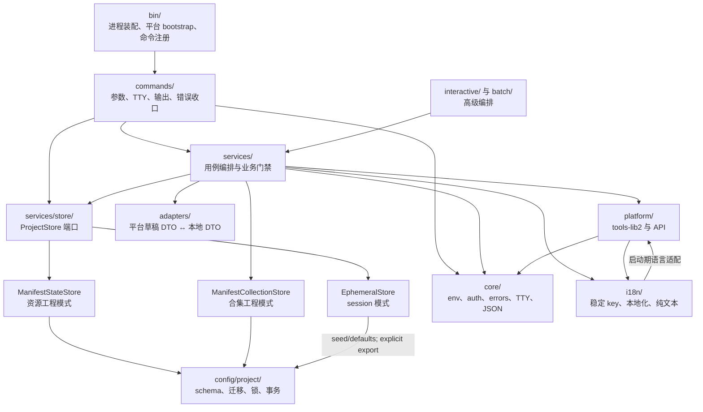

# CLI 源码架构

本文定义 `packages/cli/src` 的代码分类与依赖方向。产品行为以仓库根目录 `DESIGN.md` 为准；**一期 consolidated 规格**见 [docs/新方案/一期/01-产品与实现规格.md](../../../docs/新方案/一期/01-产品与实现规格.md)；本文只约束实现结构。

## 分层



| 目录 | 唯一职责 | 可以依赖 | 禁止承担 |
|---|---|---|---|
| `bin/` | 初始化平台适配器、注册顶层命令 | `commands`、`platform/bootstrap` | 业务流程 |
| `commands/` | 参数、TTY 交互、输出、调用一个或少量 service | `core`、`config`、`services`、`i18n` | 直接拼平台业务 payload；跨命令复用业务逻辑 |
| `services/` | 用例编排、业务门禁、同步、文件处理 | `core`、`config`、`platform`、`adapters`、`i18n` | CLI 参数解析与终端展示 |
| `adapters/` | manifest/state 与平台 DTO 的纯映射、指纹 | `config` | 网络请求、终端输出、持久化编排 |
| `config/` | manifest/state/config schema、读取与原子写入 | `core/env`、`i18n` | 平台请求、业务流程 |
| `platform/` | tools-lib 初始化、API envelope、底层平台访问 | `core`、`i18n` | 产品状态机和命令交互 |
| `core/` | 环境、认证、错误、TTY、公共命令基础设施 | `i18n` | 具体资源/合集业务 |
| `i18n/` | 稳定文案键与本地化 | `core/errors`；启动期可读取平台语言配置 | 业务流程 |

命令层目前不直接访问平台：`login` 也通过 `services/auth/loginFlow.ts`。架构测试仍保留
“至多允许 login”这条上限，不能把它理解为鼓励命令层绕过 service。

`i18n/index.ts → platform/index.ts → i18n/` 是当前启动期的有意循环：语言配置需要 tools-lib
提供的 `FI18n`，而 platform bootstrap 又需要 i18n 的错误/文案能力。它不是业务依赖；修改启动
顺序或抽离 locale adapter 时必须同步修改架构边界测试。

## 文件结构速查

| 路径 | 维护时先问的问题 | 常见入口 |
|---|---|---|
| `bin/` | 进程如何启动、命令如何注册？ | `bin/index.ts`、`bin/subCommands.ts` |
| `commands/` | 参数、TTY、JSON/文本输出如何适配？ | 与命令同名的文件；合集命令在 `commands/collection/` |
| `services/` | 业务用例、平台门禁和恢复语义在哪里？ | `*Service.ts` 或对应领域子目录 |
| `services/store/` | 业务代码如何在资源/合集工程与 session 模式下保存？ | `types.ts`、`ManifestStateStore`、`ManifestCollectionStore`、`EphemeralStore` |
| `config/project/` | manifest/state 的 schema、迁移、锁和事务如何实现？ | `store.ts`、`projects.ts`、`writeLock.ts` |
| `adapters/` | Console 草稿 DTO 与本地 DTO 如何映射？ | `versionDraftAdapter.ts` |
| `platform/` | tools-lib2 如何安装、API envelope 如何解包？ | `bootstrap.ts`、`index.ts` |
| `core/` | 环境、凭据、错误码、TTY、JSON 协议在哪里？ | `command.ts`、`auth.ts`、`env.ts` |
| `i18n/` | 文案 key、语言优先级和 fallback 在哪里？ | `bundled.ts`、`index.ts`、`cliError.ts` |

## services 分类

| 分类 | 位置 | 内容 |
|---|---|---|
| 资源发行 | `services/resource/` | 版本 payload、发布编排 |
| 合集 | `services/collection/` | 合集壳、目录草稿、属性、策略和发布 |
| 批量发行 | `services/batch/` | 扫描、配置、逐项结果、恢复 |
| 工程初始化 | `services/init/` | 模板选择、兼容矩阵、scaffold |
| 同步 | `services/sync/` | 资源 owner、pull、平台事实同步的公开入口 |
| 共享业务规则 | `services/shared/` | owner/listing/publish guards、平台读取适配 |
| 文件属性 | `services/fileProperty/` | 平台属性解析与轮询 |
| 跨域用例 | `services/*Service.ts` | release、status、diff、draft 等跨目录编排 |
| 独立管线能力 | `services/artifactPipeline.ts`、`processFile.ts`、`storageUpload.ts`、`validation.ts`、`resourceType*.ts` | 类型驱动产物、上传与校验能力 |
| 授权与接力 | `services/authorizationTree.ts`、`depAuthService.ts`、`core/consoleUrl.ts` | Console 授权树判定与需要支付/签约时的浏览器接力 |

新增代码优先进入已有领域目录。只有同时编排多个领域的用例，才以 `*Service.ts` 放在 `services/` 根目录；单文件独立能力可以留在根目录，一旦形成两个以上紧密协作模块就建立命名明确的子目录。

## 运行时调用链

### 启动

```text
package.json bin
  → bin/index.ts 安装 tools-lib2 Node adapter
  → bin/subCommands.ts 注册命令
  → citty.runMain
  → commands/*
```

### 普通写命令

```text
commands/*
  → applyWriteCommandFlags（环境、非交互和 production 门禁）
  → 选择 ProjectStore
  → services 用例（owner、同步、业务 guard）
  → platform/FServiceAPI
  → ProjectStore 保存用户意图或平台事实
  → command 层输出 JSON/文本并统一处理 CliError
```

### `publish`

```text
commands/publish.ts
  → ManifestStateStore 或 EphemeralStore
  → resource/publishVersion.ts
  → 同步与 owner 校验
  → 版本/冻结/类型/依赖授权门禁
  → processFileForPublish（文件或确定性 zip）
  → uploadFileIfNeeded
  → resolveCreateVersionPropertiesFromFile
  → buildCreateVersionParams（唯一 payload builder）
  → FServiceAPI.Resource.createVersion
  → savePublishedVersion（发布意图与目录绑定校验）
```

### 批量与 Studio

```text
准备输入与 SHA1
  → 创建正式 report
  → 写入 remote_outcome_unknown
  → 调平台创建
  → 原子记录 resourceId/versionId
  → 生成或恢复本地子工程
  → complete
```

批量和 Studio 复用同一恢复状态机。`remote_outcome_unknown` 表示平台是否执行无法自动证明，
必须先对账，不能盲目重试。

### 业务动作索引

| 业务动作 | 命令入口 | 主要 service / Store | 主要回归入口 | 副作用与恢复重点 |
|---|---|---|---|---|
| 建立或接入工程 | `init`、`bind` | `services/init/`、`bindService`、`ManifestStateStore` | `initCatalog`、`manifestStateFlow` | 只先写本地；绑定须校验 env/owner |
| 创建或维护资源 | `create`、`update` | `resourceService`、`shared/listing` | `resourceService`、`remoteWriteRecovery` | 平台写后只合并确认的事实 |
| 准备并发布版本 | `version`、`publish`、`release` | `resource/publishVersion`、`processFile`、`createVersionParams` | `publishDryRun`、`publishReuse`、`releaseService` | dry-run 零副作用；同版本恢复须完整意图匹配 |
| 草稿与冲突协调 | `draft`、`pull`、`diff` | `draftService`、`sync/`、`ManifestStateStore` | `manifestStateFlow`、`draftSession` | fingerprint 三方判断；同字段冲突 code 3 |
| 策略与上下架 | `policy`、`online`、`offline` | `policyService`、`onlineService`、shared guards | `onlineService`、`collectionPolicyStatus` | env/owner/frozen/latest/policy 门禁 |
| 批量独立资源 | `resource import-dir` | `batch/prepare`、`batch/report`、`batch/createFromDir` | `batchReport`、`batchImportRobustness` | report 是恢复事实源；unknown 必须对账 |
| 合集与目录 | `collection *` | `collection/`、`collectionDraftService` | `collectionItems`、`collectionReadiness` | 目录草稿与合集发布分离；条目操作须对账 |
| 依赖与授权 | `dep`、发布前 auth preflight | `authorizationTree`、`depAuthService` | `authorizationTree`、`depAuthSubject` | 每个直接依赖都必须有授权路径；付费走 Console 接力 |
| 无 manifest 会话 / Studio | `--session`、`session`、`studio` | `EphemeralStore`、`interactive/` | `interactiveSession`、`interactiveStudio` | 凭据不落盘；Studio 子工程和报告可恢复 |
| 合集高级维护 | `collect-rules`、`rss` | `collection/platform` | `collectionAutomationContracts`；真实 RSS 需 `verify:rss` | RSS 邮箱、验证码和 ENV 结果不得伪造 |

读任一动作时沿着“命令 → service → guard → 平台调用 → Store/报告 → 测试”顺序跳转；
如果某动作无法在这条链上定位，先补架构入口或测试索引，再添加实现。

## ProjectStore：业务与持久化的分界

resource/version 的 service 用例和 Studio/session 业务只依赖 `services/store/types.ts`，不直接
读写 manifest/state：

- `ManifestStateStore`：工程模式。每次 `save*` 立即通过 `config/project` 原子持久化；
  DTO 携带读取基线，保存时进行三方字段合并。
- `ManifestCollectionStore`：合集工程模式，具体实现位于 `services/store/collectionStore.ts`；合集
  service 通过该端口读写，不复制 manifest/state 事务细节。
- `EphemeralStore`：session 模式。数据只存在内存，只有显式 `exportProject` 才生成工程。
- Studio 使用 ephemeral 凭据，但每个已发行文件是独立的 `ManifestStateStore` 子工程。

### 当前有意例外与待端口化边界

当前仍存在以下已登记的 config/project 例外，不能误报为“全部已端口化”：

- `services/collection/create.ts`：创建/接入合集时需要区分“manifest 不存在”和“已有工程”；该初始化判定
  在写锁内直接读取 config，不能提前构造 Store。
- `services/bindService.ts`：先读取 manifest.subject 决定绑定到 resource 还是 collection Store；这是
  Store 选择前的入口判定。
- `services/shared/listing.ts`：只读读取平台 listing state，用于合并资源/合集事实。
- `services/depAuthService.ts`：读取 manifest 中声明的依赖意图，不负责持久化。
- `services/init/scaffold.ts`：初始化阶段创建/读取 manifest，ProjectStore 尚未存在是正常前置条件；已存在
  工程的合集类型推断通过 `CollectionStore` 完成。
- `services/diffService.ts`、`services/statusService.ts`、`services/validateService.ts`：只读汇总命令需要
  同时探测 resource/version/collection 三种旧 DTO，不能把 subject 探测误当成业务持久化。
- `services/store/*`、`config/project/*`：Store 实现本身当然可以访问底层文件。

新增 service 不得扩大这份例外清单。若以后支持合集 session，应先扩展
`ProjectStore.subject()` 或定义对应 session Store，并同时更新架构边界测试和双模式文档。

## 关键不变量

1. **意图与事实分离**：manifest 只存用户意图；state 只存平台 ID、owner、状态和发布事实。
2. **双文件一致**：manifest/state 在一个项目锁内读取；写入通过 transaction journal 前滚恢复。
3. **并发不覆盖**：本地修改走 revision/三方合并；同字段并发冲突，不做 last-writer-wins。资源工程由
   `ProjectStore` 承担，合集工程由 `CollectionStore` 承担。
4. **远端成功不伪装失败**：平台写成功、本地保存失败时记录 completed/pending，重试先对账。
5. **未知结果不自动重试**：网络中断后无法证明平台结果时保留报告，避免重复创建。
6. **dry-run 零副作用**：允许只读 API；不得上传、压缩、保存 state/manifest 或写平台。
7. **认证 fail closed**：工作区凭据损坏不回退 global；读取缺失 key 不创建新 key。
8. **payload 单一入口**：Console/API 字段由统一 builder 生成，批量、session、Studio 不复制规则。
9. **命令层薄**：命令负责参数、交互和输出；业务规则、平台写与恢复必须留在 service。
10. **端口例外可追踪**：任何直接 config/project 访问必须属于上面的登记清单，并说明是初始化、
    subject 探测或只读事实读取；不能以“兼容”作为无期限的理由。

## 新代码放在哪里

| 变化类型 | 放置位置 |
|---|---|
| 新命令参数、TTY 提示、输出格式 | `commands/`，共享参数先改 `core/cliArgs.ts` |
| 新资源/合集业务操作 | 对应 `services/resource/` 或 `services/collection/` |
| 跨多个领域的完整用例 | `services/*Service.ts`；超过一个紧密协作文件后建子目录 |
| manifest/state 字段或迁移 | `config/project/types.ts`、schema migration、字段账本 |
| 工程/session 都要支持的保存能力 | 先扩展 `ProjectStore`，再实现两个 store |
| 平台草稿 DTO 映射或 fingerprint | `adapters/`，保持纯函数 |
| API envelope、tools-lib adapter | `platform/` |
| 环境、认证、错误、TTY、机器协议 | `core/` |
| 可复用业务 guard | `services/shared/guards/` |

提交前至少运行对应单测、`typecheck` 和 `architectureBoundary.test.ts`；涉及 manifest/state、
发布或恢复状态机时还应运行全量 `pnpm verify`。

## 强制规则

1. 所有平台写入必须在 service 入口执行环境、owner、同步和业务门禁；命令层保护只能作为第一道防线。
2. `dry-run` 使用只读查询路径，不得调用会保存 state 的自动同步入口。
3. resource/version 的 manifest 意图和 state 平台事实只通过 **`ProjectStore`** 读写（工程模式：
   `ManifestStateStore` → `config/project`；会话模式：`EphemeralStore`）；合集工程的写入只通过
   **`CollectionStore`**（`ManifestCollectionStore` → `config/project`）。初始化、subject 探测、只读
   汇总和依赖声明读取遵循上面的登记例外；新增业务路径不得直接调用 `loadManifest/loadState`。
4. 平台 DTO 到本地 DTO 的转换集中在 adapter/shared mapping，不在命令中散落；**`buildCreateVersionParams` 等为 Console/API 唯一 payload 入口，不因 CLI 模式复制。**
5. Console parity 验证工具仍遵守分层；`cover`、`meta` 命令通过 service 完成 SHA1、上传和对比。
6. 新增跨层依赖必须先更新本文，并修改架构边界测试。
